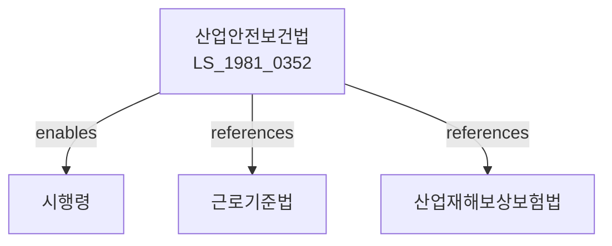

# 산업안전보건법

> [법률 제20095호, 2024. 1. 9., 일부개정]

---

---

## 제1장 총칙

### 제1조 (목적)

이 법은 산업재해를 예방하고 쾌적한 작업환경을 조성하여 근로자의 안전과 건강을 보호ㆍ증진함으로써 국민경제의 발전에 이바지함을 목적으로 한다。

### 제2조 (정의)

이 법에서 사용하는 용어의 뜻은 다음과 같다。

1. "산업재해"란 산업활동에 수반하여 발생하는 근로자의 부상ㆍ질병 또는 사망을 말한다。
2. "안전ㆍ건강"이란 근로자의 생명ㆍ신체 및 정신상태의 안녕을 유지하는 것을 말한다。
3. "사업주"란 근로자를 사용하여 사업을 하는 자를 말한다。
4. "근로자"란 직업의 종류를 불문하고 임금을 받고 사업주에게 고용되어 근로를 제공하는 자를 말한다。
5. "유해ㆍ위험요인"이란 근로자의 안전ㆍ건강에 위해를 끼칠 우려가 있는 요인을 말한다。

---

## 제2장 안전보건관리체제

### 第4条 (안전보건관리 책임)

① 사업주는 근로자의 안전과 건강을 확보하기 위하여 다음 각 호의 책무를 다하여야 한다。

1. 산업재해 예방을 위한 안전보건시설의 설치ㆍ관리
2. 근로자의 안전보건교육 실시
3. 유해ㆍ위험요인의 파악 및 개선
4. 산업재해 발생 시 필요한 조치

② 근로자는 사업주가 실시하는 안전보건 관련 조치에 협조하여야 한다。

### 第5条 (안전보건관리자)

① 사업주는 상시 근로자 수가 50명 이상인 사업장에 안전보건관리자를 선임하여야 한다。

② 안전보건관리자의 자격ㆍ직무 및 선임기준 등에 관하여 필요한 사항은 대통령령으로 정한다。

### 第6条 (산업안전보건위원회)

① 상시 근로자 수가 100명 이상인 사업장에 산업안전보건위원회를 설치하여야 한다。

② 산업안전보건위원회는 다음 각 호의 사항을 심의한다。

1. 안전보건관리규정의 작성 및 개정
2. 산업재해 예방계획의 수립
3. 안전보건교육 계획의 수립
4. 그 밖에 근로자의 안전보건에 관한 중요 사항

---

## 제3장 유해ㆍ위험요인의 파악 및 개선

### 第10条 (유해ㆍ위험요인의 파악)

① 사업주는 근로자의 안전ㆍ건강에 위해를 끼칠 우려가 있는 요인을 정기적으로 파악하여야 한다.

② 제1항에 따른 유해ㆍ위험요인의 파악방법 및 주기 등에 관하여 필요한 사항은 고용노동부령으로 정한다。

### 第11条 (유해ㆍ위험요인의 개선)

사업주는 제10조에 따라 파악된 유해ㆍ위험요인을 지체 없이 개선하여야 한다。

### 第12条 (위험성평가)

① 사업주는 작업공정 및 설비 등에 대하여 위험성평가를 실시하여야 한다.

② 위험성평가의 방법 및 절차 등에 관하여 필요한 사항은 고용노동부령으로 정한다。

---

## 제4장 안전보건시설

### 第20条 (안전시설)

사업주는 다음 각 호의 안전시설을 설치ㆍ관리하여야 한다.

1. 기계ㆍ기구의 안전장치
2. 전기설비의 안전장치
3. 건축물 및 작업장의 안전시설
4. 그 밖에 근로자의 안전을 확보하기 위하여 필요한 시설

### 第21条 (건강관리시설)

사업주는 다음 각 호의 건강관리시설을 설치ㆍ관리하여야 한다.

1. 국소배기장치 등 작업환경 개선시설
2. 보호구 제공 및 관리
3. 건강진단 시설
4. 그 밖에 근로자의 건강을 보호하기 위하여 필요한 시설

---

## 제5장 근로자의 건강진단

### 第30条 (건강진단)

① 사업주는 근로자에 대하여 정기적으로 건강진단을 실시하여야 한다.

② 건강진단의 종류ㆍ주기 및 방법 등에 관하여 필요한 사항은 고용노동부령으로 정한다。

### 第31条 (건강진단 결과에 대한 조치)

① 사업주는 건강진단 결과 이상이 발견된 근로자에 대하여 다음 각 호의 조치를 하여야 한다.

1. 작업장소의 변경
2. 작업시간의 단축
3. 근로의 제한 또는 금지
4. 의료기관에서의 치료

---

## 제6장 안전보건교육

### 第40条 (안전보건교육)

① 사업주는 근로자에 대하여 정기적으로 안전보건교육을 실시하여야 한다.

② 안전보건교육의 내용ㆍ시간 및 방법 등에 관하여 필요한 사항은 고용노동부령으로 정한다。

### 第41条 (정기안전보건교육)

사업주는 상시 근로자에 대하여 매년 정기안전보건교육을 실시하여야 한다.

---

## 제7장 벌칙

### 第100条 (벌칙)

다음 각 호의 어느 하나에 해당하는 자는 5년 이하의 징역 또는 5천만원 이하의 벌금에 처한다.

1. 제4조에 따른 안전보건관리 책무를 위반하여 중대재해를 발생시킨 사업주
2. 제20조에 따른 안전시설을 설치하지 아니하여 중대재해를 발생시킨 사업주

### 第101条 (과태료)

다음 각 호의 어느 하나에 해당하는 자에게는 1천만원 이하의 과태료를 부과한다.

1. 제5조에 따른 안전보건관리자를 선임하지 아니한 사업주
2. 제30조에 따른 건강진단을 실시하지 아니한 사업주

---

## 관계 그래프

**상위 법령**
- [[헌법]] 제32조 (근로의 권리)
- [[근로기준법]] 제3장 (안전보건)

**관련 법령**
- [[산업재해보상보험법]]
- [[중대재해처벌법]]
- [[건설기술 진흥법]]
- [[소방기본법]]

**하위 법령**
- [[산업안전보건법 시행령]]
- [[산업안전보건법 시행규칙]]
