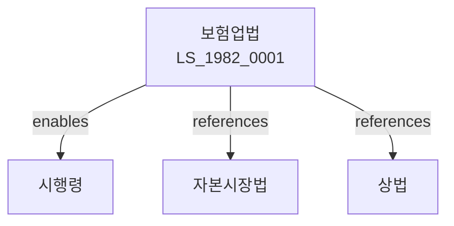

# 보험업법

> [법률 제20095호, 2024. 1. 9., 일부개정]

---

---

## 제1장 총칙

### 제1조 (목적)

이 법은 보험업을 건전하게 발전시키고 보험계약자를 보호함으로써 국민경제의 발전에 이바지함을 목적으로 한다。

### 제2조 (정의)

이 법에서 사용하는 용어의 뜻은 다음과 같다。

1. "보험업"이란 보험을 인수하는 사업을 말한다。
2. "보험자"란 보험업을 영위하는 자를 말한다。
3. "보험계약자"란 보험계약을 체결하는 자를 말한다。
4. "보험료"란 보험의 대가로 납부하는 금전을 말한다。

---

## 제2장 보험업의 인가

### 第5条 (보험업의 인가)

보험업을 하려는 자는 금융위원회의 인가를 받아야 한다。

### 第6条 (인가요건)

인가요건은 다음 각 호와 같다。

1. 자본금의 확보
2. 전문인력의 보유
3. 재무건전성

### 第7条 (인가결격사유)

다음 각 호의 어느 하나에 해당하는 자는 인가를 받을 수 없다。

1. 금치산자 또는 한정치산자
2. 파산자로서 복권되지 아니한 자
3. 금융관련법을 위반하여 인가취소 후 3년이 지나지 아니한 자

### 第8条 (인가의 유효기간)

인가의 유효기간은 대통령령으로 정한다。

---

## 제3장 보험의 종류

### 第15条 (생명보험)

생명보험은 피보험자의 생존 또는 사망을 보험사고로 하는 보험이다。

### 第16条 (손해보험)

손해보험은 재산상의 손해를 보험사고로 하는 보험이다。

### 第17条 (제3보험)

제3보험은 생명보험과 손해보험의 중간적 성격을 가진 보험이다。

### 第18条 (재보험)

재보험은 보험자가 인수한 위험을 다시 보험하는 것이다。

---

## 제4장 보험계약

### 第25条 (보험계약의 체결)

보험계약은 보험자와 보험계약자 사이에 체결한다。

### 第26条 (고지의무)

보험계약자는 고지의무를 성실히 이행하여야 한다。

### 第27条 (보험료의 납입)

보험계약자는 보험료를 납입하여야 한다。

### 第28条 (보험금의 지급)

보험자는 보험사고 발생 시 보험금을 지급한다。

---

## 제5장 보험계약자 보호

### 第35条 (보험계약자 보호)

국가는 보험계약자를 보호한다。

### 第36条 (보험계약자 보호기금)

보험계약자 보호기금을 조성한다。

### 第37条 (약관의 심사)

보험약관은 금융위원회의 심사를 받아야 한다。

### 第38条 (불공정약관의 금지)

불공정한 약관을 금지한다。

---

## 제6장 감독

### 第45条 (감독)

금융위원회는 보험업을 감독한다。

### 第46条 (보고 및 검사)

금융감독원장은 필요한 경우 보고를 명하거나 검사할 수 있다。

### 第47条 (영업정지)

금융위원회는 이 법을 위반한 보험자에 대하여 영업정지를 명할 수 있다。

### 第48条 (인가취소)

금융위원회는 중대한 위반사유가 있는 경우 인가를 취소할 수 있다。

---

## 제7장 벌칙

### 第55条 (벌칙)

다음 각 호의 어느 하나에 해당하는 자는 5년 이하의 징역 또는 5천만원 이하의 벌금에 처한다。

1. 인가 없이 보험업을 한 자
2. 허위로 인가를 받은 자
3. 보험금 부정수급자

### 第56条 (과태료)

다음 각 호의 어느 하나에 해당하는 자에게는 2천만원 이하의 과태료를 부과한다。

1. 정당한 사유 없이 보고를 하지 아니한 자
2. 약관심사를 위반한 자

---

## 관계 그래프

**상위 법령**
- [[헌법]] 제119조 (경제질서)
- [[상법]] 제4편 (보험)

**관련 법령**
- [[자본시장법]]
- [[은행법]]
- [[상법]]
- [[약관규제법]]

**하위 법령**
- [[보험업법 시행령]]
