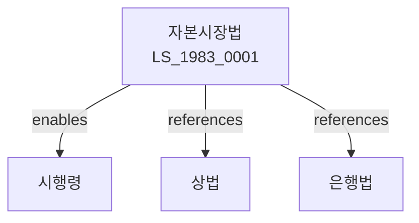

# 자본시장법

> [법률 제20096호, 2024. 1. 9., 일부개정]

---

---

## 제1장 총칙

### 제1조 (목적)

이 법은 자본시장의 공정성ㆍ효율성ㆍ투명성을 제고하고 투자자를 보호함으로써 국민경제의 발전에 이바지함을 목적으로 한다。

### 제2조 (정의)

이 법에서 사용하는 용어의 뜻은 다음과 같다。

1. "자본시장"이란 유가증권과 파생상품이 거래되는 시장을 말한다。
2. "유가증권"이란 주식, 채권 등을 말한다。
3. "파생상품"이란 선물, 옵션 등을 말한다。
4. "금융투자업"이란 투자매매업, 투자중개업 등을 말한다。

---

## 제2장 금융투자업

### 第5条 (금융투자업의 인가)

금융투자업을 하려는 자는 금융위원회의 인가를 받아야 한다。

### 第6条 (인가요건)

인가요건은 다음 각 호와 같다。

1. 자본금의 확보
2. 인력의 확보
3. 시설의 확보

### 第7条 (인가결격사유)

다음 각 호의 어느 하나에 해당하는 자는 인가를 받을 수 없다。

1. 금치산자 또는 한정치산자
2. 파산자로서 복권되지 아니한 자
3. 금융관련법을 위반하여 인가취소 후 3년이 지나지 아니한 자

### 第8条 (인가의 유효기간)

인가의 유효기간은 대통령령으로 정한다。

---

## 제3장 유가증권의 발행

### 第15条 (유가증권신고서)

유가증권을 발행하려는 자는 유가증권신고서를 제출하여야 한다。

### 第16条 (증권신고서의 효력)

증권신고서는 수리 후 효력이 발생한다。

### 第17条 (공시의무)

발행인은 정보를 공시하여야 한다。

### 第18条 (사업설명서)

유가증권발행 시 사업설명서를 작성하여야 한다。

---

## 제4장 유가증권시장

### 第25条 (증권거래소)

증권거래소는 유가증권시장을 개설한다。

### 第26条 (상장)

유가증권은 상장절차를 거쳐 거래된다。

### 第27条 (공시)

상장법인은 정보를 공시하여야 한다。

### 第28条 (거래)

유가증권은 공정하게 거래된다。

---

## 제5장 불공정거래의 금지

### 第35条 (내부자거래의 금지)

내부정보를 이용한 거래를 금지한다。

### 第36条 (시세조작의 금지)

시세조작행위를 금지한다。

### 第37条 (미공개정보이용의 금지)

미공개정보를 이용한 거래를 금지한다。

### 第38条 (부당권유의 금지)

부당한 권유행위를 금지한다。

---

## 제6장 투자자 보호

### 第45条 (투자자 보호)

국가는 투자자를 보호한다。

### 第46条 (투자자보호기금)

투자자보호기금을 조성한다。

### 第47条 (분쟁조정)

투자자 분쟁을 조정한다。

### 第48条 (집단소송)

집단소송제도를 운영한다。

---

## 제7章 감독

### 第55条 (감독)

금융위원회는 자본시장을 감독한다。

### 第56条 (보고 및 검사)

금융감독원장은 필요한 경우 보고를 명하거나 검사할 수 있다。

### 第57条 (영업정지)

금융위원회는 이 법을 위반한 자에 대하여 영업정지를 명할 수 있다。

### 第58条 (인가취소)

금융위원회는 중대한 위반사유가 있는 경우 인가를 취소할 수 있다。

---

## 제8장 벌칙

### 第65条 (벌칙)

다음 각 호의 어느 하나에 해당하는 자는 10년 이하의 징역 또는 1억원 이하의 벌금에 처한다。

1. 인가 없이 금융투자업을 한 자
2. 내부자거래를 한 자
3. 시세조작을 한 자

### 第66条 (과태료)

다음 각 호의 어느 하나에 해당하는 자에게는 5천만원 이하의 과태료를 부과한다。

1. 정당한 사유 없이 보고를 하지 아니한 자
2. 공시의무를 위반한 자

---

## 관계 그래프

**상위 법령**
- [[헌법]] 제119조 (경제질서)
- [[상법]]

**관련 법령**
- [[은행법]]
- [[보험업법]]
- [[상법]]
- [[외환거래법]]

**하위 법령**
- [[자본시장법 시행령]]
