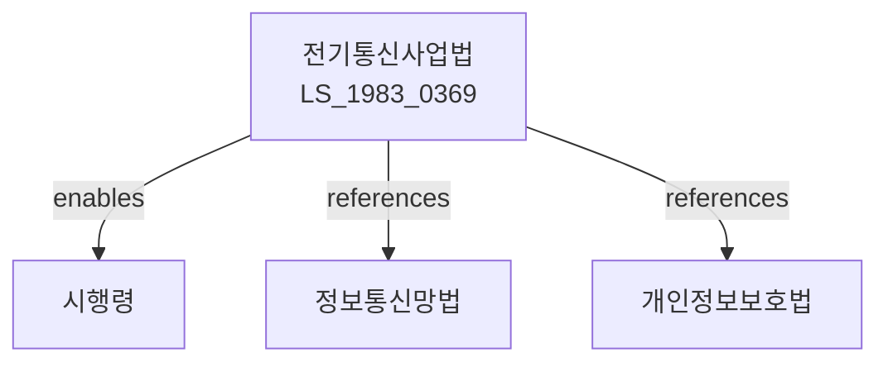

# 전기통신사업법

> [법률 제20098호, 2024. 1. 9., 일부개정]

---

---

## 제1장 총칙

### 제1조 (목적)

이 법은 전기통신사업의 건전한 발전과 전기통신서비스의 효율적인 제공을 도모함으로써 국민생활의 편익과 공공복리의 증진에 이바지함을 목적으로 한다.

### 제2조 (정의)

이 법에서 사용하는 용어의 뜻은 다음과 같다.

1. "전기통신"이란 유선ㆍ무선ㆍ광파 및 그 밖의 전자적 방식에 의하여 부호ㆍ문자ㆍ음향 또는 영상을 송신ㆍ수신하거나 처리하는 것을 말한다.
2. "전기통신설비"란 전기통신을 위한 기계ㆍ기구ㆍ선로 그 밖에 전기통신에 필요한 설비를 말한다.
3. "전기통신역무"란 전기통신설비를 이용하여 타인의 통신을 매개하거나 전기통신설비를 타인의 통신용으로 제공하는 것을 말한다.
4. "전기통신사업"이란 전기통신역무를 제공하는 사업을 말한다.
5. "전기통신사업자"란 이 법에 따라 전기통신사업의 등록 또는 신고를 한 자를 말한다.

---

## 제2장 전기통신사업

### 제5조 (전기통신사업의 구분)

전기통신사업은 다음 각 호와 같이 구분한다.

1. 기간통신사업: 전기통신역무를 제공하기 위하여 전기통신설비를 설치하거나 이를 이용하여 공중에게 전기통신역무를 제공하는 사업
2. 별정통신사업: 기간통신사업자의 전기통신설비를 이용하여 공중에게 전기통신역무를 제공하는 사업
3. 부가통신사업: 기간통신사업자 또는 별정통신사업자의 전기통신역무를 이용하여 그 부가가치를 높여 제공하는 사업

### 제6조 (기간통신사업의 등록)

① 기간통신사업을 하려는 자는 과학기술정보통신부장관에게 등록하여야 한다.

② 제1항에 따른 등록의 기준ㆍ절차 등에 관하여 필요한 사항은 대통령령으로 정한다.

### 제7조 (결격사유)

다음 각 호의 어느 하나에 해당하는 자는 제6조에 따른 등록을 할 수 없다.

1. 금치산자 또는 한정치산자
2. 파산선고를 받고 복권되지 아니한 자
3. 이 법을 위반하여 징역형을 선고받고 그 집행이 종료되거나 집행을 받지 아니하기로 확정된 후 2년이 지나지 아니한 자

### 제10조 (별정통신사업의 신고)

별정통신사업을 하려는 자는 과학기술정보통신부령으로 정하는 바에 따라 과학기술정보통신부장관에게 신고하여야 한다.

### 제11조 (부가통신사업의 신고)

부가통신사업을 하려는 자는 과학기술정보통신부령으로 정하는 바에 따라 과학기술정보통신부장관에게 신고하여야 한다.

---

## 제3장 전기통신사업자의 책임

### 제20조 (전기통신역무 제공의무)

기간통신사업자는 정당한 사유 없이 누구에게나 차별 없이 전기통신역무를 제공하여야 한다.

### 제21조 (비밀의 보호)

① 전기통신사업자는 타인의 통신비밀을 침해하여서는 아니 된다.

② 누구든지 전기통신사업자의 전기통신설비를 이용한 타인의 통신 비밀을 침해하거나 침해받을 우려가 있는 행위를 하여서는 아니 된다。

### 제22조 (통신의 비밀)

① 우편물과 전기통신의 비밀은 침해될 수 없다.

② 검사ㆍ압수 또는 수사상 필요한 경우를 제외하고는 통신비밀을 제한할 수 없다。

### 제23조 (통신내용의 이용 제한)

전기통신사업자는 이용자의 통신내용을 제3자에게 제공하거나 공개하여서는 아니 된다. 다만, 이용자의 동의가 있거나 다른 법률에 특별한 규정이 있는 경우에는 그러하지 아니하다。

---

## 제4장 전기통신설비

### 제30조 (전기통신설비의 설치)

① 전기통신사업자는 전기통신역무를 제공하기 위하여 필요한 전기통신설비를 설치ㆍ운영하여야 한다.

② 전기통신설비의 설치 및 운영기준 등에 관하여 필요한 사항은 과학기술정보통신부령으로 정한다。

### 제31조 (전기통신설비의 상호접속)

① 전기통신사업자는 상호접속을 요청받은 경우 정당한 사유 없이 이를 거부하여서는 아니 된다。

② 상호접속의 조건ㆍ절차 및 이용료 등에 관하여 필요한 사항은 대통령령으로 정한다。

---

## 제5장 보칙

### 第40条 (이용자 보호)

전기통신사업자는 이용자의 권익을 보호하기 위하여 다음 각 호의 조치를 취하여야 한다.

1. 이용약관의 공시
2. 이용자 불만 처리기구의 설치ㆍ운영
3. 이용자 정보의 보호

### 第41条 (이용약관)

① 전기통신사업자는 이용약관을 작성하여 과학기술정보통신부장관에게 신고하여야 한다.

② 이용약관에 포함되어야 할 사항은 과학기술정보통신부령으로 정한다。

---

## 제6장 벌칙

### 第80条 (벌칙)

다음 각 호의 어느 하나에 해당하는 자는 5년 이하의 징역 또는 5천만원 이하의 벌금에 처한다。

1. 제21조 제1항을 위반하여 타인의 통신비밀을 침해한 자
2. 제23조를 위반하여 통신내용을 제3자에게 제공하거나 공개한 자

### 第81条 (과태료)

다음 각 호의 어느 하나에 해당하는 자에게는 2천만원 이하의 과태료를 부과한다。

1. 제6조에 따른 등록을 하지 아니하고 기간통신사업을 한 자
2. 제20조를 위반하여 정당한 사유 없이 전기통신역무 제공을 거부한 자

---

## 관계 그래프

**상위 법령**
- [[헌법]] 제18조 (통신의 비밀)
- [[전기통신기본법]]

**관련 법령**
- [[정보통신망 이용촉진 및 정보보호 등에 관한 법률]]
- [[개인정보 보호법]]
- [[전파법]]
- [[방송법]]

**하위 법령**
- [[전기통신사업법 시행령]]
- [[전기통신사업법 시행규칙]]
