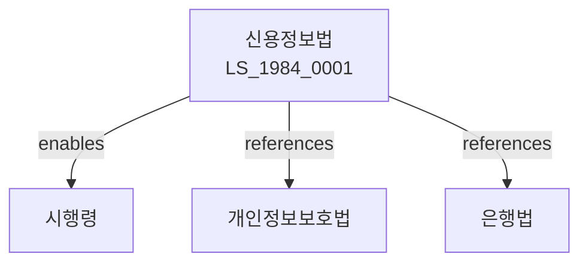

# 신용정보법

> [법률 제20097호, 2024. 1. 9., 일부개정]

---

---

## 제1장 총칙

### 제1조 (목적)

이 법은 신용정보의 효율적인 이용과 신용정보주체의 권익보호를 도모함으로써 건전한 신용질서를 확립함을 목적으로 한다。

### 제2조 (정의)

이 법에서 사용하는 용어의 뜻은 다음과 같다。

1. "신용정보"란 신용거래와 관련된 정보를 말한다。
2. "신용정보주체"란 신용정보에 의하여 식별되는 자를 말한다。
3. "신용정보업"이란 신용정보를 수집ㆍ조사ㆍ제공하는 업무를 말한다。
4. "신용평가"란 신용정보를 바탕으로 신용등급을 산정하는 것을 말한다。

---

## 제2장 신용정보업

### 第5条 (신용정보업의 등록)

신용정보업을 하려는 자는 금융위원회에 등록하여야 한다。

### 第6条 (등록요건)

등록요건은 다음 각 호와 같다。

1. 자본금의 확보
2. 전문인력의 보유
3. 시설의 확보

### 第7条 (등록결격사유)

다음 각 호의 어느 하나에 해당하는 자는 등록할 수 없다。

1. 금치산자 또는 한정치산자
2. 파산자로서 복권되지 아니한 자
3. 이 법을 위반하여 등록취소 후 2년이 지나지 아니한 자

### 第8条 (등록의 유효기간)

등록의 유효기간은 대통령령으로 정한다。

---

## 제3장 신용정보의 수집

### 第15条 (수집의 원칙)

신용정보는 적법하게 수집하여야 한다。

### 第16条 (수집의 범위)

수집할 수 있는 신용정보의 범위는 대통령령으로 정한다。

### 第17条 (정보주체의 동의)

신용정보를 수집할 때는 정보주체의 동의를 받아야 한다。

### 第18条 (금지정보)

다음 각 호의 정보는 수집할 수 없다。

1. 사상ㆍ신념
2. 가족관계
3. 건강상태
4. 그 밖에 대통령령으로 정하는 정보

---

## 제4장 신용정보의 이용

### 第25条 (이용의 원칙)

신용정보는 수집목적에 따라 이용하여야 한다。

### 第26条 (제공의 제한)

신용정보는 제3자에게 제공할 수 없다。

### 第27条 (정보주체의 열람청구권)

정보주체는 자신의 신용정보를 열람할 수 있다。

### 第28条 (정정청구권)

정보주체는 잘못된 정보에 대하여 정정을 요구할 수 있다。

---

## 제5장 신용평가

### 第35条 (신용평가의 공정성)

신용평가는 공정하게 하여야 한다。

### 第36条 (신용평가모형)

신용평가모형은 합리적이어야 한다。

### 第37条 (평가결과의 통지)

신용평가결과를 정보주체에게 통지하여야 한다。

### 第38条 (이의신청)

정보주체는 신용평가결과에 대하여 이의를 신청할 수 있다。

---

## 제6장 감독

### 第45条 (감독)

금융위원회는 신용정보업을 감독한다。

### 第46条 (보고 및 검사)

금융감독원장은 필요한 경우 보고를 명하거나 검사할 수 있다。

### 第47条 (영업정지)

금융위원회는 이 법을 위반한 자에 대하여 영업정지를 명할 수 있다。

### 第48条 (등록취소)

금융위원회는 중대한 위반사유가 있는 경우 등록을 취소할 수 있다。

---

## 제7장 벌칙

### 第55条 (벌칙)

다음 각 호의 어느 하나에 해당하는 자는 5년 이하의 징역 또는 5천만원 이하의 벌금에 처한다。

1. 등록 없이 신용정보업을 한 자
2. 부정하게 정보를 수집한 자
3. 정보를 유출한 자

### 第56条 (과태료)

다음 각 호의 어느 하나에 해당하는 자에게는 2천만원 이하의 과태료를 부과한다。

1. 정당한 사유 없이 보고를 하지 아니한 자
2. 정보주체의 권리를 침해한 자

---

## 관계 그래프

**상위 법령**
- [[헌법]] 제17조 (사생활의 비밀)
- [[개인정보보호법]]

**관련 법령**
- [[은행법]]
- [[여신전문금융업법]]
- [[개인정보보호법]]
- [[정보통신망법]]

**하위 법령**
- [[신용정보법 시행령]]
