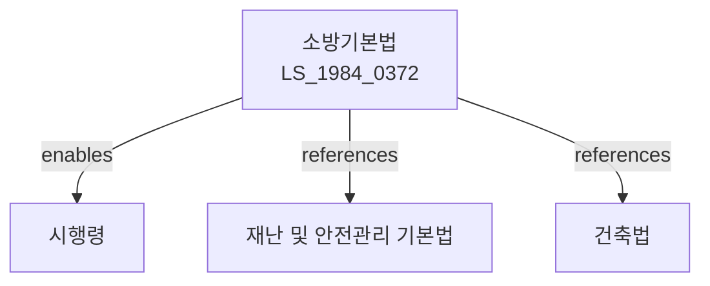

# 소방기본법

> [법률 제20086호, 2024. 1. 9., 일부개정]

---

---

## 제1장 총칙

### 제1조 (목적)

이 법은 화재의 예방ㆍ경계 및 진압과 화재로 인한 피해를 최소화하기 위하여 소방에 관한 기본적인 사항을 정함으로써 국민의 생명ㆍ신체 및 재산을 보호하고 공공의 안녕질서 유지에 이바지함을 목적으로 한다.

### 제2조 (정의)

이 법에서 사용하는 용어의 뜻은 다음과 같다.

1. "소방"이란 화재의 예방ㆍ경계 및 진압과 화재로 인한 재해경감을 위한 활동을 말한다.
2. "소방대상물"이란 건축물ㆍ차량ㆍ선박ㆍ항공기 등 화재의 예방 및 진압의 대상이 되는 것을 말한다.
3. "방화관리"란 소방대상물의 화재예방을 위한 관리를 말한다.
4. "소방설비"란 소화설비ㆍ경보설비ㆍ피난설비 등을 말한다.

---

## 제2장 화재의 예방

### 第5条 (방화관리자)

① 일정 규모 이상의 소방대상물의 관리주체는 방화관리자를 선임하여야 한다.

② 방화관리자의 자격요건 및 선임절차 등에 관하여 필요한 사항은 대통령령으로 정한다.

### 第6条 (방화관리업무)

방화관리자는 다음 각 호의 업무를 수행한다.

1. 소방용수 및 소방시설의 유지관리
2. 화기의 취급제한 및 감독
3. 피난ㆍ방화구조 및 소방시설의 유지관리
4. 인명구조 및 피난에 관한 훈련
5. 그 밖에 화재예방에 필요한 사항

### 第7条 (소방시설의 설치)

소방대상물의 관리주체는 대통령령으로 정하는 바에 따라 소방시설을 설치하고 유지관리하여야 한다。

---

## 제3장 화재의 경계

### 第15条 (화재감시)

① 소방본부장 또는 소방서장은 관할 구역 안의 화재를 감시하여야 한다.

② 화재감시의 방법 및 절차 등에 관하여 필요한 사항은 대통령령으로 정한다.

### 第16条 (화재경보)

① 소방본부장 또는 소방서장은 화재 발생의 우려가 높은 경우 화재경보를 발령할 수 있다.

② 화재경보의 종류 및 내용 등에 관하여 필요한 사항은 대통령령으로 정한다。

---

## 제4장 화재의 진압

### 第20条 (소방활동)

① 소방관서는 화재가 발생한 경우 지체 없이 소방활동을 하여야 한다.

② 소방활동에는 다음 각 호의 사항이 포함된다.

1. 화재의 발견 및 통보
2. 인명구조 및 피난유도
3. 화재의 진압
4. 소방용수의 확보
5. 그 밖에 화재진압에 필요한 사항

### 第21条 (소방차 등의 우선通行)

소방차 및 구급차는 화재현장 등으로 긴급하게 출동하는 경우 도로교통법에 불구하고 우선적으로 통행할 수 있다.

### 第22条 (소방활동에 대한 협조)

누구든지 소방관서의 소방활동에 협조하여야 한다.

---

## 제5장 소방시설

### 第30条 (소방시설의 기준)

소방시설은 대통령령으로 정하는 기준에 적합하게 설치하여야 한다.

### 第31条 (소방시설의 유지관리)

소방대상물의 관리주체는 소방시설을 항상 사용할 수 있는 상태로 유지관리하여야 한다.

### 第32条 (소방시설공사업)

① 소방시설공사업을 영위하려는 자는 행정안전부장관에게 등록하여야 한다.

② 등록의 요건 및 절차 등에 관하여 필요한 사항은 대통령령으로 정한다。

---

## 제6장 벌칙

### 第45条 (벌칙)

다음 각 호의 어느 하나에 해당하는 자는 5년 이하의 징역 또는 5천만원 이하의 벌금에 처한다.

1. 고의로 화재를 발생시킨 자
2. 소방활동을 고의로 방해한 자

### 第46条 (과태료)

다음 각 호의 어느 하나에 해당하는 자에게는 2천만원 이하의 과태료를 부과한다.

1. 제5조에 따른 방화관리자를 선임하지 아니한 자
2. 제7조에 따른 소방시설을 설치하지 아니한 자

---

## 관계 그래프

**상위 법령**
- [[헌법]] 제34조 (재해예방)
- [[재난 및 안전관리 기본법]]

**관련 법령**
- [[건축법]]
- [[위험물안전관리법]]
- [[다중이용업소의안전관리에관한법률]]
- [[소방시설설치및관리에관한법률]]

**하위 법령**
- [[소방기본법 시행령]]
