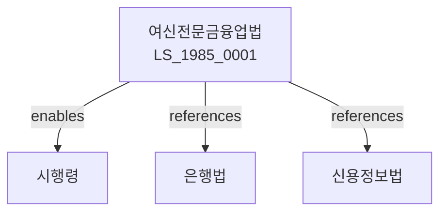

# 여신전문금융업법

> [법률 제20098호, 2024. 1. 9., 일부개정]

---

---

## 제1장 총칙

### 제1조 (목적)

이 법은 여신전문금융업의 건전한 발전과 이용자의 보호를 도모함으로써 국민경제의 발전에 이바지함을 목적으로 한다。

### 제2조 (정의)

이 법에서 사용하는 용어의 뜻은 다음과 같다。

1. "여신전문금융업"이란 여신을 전문으로 하는 금융업을 말한다。
2. "여신전문금융회사"란 이 법에 따라 인가를 받은 회사를 말한다。
3. "신용카드업"이란 신용카드를 발행하고 가맹점을 모집하는 업무를 말한다。
4. "시설대여업"이란 시설을 대여하는 업무를 말한다。

---

## 제2장 여신전문금융업의 인가

### 第5条 (여신전문금융업의 인가)

여신전문금융업을 하려는 자는 금융위원회의 인가를 받아야 한다。

### 第6条 (인가요건)

인가요건은 다음 각 호와 같다。

1. 자본금의 확보
2. 전문인력의 보유
3. 재무건전성

### 第7条 (인가결격사유)

다음 각 호의 어느 하나에 해당하는 자는 인가를 받을 수 없다。

1. 금치산자 또는 한정치산자
2. 파산자로서 복권되지 아니한 자
3. 금융관련법을 위반하여 인가취소 후 3년이 지나지 아니한 자

### 第8条 (인가의 유효기간)

인가의 유효기간은 대통령령으로 정한다。

---

## 제3장 신용카드업

### 第15条 (신용카드의 발행)

신용카드는 신용카드업자가 발행한다。

### 第16条 (가맹점의 모집)

신용카드업자는 가맹점을 모집한다。

### 第17条 (신용카드의 이용)

신용카드는 정직하게 이용하여야 한다。

### 第18条 (부정사용의 금지)

신용카드를 부정하게 사용하여서는 아니 된다。

---

## 제4장 시설대여업

### 第25条 (시설대여계약)

시설대여는 계약에 따라 시행한다。

### 第26条 (대여료)

대여료는 당사자 사이에 정한다。

### 第27条 (시설의 관리)

대여시설은 적절하게 관리하여야 한다。

### 第28条 (계약의 해지)

계약은 정당한 사유가 있는 경우 해지할 수 있다。

---

## 제5장 할부금융업

### 第35条 (할부금융)

할부금융은 물품을 할부로 구매하는 자에게 자금을 공급하는 것이다。

### 第36条 (할부금융계약)

할부금융계약은 서면으로 체결하여야 한다。

### 第37条 (할부금융의 이용)

할부금융을 이용하는 자는 성실하게 상환하여야 한다。

### 第38条 (연체금의 관리)

연체금은 적절하게 관리하여야 한다。

---

## 제6장 감독

### 第45条 (감독)

금융위원회는 여신전문금융업을 감독한다。

### 第46条 (보고 및 검사)

금융감독원장은 필요한 경우 보고를 명하거나 검사할 수 있다。

### 第47条 (영업정지)

금융위원회는 이 법을 위반한 자에 대하여 영업정지를 명할 수 있다。

### 第48条 (인가취소)

금융위원회는 중대한 위반사유가 있는 경우 인가를 취소할 수 있다。

---

## 제7장 벌칙

### 第55条 (벌칙)

다음 각 호의 어느 하나에 해당하는 자는 5년 이하의 징역 또는 5천만원 이하의 벌금에 처한다。

1. 인가 없이 여신전문금융업을 한 자
2. 허위로 인가를 받은 자
3. 신용카드를 부정 사용한 자

### 第56条 (과태료)

다음 각 호의 어느 하나에 해당하는 자에게는 2천만원 이하의 과태료를 부과한다。

1. 정당한 사유 없이 보고를 하지 아니한 자
2. 약관을 위반한 자

---

## 관계 그래프

**상위 법령**
- [[헌법]] 제119조 (경제질서)
- [[은행법]]

**관련 법령**
- [[은행법]]
- [[신용정보법]]
- [[할부거래법]]
- [[방문판매법]]

**하위 법령**
- [[여신전문금융업법 시행령]]
