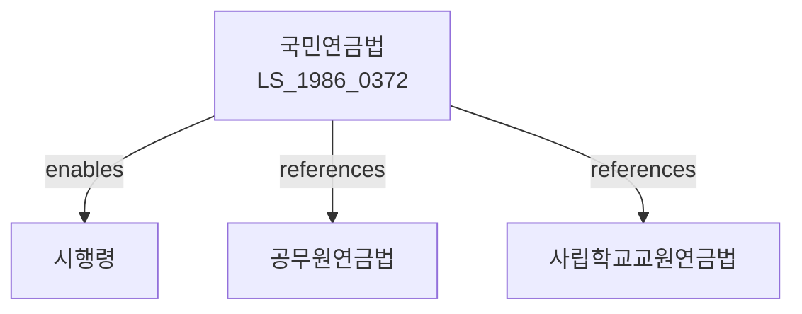

# 국민연금법

> [법률 제20083호, 2024. 1. 9., 일부개정]

---

---

## 제1장 총칙

### 제1조 (목적)

이 법은 국민의 노령, 장애 또는 사망에 대하여 연금급여를 실시함으로써 국민의 생활안정과 복지증진에 이바지함을 목적으로 한다。

### 제2조 (정의)

이 법에서 사용하는 용어의 뜻은 다음과 같다。

1. "국민연금"이란 노령ㆍ장애 또는 사망에 대하여 지급되는 연금을 말한다。
2. "가입자"란 국민연금에 가입한 자를 말한다.
3. "사업장가입자"란 사업장에 고용된 18세 이상 60세 미만의 근로자를 말한다.
4. "지역가입자"란 사업장가입자 외의 자로서 18세 이상 60세 미만의 자를 말한다.
5. "기여금"이란 가입자가 납부하는 보험료를 말한다.
6. "연금보험료"란 가입자가 납부하는 보험료를 말한다。

---

## 제2장 국민연금가입자

### 제5조 (당연적용)

① 사업장에 고용된 18세 이상 60세 미만의 근로자는 당연히 사업장가입자가 된다.

② 상시 근로자 1인 이상을 사용하는 사업장은 당연적용사업장이 된다。

### 제6조 (임의가입)

① 다음 각 호의 어느 하나에 해당하는 자는 지역가입자로 가입할 수 있다。

1. 18세 이상 60세 미만의 자로서 소득이 있는 자
2. 60세 이상의 자로서 대통령령으로 정하는 자

### 제7조 (가입자격의 상실)

가입자는 다음 각 호의 어느 하나에 해당하는 경우 가입자격을 상실한다。

1. 사망한 경우
2. 65세가 된 경우
3. 국적을 상실한 경우

---

## 제3장 보험료

### 第10条 (보험료의 부과)

① 사업장가입자의 월보험료는 표준소득월액에 보험료율을 곱한 금액으로 한다.

② 지역가입자의 월보험료는 소득에 보험료율을 곱한 금액으로 한다。

### 第11条 (보험료율)

국민연금의 보험료율은 100분의 9로 한다. 다만, 사업장가입자의 경우 반액은 사용자가 부담한다。

### 第12条 (보험료의 납부)

① 가입자는 매월 보험료를 다음 달 10일까지 납부하여야 한다。

② 사업장가입자의 보험료는 사용자가 원천징수하여 납부한다.

---

## 제4장 급여

### 第20条 (급여의 종류)

국민연금의 급여는 다음 각 호와 같다。

1. 노령연금
2. 장애연금
3. 유족연금
4. 반환일시금

### 第21条 (노령연금)

① 노령연금은 가입기간이 10년 이상인 자가 65세가 된 때에 지급한다.

② 노령연금의 수급권자는 연금액의 100분의 100을 지급받는다. 다만, 조기노령연금의 경우 감액하여 지급할 수 있다.

### 第22条 (장애연금)

장애연금은 가입 중에 발생한 질병 또는 부상으로 장애상태가 된 자에게 지급한다.

### 第23条 (유족연금)

유족연금은 가입자 또는 수급권자가 사망한 경우 그 유족에게 지급한다.

---

## 제5장 국민연금공단

### 第30条 (설립)

국민연금사업을 효율적으로 운영하기 위하여 국민연금공단을 설립한다。

### 第31条 (업무)

국민연금공단은 다음 각 호의 업무를 수행한다。

1. 가입자의 등록 및 관리
2. 보험료의 징수
3. 급여의 지급
4. 기금의 운용
5. 그 밖에 국민연금에 관한 업무

---

## 제6장 기금

### 第40条 (국민연금기금)

① 국민연금의 재원을 확보하기 위하여 국민연금기금을 설치한다。

② 기금은 보험료, 적립금의 운용수익 및 그 밖의 수입으로 조성한다。

### 第41条 (기금의 운용)

기금은 안전성과 수익성을 고려하여 운용하여야 한다.

---

## 제7장 벌칙

### 第100条 (벌칙)

다음 각 호의 어느 하나에 해당하는 자는 3년 이하의 징역 또는 3천만원 이하의 벌금에 처한다.

1. 허위로 연금급여를 받은 자
2. 사업주로서 보험료를 납부하지 아니한 자

### 第101条 (과태료)

다음 각 호의 어느 하나에 해당하는 자에게는 1천만원 이하의 과태료를 부과한다.

1. 보험료를 납부하지 아니한 자
2. 보고를 하지 아니하거나 허위로 보고한 자

---

## 관계 그래프

**상위 법령**
- [[헌법]] 제34조 (사회보장)
- [[사회보장기본법]]

**관련 법령**
- [[공무원연금법]]
- [[사립학교교원연금법]]
- [[군인연금법]]
- [[별정우체국연금법]]
- [[기초연금법]]

**하위 법령**
- [[국민연금법 시행령]]
