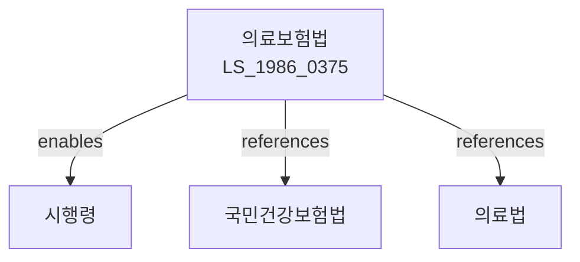

# 의료보험법

> [법률 제20085호, 2024. 1. 9., 일부개정]

---

---

## 제1장 총칙

### 제1조 (목적)

이 법은 국민의 질병ㆍ부상 등에 대한 의료서비스를 보장하고, 의료비용의 사회적 부담을 통해 국민건강의 증진과 사회보장의 확충에 이바지함을 목적으로 한다。

### 제2조 (정의)

이 법에서 사용하는 용어의 뜻은 다음과 같다。

1. "의료보험"이란 질병ㆍ부상 등에 대하여 의료서비스를 제공하거나 의료비용을 지급하는 제도를 말한다。
2. "가입자"란 의료보험에 가입한 자를 말한다。
3. "피부양자"란 가입자의 배우자, 직계존속, 직계비속 등으로서 대통령령으로 정하는 자를 말한다。
4. "요양기관"이란 의료보험 진료를 제공하는 의료기관을 말한다。

---

## 제2장 적용범위

### 第3条 (적용대상)

① 이 법은 전 국민에게 적용된다。

② 다음 각 호의 어느 하나에 해당하는 자는 제1항에도 불구하고 적용을 제한할 수 있다。

1. 수형자
2. 국외체류자
3. 그 밖에 대통령령으로 정하는 자

### 第4条 (가입자격)

① 직장가입자: 사업장에 고용된 근로자
② 지역가입자: 직장가입자 외의 자로서 소득 또는 재산이 있는 자
③ 피부양자: 가입자의 배우자, 직계존속, 직계비속

---

## 제3장 보험료

### 第10条 (보험료 부과)

① 의료보험의 보험료는 소득, 재산, 자동차 등을 기준으로 부과한다。

② 직장가입자의 보험료는 보수월액에 보험료율을 곱하여 산정한다。

③ 지역가입자의 보험료는 소득, 재산, 자동차 등의 점수에 따라 산정한다。

### 第11条 (보험료율)

① 직장가입자의 보험료율은 보수월액의 100분의 7.09로 한다。

② 지역가입자의 보험료율은 소득의 100분의 7.09로 한다。

### 第12条 (보험료 납부)

① 가입자는 매월 보험료를 납부하여야 한다。

② 직장가입자의 보험료는 사업주가 원천징수하여 납부한다.

---

## 제4장 급여

### 第20条 (요양급여)

가입자 및 피부양자가 질병ㆍ부상 등으로 요양기관에서 진료를 받는 경우 요양급여를 제공한다。

### 第21条 (요양급여의 범위)

요양급여의 범위는 다음 각 호와 같다.

1. 진찰ㆍ검사
2. 약제ㆍ치료재료의 지급
3. 처치ㆍ수술ㆍ기타 치료
4. 입원ㆍ간호
5. 예방접종

### 第22条 (본인부담금)

① 요양급여를 받는 자는 진료비의 일부를 본인부담금으로 납부하여야 한다.

② 본인부담금의 비율은 다음 각 호와 같다.

1. 외래진료: 100분의 30 ~ 60
2. 입원진료: 100분의 20
3. 상급병실: 실비

### 第23条 (요양비)

요양기관 외의 장소에서 분만 또는 응급조치를 받은 경우 요양비를 지급한다.

---

## 제5장 요양기관

### 第30条 (요양기관 지정)

① 의료기관은 국민건강보험공단에 요양기관 지정을 신청할 수 있다.

② 요양기관의 지정기준은 대통령령으로 정한다.

### 第31条 (요양기관의 의무)

요양기관은 다음 각 호의 의무를 가진다.

1. 가입자 등에게 요양급여를 제공할 의무
2. 진료기록부 작성 및 보관 의무
3. 청구서 제출 의무
4. 그 밖에 대통령령으로 정하는 의무

---

## 제6장 벌칙

### 第50条 (벌칙)

다음 각 호의 어느 하나에 해당하는 자는 2년 이하의 징역 또는 2천만원 이하의 벌금에 처한다.

1. 허위로 보험급여를 받은 자
2. 요양기관으로서 허위 청구를 한 자

### 第51条 (과태료)

다음 각 호의 어느 하나에 해당하는 자에게는 500만원 이하의 과태료를 부과한다.

1. 보험료를 납부하지 아니한 자
2. 요양기관의 지정기준을 위반한 자

---

## 관계 그래프

**상위 법령**
- [[헌법]] 제34조 (사회보장)
- [[국민건강보험법]]

**관련 법령**
- [[의료법]]
- [[의료급여법]]
- [[노인장기요양보험법]]
- [[건강보험료 부과 관련 법률]]

**하위 법령**
- [[의료보험법 시행령]]
