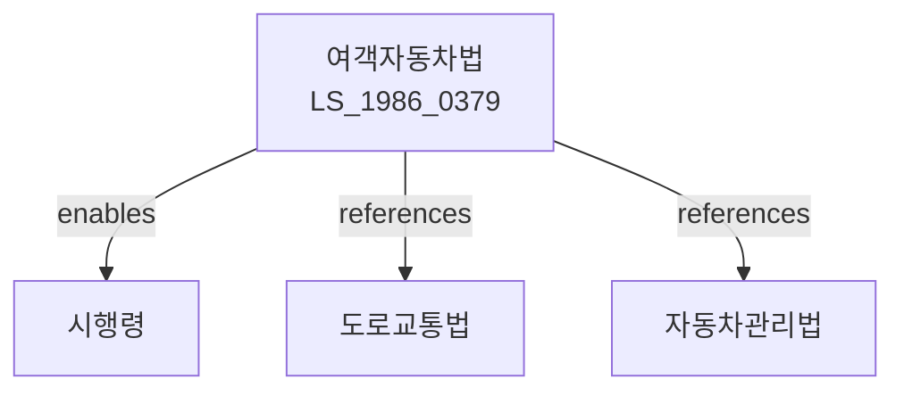

# 여객자동차 운수사업법

> [법률 제20100호, 2024. 1. 9., 일부개정]

---

---

## 제1장 총칙

### 제1조 (목적)

이 법은 여객자동차 운수사업의 적정한 운영과 건전한 육성을 도모함으로써 운수사업자의 이익과 이용자의 편의를 증진하고 공공복리에 이바지함을 목적으로 한다。

### 제2조 (정의)

이 법에서 사용하는 용어의 뜻은 다음과 같다。

1. "여객자동차 운수사업"이란 자동차를 이용하여 여객을 운송하는 사업을 말한다。
2. "여객자동차"이란 여객자동차 운수사업에 사용하기 위한 자동차를 말한다。
3. "노선여객자동차운송사업"이란 정해진 노선에 따라 여객을 운송하는 사업을 말한다。
4. "전세여객자동차운송사업"이란 일정한 운송계약에 따라 여객을 운송하는 사업을 말한다。
5. "택시여객자동차운송사업"이란 이용자의 승차요청에 따라 여객을 운송하는 사업을 말한다。

---

## 제2장 운수사업의 면허

### 第5条 (운수사업의 면허)

① 여객자동차 운수사업을 영위하려는 자는 국토교통부장관의 면허를 받아야 한다。

② 면허의 종류는 다음 각 호와 같다。

1. 노선여객자동차운송사업
2. 전세여객자동차운송사업
3. 택시여객자동차운송사업

③ 면허의 요건 및 절차 등에 관하여 필요한 사항은 대통령령으로 정한다。

### 第6条 (면허의 결격사유)

다음 각 호의 어느 하나에 해당하는 자는 운수사업의 면허를 받을 수 없다。

1. 금치산자 또는 한정치산자
2. 파산자로서 복권되지 아니한 자
3. 이 법에 따라 면허가 취소된 후 2년이 지나지 아니한 자

### 第7条 (면허의 제한)

국토교통부장관은 운송질서의 확립과 이용자의 편의를 위하여 필요한 경우 면허를 제한할 수 있다。

---

## 제3장 운수사업의 운영

### 第15条 (운임 및 요금)

① 운수사업자는 대통령령으로 정하는 바에 따라 운임 및 요금을 신고하여야 한다。

② 국토교통부장관은 운임 및 요금을 승인 또는 인가한다。

### 第16条 (운행계획의 신고)

운수사업자는 운행계획을 국토교통부장관에게 신고하여야 한다。

### 第17条 (운행의 의무)

운수사업자는 면허받은 내용에 따라 운행하여야 한다。

### 第18条 (운송장비의 기준)

운수사업자는 대통령령으로 정하는 기준에 적합한 운송장비를 갖추어야 한다。

---

## 제4章 이용자의 보호

### 第25条 (운송책임)

운수사업자는 여객을 운송하는 과정에서 발생한 사망 또는 부상에 대하여 배상할 책임을 진다。

### 第26条 (운송거부의 금지)

운수사업자는 정당한 사유 없이 운송을 거부하지 못한다。

### 第27条 (이용자의 불만처리)

운수사업자는 이용자의 불만을 처리하기 위한 기구를 설치하여야 한다。

---

## 第5章 감독

### 第35条 (감독)

① 국토교통부장관은 운수사업을 감독한다。

② 감독의 범위 및 방법 등에 관하여 필요한 사항은 대통령령으로 정한다。

### 第36条 (보고 및 검사)

국토교통부장관은 필요한 경우 운수사업자에게 보고를 명하거나 검사할 수 있다。

### 第37条 (영업정지 등)

국토교통부장관은 운수사업자가 이 법을 위반한 경우 영업정지 또는 면허취소를 할 수 있다。

---

## 第6章 벌칙

### 第70条 (벌칙)

다음 각 호의 어느 하나에 해당하는 자는 3년 이하의 징역 또는 3천만원 이하의 벌금에 처한다。

1. 제5조에 따른 면허 없이 운수사업을 영위한 자
2. 허위로 면허를 받은 자

### 第71条 (과태료)

다음 각 호의 어느 하나에 해당하는 자에게는 2천만원 이하의 과태료를 부과한다。

1. 제17조에 따른 운행의무를 위반한 자
2. 정당한 사유 없이 운송을 거부한 자

---

## 관계 그래프

**상위 법령**
- [[헌법]] 제119조 (경제질서)
- [[도로교통법]]

**관련 법령**
- [[자동차관리법]]
- [[자동차손해배상보장법]]
- [[교통약자의이동편의증진법]]
- [[여객자동차터미널법]]

**하위 법령**
- [[여객자동차법 시행령]]
