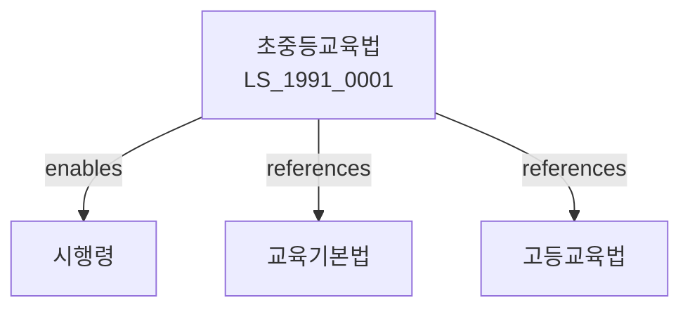

# 초중등교육법

> [법률 제20099호, 2024. 1. 9., 일부개정]

---

---

## 제1장 총칙

### 제1조 (목적)

이 법은 초등학교ㆍ중학교ㆍ고등학교 등에서의 교육에 관한 사항을 정함으로써 국민으로서 갖추어야 할 기본적인 자질을 함양함을 목적으로 한다。

### 제2조 (정의)

이 법에서 사용하는 용어의 뜻은 다음과 같다。

1. "초등학교"란 초등교육을 실시하는 학교를 말한다。
2. "중학교"란 중등교육을 실시하는 학교를 말한다。
3. "고등학교"란 고등교육을 실시하는 학교를 말한다。
4. "특수학교"란 특수교육을 실시하는 학교를 말한다。

---

## 제2장 학교의 설립ㆍ경영

### 第5条 (학교의 설립)

국가와 지방자치단체는 학교를 설립한다。

### 第6条 (학교의 경영)

학교는 교육부의 감독을 받아 경영한다。

### 第7条 (학교법인)

사립학교는 학교법인이 설립한다。

### 第8条 (학교의 폐지)

학교는 정당한 사유가 있는 경우 폐지할 수 있다。

---

## 제3장 교육과정

### 第15条 (교육과정)

교육부장관은 교육과정을 결정한다。

### 第16条 (교육과정의 구성)

교육과정은 다음 각 호와 같다。

1. 국민공통기본교육과정
2. 선택중심교육과정

### 第17条 (교과서)

교과서는 검정 또는 저작에 의한다。

### 第18条 (교육내용)

교육내용은 교육과정에 따라 구성한다。

---

## 제4장 수업

### 第25条 (수업연한)

수업연한은 대통령령으로 정한다。

### 第26条 (수업일수)

수업일수는 대통령령으로 정한다。

### 第27条 (학급편성)

학급은 학생의 수에 따라 편성한다。

### 第28条 (교육방법)

교육은 효율적인 방법으로 실시한다。

---

## 제5장 교원

### 第35条 (교원의 자격)

교원은 자격을 갖추어야 한다。

### 第36条 (교원의 임용)

교원은 공개채용으로 임용한다。

### 第37条 (교원의 복무)

교원은 성실히 복무하여야 한다。

### 第38条 (교원의 연수)

교원은 연수를 받아야 한다。

---

## 제6장 학생

### 第45条 (학생의 권리)

학생은 학습권을 가진다。

### 第46条 (학생의 의무)

학생은 학업에 정진하여야 한다。

### 第47条 (학생생활규정)

학교는 학생생활규정을 제정한다。

### 第48条 (학생징계)

학생은 징계할 수 있다。

---

## 제7장 학교평가

### 第55条 (학교평가)

교육부장관은 학교를 평가한다。

### 第56条 (평가지표)

평가지표는 대통령령으로 정한다。

### 第57条 (평가결과의 공개)

평가결과를 공개한다。

### 第58条 (평가결과의 활용)

평가결과를 학교발전에 활용한다。

---

## 제8장 감독

### 第65条 (감독)

교육부장관은 초중등교육을 감독한다。

### 第66条 (보고 및 검사)

교육부장관은 필요한 경우 보고를 명하거나 검사할 수 있다。

### 第67条 (시정명령)

교육부장관은 이 법을 위반한 자에 대하여 시정명령을 할 수 있다。

### 第68条 (과태료)

다음 각 호의 어느 하나에 해당하는 자에게는 과태료를 부과한다。

1. 정당한 사유 없이 보고를 하지 아니한 자
2. 교육과정을 위반한 자

---

## 제9장 벌칙

### 第75条 (벌칙)

다음 각 호의 어느 하나에 해당하는 자는 2년 이하의 징역 또는 2천만원 이하의 벌금에 처한다。

1. 허위로 학교를 설립한 자
2. 교원자격을 위조한 자

### 第76条 (과태료)

다음 각 호의 어느 하나에 해당하는 자에게는 1천만원 이하의 과태료를 부과한다。

1. 정당한 사유 없이 보고를 하지 아니한 자
2. 학생의 권리를 침해한 자

---

## 관계 그래프

**상위 법령**
- [[헌법]] 제31조 (교육권)
- [[교육기본법]]

**관련 법령**
- [[고등교육법]]
- [[평생교육법]]
- [[사립학교법]]
- [[특수교육법]]

**하위 법령**
- [[초중등교육법 시행령]]
