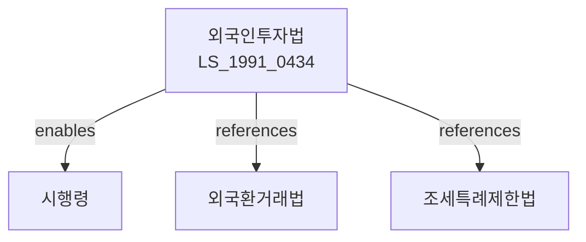

# 외국인투자 촉진법

> [법률 제20078호, 2024. 1. 9., 일부개정]

---

---

## 제1장 총칙

### 제1조 (목적)

이 법은 외국인투자에 대한 지원과 편의를 제공함으로써 외국인의 대한민국 내에서의 기업활동을 촉진하고 산업발전과 국민경제에 이바지함을 목적으로 한다。

### 제2조 (정의)

이 법에서 사용하는 용어의 뜻은 다음과 같다。

1. "외국인"이란 외국의 국적을 가진 개인, 외국의 법령에 따라 설립된 법인 및 국제협력기구 등을 말한다.
2. "외국인투자"란 외국인이 대한민국 법인의 주식을 소유하거나 출자하는 것을 말한다.
3. "외국투자기업"이란 외국인투자를 받은 대한민국 법인을 말한다。
4. "외국인투자기관"이란 외국인투자와 관련된 업무를 수행하는 기관을 말한다。

---

## 제2장 외국인투자의 절차

### 제5조 (외국인투자 신고)

① 외국인이 대한민국 내에서 투자하려는 경우 산업통상자원부장관에게 신고하여야 한다.

② 신고의 절차 및 방법 등에 관하여 필요한 사항은 대통령령으로 정한다。

### 제6조 (투자완료 신고)

외국인은 외국인투자를 완료한 날부터 30일 이내에 산업통상자원부장관에게 투자완료 신고를 하여야 한다。

### 제7조 (투자의 변경)

외국인투자의 내용을 변경하려는 경우 산업통상자원부장관에게 변경신고를 하여야 한다。

---

## 제3장 외국인투자의 지원

### 第10条 (조세지원)

외국투자기업에 대하여는 「조세특례제한법」에 따라 소득세, 법인세, 취득세 등을 감면할 수 있다。

### 第11条 (임대지원)

국가 또는 지방자치단체는 외국투자기업에게 국유 또는 공유재산을 우선적으로 임대할 수 있다。

### 第12条 (외국인투자지역)

① 산업통상자원부장관은 외국인투자를 촉진하기 위하여 외국인투자지역을 지정할 수 있다。

② 외국인투자지역에 입주하는 외국투자기업에 대하여는 추가적인 지원을 할 수 있다。

### 第13条 (행정지원)

산업통상자원부장관은 외국인투자와 관련된 행정편의를 제공하기 위하여 외국인투자지원센터를 설치ㆍ운영할 수 있다。

---

## 제4장 외국인투자기업의 보호

### 第20条 (이익의 송금)

외국인은 외국인투자로 얻은 이익, 배당금, 주식매각대금 등을 자유롭게 송금할 수 있다。

### 第21条 (수용의 제한)

국가는 공공목적을 위하여 외국투자기업의 재산을 수용하는 경우 정당한 보상을 하여야 한다。

### 第22条 (처분의 제한)

외국투자기업은 자유롭게 그 재산을 처분할 수 있다。

---

## 제5장 분쟁해결

### 第30条 (분쟁의 해결)

외국인투자와 관련된 분쟁은 당사자 간 협의, 조정 또는 중재에 의하여 해결할 수 있다。

### 第31条 (투자분쟁조정위원회)

산업통상자원부장관은 외국인투자 분쟁을 조정하기 위하여 투자분쟁조정위원회를 둘 수 있다。

---

## 제6장 벌칙

### 第40条 (과태료)

다음 각 호의 어느 하나에 해당하는 자에게는 1천만원 이하의 과태료를 부과한다。

1. 제5조에 따른 신고를 하지 아니한 자
2. 허위로 신고한 자

---

## 관계 그래프

**상위 법령**
- [[헌법]] 제119조 (경제질서)
- [[외국환거래법]]

**관련 법령**
- [[조세특례제한법]]
- [[자유무역지역지정등에관한법률]]
- [[경제자유구역지정및운영에관한특별법]]
- [[기업도시개발특별법]]

**하위 법령**
- [[외국인투자촉진법 시행령]]
