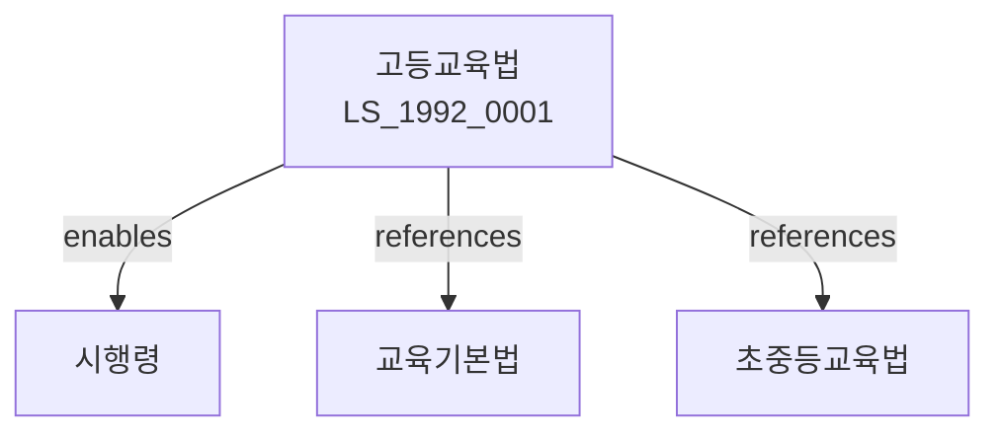

# 고등교육법

> [법률 제20100호, 2024. 1. 9., 일부개정]

---

---

## 제1장 총칙

### 제1조 (목적)

이 법은 대학 등 고등교육기관의 교육에 관한 사항을 정함으로써 고등교육의 발전과 국가발전에 이바지함을 목적으로 한다。

### 제2조 (정의)

이 법에서 사용하는 용어의 뜻은 다음과 같다。

1. "대학"이란 고등교육을 실시하는 교육기관을 말한다。
2. "대학원"이란 대학 졸업자에게 고도의 학술이론과 응용방법을 교수하는 기관을 말한다。
3. "교원"이란 학장 이상의 장과 교수ㆍ부교수ㆍ조교수ㆍ전임강사ㆍ조교를 말한다。
4. "학생정원"이란 입학정원과 재학정원을 말한다。

---

## 제2장 대학의 설립

### 第5条 (대학의 설립)

국가와 지방자치단체는 대학을 설립한다。

### 第6条 (사립대학의 설립)

사립대학은 학교법인이 설립한다。

### 第7条 (설립인가)

대학을 설립하려는 자는 교육부장관의 인가를 받아야 한다。

### 第8条 (설립요건)

설립요건은 다음 각 호와 같다。

1. 교지 및 교사
2. 교원
3. 학생
4. 재산 및 재원

---

## 제3장 대학의 조직

### 第15条 (학부와 학과)

대학은 학부 또는 학과를 둔다。

### 第16条 (대학원)

대학은 대학원을 둘 수 있다。

### 第17条 (부속기관)

대학은 부속기관을 둘 수 있다。

### 第18条 (부설기관)

대학은 부설연구기관을 둘 수 있다。

---

## 제4장 교원

### 第25条 (교원의 자격)

교원은 자격을 갖추어야 한다。

### 第26条 (교원의 임용)

교원은 대학의 장이 임용한다。

### 第27条 (교원의 신분보장)

교원은 신분이 보장된다。

### 第28条 (교원의 연구)

교원은 연구활동을 보장받는다。

---

## 제5장 학생

### 第35条 (입학)

입학은 입학전형에 따른다。

### 第36条 (등록금)

등록금은 당해 대학이 정한다。

### 第37条 (학생자치활동)

학생은 자치활동을 할 수 있다。

### 第38条 (장학금)

학생은 장학금을 받을 수 있다。

---

## 제6장 학위

### 第45条 (학위의 종류)

학위는 학사ㆍ석사ㆍ박사로 구분한다。

### 第46条 (학위수여)

대학의 장은 학위를 수여한다。

### 第47条 (명예박사)

대학은 명예박사학위를 수여할 수 있다。

### 第48条 (학위등록)

학위는 국가에 등록한다。

---

## 제7장 대학평가

### 第55条 (대학평가)

교육부장관은 대학을 평가한다。

### 第56条 (평가지표)

평가지표는 대통령령으로 정한다。

### 第57条 (평가결과의 공개)

평가결과를 공개한다。

### 第58条 (평가결과의 활용)

평가결과를 재정지원에 반영한다。

---

## 제8장 감독

### 第65条 (감독)

교육부장관은 고등교육을 감독한다。

### 第66条 (보고 및 검사)

교육부장관은 필요한 경우 보고를 명하거나 검사할 수 있다。

### 第67条 (시정명령)

교육부장관은 이 법을 위반한 자에 대하여 시정명령을 할 수 있다。

### 第68条 (인가취소)

교육부장관은 중대한 위반사유가 있는 경우 인가를 취소할 수 있다。

---

## 제9장 벌칙

### 第75条 (벌칙)

다음 각 호의 어느 하나에 해당하는 자는 3년 이하의 징역 또는 3천만원 이하의 벌금에 처한다。

1. 허위로 대학을 설립한 자
2. 학위를 위조한 자

### 第76条 (과태료)

다음 각 호의 어느 하나에 해당하는 자에게는 1천만원 이하의 과태료를 부과한다。

1. 정당한 사유 없이 보고를 하지 아니한 자
2. 평가에 협조하지 아니한 자

---

## 관계 그래프

**상위 법령**
- [[헌법]] 제31조 (교육권)
- [[교육기본법]]

**관련 법령**
- [[초중등교육법]]
- [[평생교육법]]
- [[사립학교법]]
- [[학점인정법]]

**하위 법령**
- [[고등교육법 시행령]]
