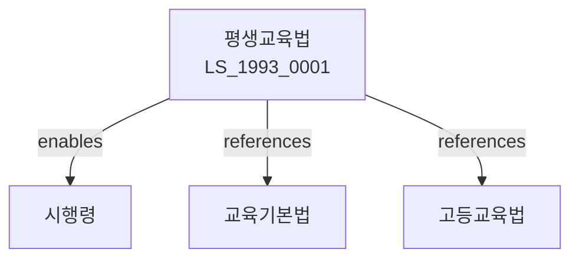

# 평생교육법

> [법률 제20101호, 2024. 1. 9., 일부개정]

---

---

## 제1장 총칙

### 제1조 (목적)

이 법은 평생교육에 관한 사항을 정함으로써 모든 국민이 평생에 걸쳐 학습할 수 있는 기회를 제공함을 목적으로 한다。

### 제2조 (정의)

이 법에서 사용하는 용어의 뜻은 다음과 같다。

1. "평생교육"이란 학교교육 외에 국민의 평생에 걸친 교육활동을 말한다。
2. "평생교육시설"이란 평생교육을 실시하는 시설을 말한다。
3. "평생교육사"이란 평생교육을 전문적으로 담당하는 자를 말한다。
4. "학점은행제"란 평생교육의 학점을 인정하는 제도를 말한다。

---

## 제2장 평생교육의 실시

### 第5条 (평생교육의 실시)

국가와 지방자치단체는 평생교육을 실시한다。

### 第6条 (평생교육의 내용)

평생교육의 내용은 다음 각 호와 같다。

1. 문자해득교육
2. 직업능력향상교육
3. 인문교양교육
4. 노인교육

### 第7条 (평생교육의 방법)

평생교육은 다양한 방법으로 실시한다。

### 第8条 (평생교육의 기회)

모든 국민은 평생교육의 기회를 가진다。

---

## 제3장 평생교육시설

### 第15条 (평생교육시설의 설치)

평생교육시설을 설치할 수 있다。

### 第16条 (시설의 종류)

평생교육시설은 다음 각 호와 같다。

1. 평생학습관
2. 평생학습센터
3. 사내대학
4. 원격평생교육시설

### 第17条 (시설의 등록)

평생교육시설을 설치하려는 자는 등록하여야 한다。

### 第18条 (시설의 기준)

시설의 기준은 대통령령으로 정한다。

---

## 제4장 평생교육사

### 第25条 (평생교육사의 자격)

평생교육사는 자격을 갖추어야 한다。

### 第26条 (자격인정)

평생교육사 자격은 교육부장관이 인정한다。

### 第27条 (직무)

평생교육사는 평생교육을 기획ㆍ분석ㆍ진행한다。

### 第28条 (연수)

평생교육사는 연수를 받아야 한다。

---

## 제5장 학점인정

### 第35条 (학점은행제)

교육부장관은 학점은행제를 운영한다。

### 第36条 (학점의 인정)

평생교육과정의 학점을 인정한다。

### 第37条 (학위취득)

학점을 취득하여 학위를 취득할 수 있다。

### 第38条 (평가)

학점인정을 위한 평가를 실시한다。

---

## 제6장 지원

### 第45条 (재정지원)

국가는 평생교육에 재정지원을 한다。

### 第46条 (협력)

관계 기관과 협력한다。

### 第47条 (정보화)

평생교육의 정보화를 추진한다。

### 第48条 (국제교류)

평생교육의 국제교류를 추진한다。

---

## 제7장 감독

### 第55条 (감독)

교육부장관은 평생교육을 감독한다。

### 第56条 (보고 및 검사)

교육부장관은 필요한 경우 보고를 명하거나 검사할 수 있다。

### 第57条 (시정명령)

교육부장관은 이 법을 위반한 자에 대하여 시정명령을 할 수 있다。

### 第58条 (과태료)

다음 각 호의 어느 하나에 해당하는 자에게는 과태료를 부과한다。

1. 정당한 사유 없이 보고를 하지 아니한 자
2. 등록 없이 시설을 운영한 자

---

## 제8장 벌칙

### 第65条 (과태료)

다음 각 호의 어느 하나에 해당하는 자에게는 1천만원 이하의 과태료를 부과한다。

1. 정당한 사유 없이 보고를 하지 아니한 자
2. 허위로 등록한 자

---

## 관계 그래프

**상위 법령**
- [[헌법]] 제31조 (교육권)
- [[교육기본법]]

**관련 법령**
- [[초중등교육법]]
- [[고등교육법]]
- [[직업교육법]]
- [[노인복지법]]

**하위 법령**
- [[평생교육법 시행령]]
