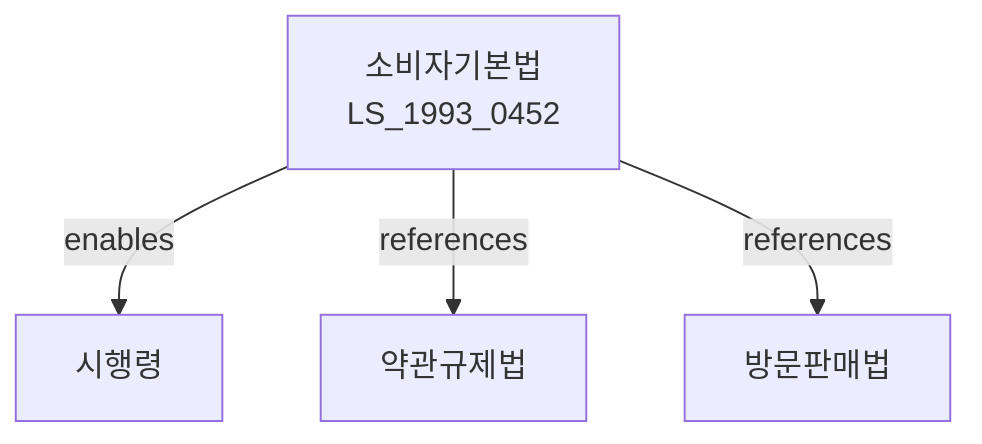

# 소비자기본법

> [법률 제20098호, 2024. 1. 9., 일부개정]

---

---

## 제1장 총칙

### 제1조 (목적)

이 법은 소비자의 권익을 보호하고 소비자생활의 향상을 도모함으로써 사회ㆍ경제의 발전에 이바지함을 목적으로 한다.

### 제2조 (정의)

이 법에서 사용하는 용어의 뜻은 다음과 같다.

1. "소비자"란 물품 및 용역(이하 "물품등"이라 한다)을 사용ㆍ소비하는 자를 말한다.
2. "사업자"란 물품등을 공급하는 자를 말한다.
3. "소비자단체"란 소비자의 권익을 보호하고 소비자생활의 향상을 도모하기 위하여 설립된 법인을 말한다.

### 제3조 (소비자의 권리)

소비자는 다음 각 호의 권리를 가진다.

1. 물품등을 선택함에 있어서 필요한 지식과 정보를 제공받을 권리
2. 물품등의 거래조건에 대하여 부당한 차별을 받지 아니할 권리
3. 물품등으로 인한 피해에 대하여 신속ㆍ공정한 보상을 받을 권리
4. 소비자생활의 향상을 위한 교육을 받을 권리
5. 소비자의 권익을 보호하기 위한 단체를 조직할 권리
6. 소비자정책의 수립 및 집행에 참여할 권리

---

## 제2장 국가 및 지방자치단체의 책임

### 제5조 (국가의 책무)

국가는 소비자의 권익을 보호하고 소비자생활을 향상시키기 위하여 다음 각 호의 책무를 다하여야 한다.

1. 소비자의 권리가 침해되지 아니하도록 필요한 시책을 수립ㆍ시행할 것
2. 소비자에게 필요한 정보를 제공할 것
3. 소비자교육을 실시할 것
4. 소비자단체의 활동을 지원할 것

### 제6조 (지방자치단체의 책무)

지방자치단체는 당해 지역의 특성에 적합한 소비자보호시책을 수립ㆍ시행하여야 한다.

---

## 제3장 소비자정책심의위원회

### 제10조 (설치)

소비자정책에 관한 중요 사항을 심의하기 위하여 기획재정부에 소비자정책심의위원회(이하 "위원회"라 한다)를 둔다。

### 제11조 (기능)

위원회는 다음 각 호의 사항을 심의한다。

1. 소비자정책의 기본방향에 관한 사항
2. 소비자보호 종합계획의 수립에 관한 사항
3. 소비자의 권익보호를 위한 주요 제도의 개선에 관한 사항
4. 그 밖에 소비자정책과 관련하여 위원장이 부의하는 사항

### 제12조 (조직 및 운영)

위원회의 조직 및 운영 등에 관하여 필요한 사항은 대통령령으로 정한다。

---

## 제4장 소비자단체

### 제20조 (소비자단체의 설립)

① 소비자의 권익을 보호하고 소비자생활의 향상을 도모하기 위하여 소비자단체를 설립할 수 있다.

② 소비자단체는 법인으로 하되, 그 설립ㆍ운영 등에 관하여 필요한 사항은 대통령령으로 정한다。

### 제21조 (소비자단체의 사업)

소비자단체는 다음 각 호의 사업을 수행할 수 있다.

1. 소비자에 대한 정보제공 및 상담
2. 소비자교육 및 홍보
3. 소비자피해의 조사 및 구제
4. 물품등의 시험ㆍ검사
5. 사업자와의 거래조건 협의
6. 그 밖에 소비자의 권익보호를 위하여 필요한 사업

### 제22조 (지원)

국가 및 지방자치단체는 소비자단체의 활동을 지원하기 위하여 예산의 범위에서 보조금을 지급할 수 있다.

---

## 제5장 소비자피해구제

### 제30조 (사업자의 책임)

사업자는 물품등의 하자로 인하여 소비자에게 발생한 피해를 신속ㆍ공정하게 보상하여야 한다.

### 제31조 (피해구제기구)

① 소비자의 피해를 구제하기 위하여 한국소비자원을 둔다.

② 한국소비자원의 조직 및 운영 등에 관하여 필요한 사항은 따로 법률로 정한다。

### 제32조 (분쟁조정)

① 소비자와 사업자 사이의 분쟁은 한국소비자원의 조정을 거칠 수 있다.

② 한국소비자원은 분쟁조정을 위하여 소비자분쟁조정위원회를 둔다。

---

## 제6장 소비자안전

### 제40조 (안전관리)

국가 및 지방자치단체는 소비자의 안전을 확보하기 위하여 다음 각 호의 조치를 취하여야 한다.

1. 위해물품등의 조사 및 정보공개
2. 위해물품등의 수거ㆍ파기명령
3. 위해물품등의 판매중지 및 회수명령
4. 그 밖에 소비자안전을 위하여 필요한 조치

### 제41조 (위해정보의 수집 및 공표)

국가는 소비자에게 위해를 끼치거나 끼칠 우려가 있는 물품등에 대한 정보를 수집하고 필요한 경우 이를 공표하여야 한다。

---

## 제7장 벌칙

### 제48조 (과태료)

다음 각 호의 어느 하나에 해당하는 자에게는 500만원 이하의 과태료를 부과한다。

1. 제40조에 따른 조치명령에 따르지 아니한 자
2. 정당한 사유 없이 소비자의 권리행사를 방해한 자

---

## 관계 그래프

**상위 법령**
- [[헌법]] 제23조 (재산권), 제34조 (생존권)
- [[민법]] 제527조~ (계약)

**관련 법령**
- [[약관의규제에관한법률]]
- [[방문판매등에관한법률]]
- [[제품책임법]]
- [[할부거래에관한법률]]
- [[전자상거래등에서의소비자보호에관한법률]]

**하위 법령**
- [[소비자기본법 시행령]]
