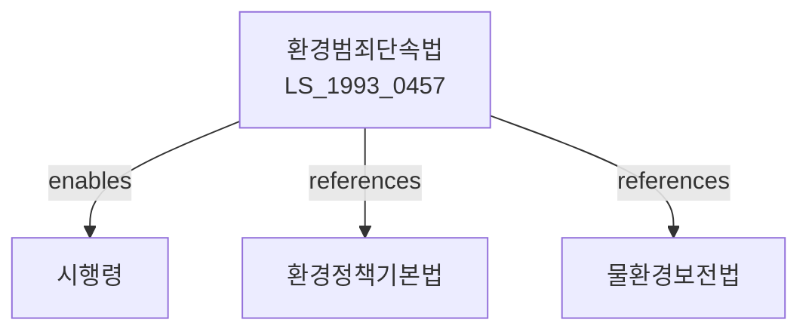

# 환경범죄等的 가중처벌等에 관한 법률

> [법률 제20087호, 2024. 1. 9., 일부개정]

---

---

## 제1장 총칙

### 제1조 (목적)

이 법은 환경오염을 유발하는 행위에 대한 형사처벌을 가중하고 환경범죄에 대한 수사 및 공판 절차 등에 관한 특례를 정함으로써 국민의 건강과 환경을 보호하고 국가의 환경보전에 이바지함을 목적으로 한다.

### 제2조 (정의)

이 법에서 사용하는 용어의 뜻은 다음과 같다.

1. "환경범죄"란 환경오염을 유발하는 행위로서 처벌받는 범죄를 말한다.
2. "환경오염물질"이란 대기오염물질, 수질오염물질, 토양오염물질 등을 말한다.
3. "배출시설"이란 환경오염물질을 배출하는 시설을 말한다。

---

## 제2장 환경범죄에 대한 가중처벌

### 第3条 (가중처벌)

환경범죄를 범한 자에 대하여는 다른 법률에 따른 벌칙에 불구하고 다음 각 호의 구분에 따라 가중하여 처벌한다.

1. 환경오염으로 인하여 사람이 사망하게 한 자: 무기 또는 5년 이상의 징역
2. 환경오염으로 인하여 사람이 상해를 입게 한 자: 1년 이상의 징역 또는 5천만원 이상의 벌금
3. 환경오염으로 인하여 공중의 건강에 위해를 끼친 자: 3년 이상의 징역 또는 2천만원 이상의 벌금

### 第4条 (미수범)

제3조의 죄의 미수범은 처벌한다。

### 第5条 (과실범)

제3조의 죄는 과실로도 범할 수 있다.

---

## 제3장 환경범죄에 대한 수사 등

### 第10条 (환경범죄 수사)

① 검사 또는 사법경찰관은 환경범죄를 수사하는 경우 환경전문가의 의견을 들을 수 있다.

② 환경전문가의 자격요건 등에 관하여 필요한 사항은 대통령령으로 정한다。

### 第11条 (환경오염의 측정)

① 환경범죄의 수사에 있어 환경오염의 정도를 측정하여야 하는 경우 환경부장관 또는 그가 지정하는 기관이 측정한다.

② 측정의 방법 및 절차 등에 관하여 필요한 사항은 환경부령으로 정한다。

### 第12条 (영장발부의 특례)

법관은 환경범죄에 대하여는 범죄의 혐의가 있다고 인정할 만한 상당한 이유가 있는 때에도 영장을 발부할 수 있다。

---

## 제4장 환경개선부담금

### 第15条 (환경개선부담금)

① 환경부장관은 환경범죄를 범한 자에 대하여 환경개선부담금을 부과할 수 있다.

② 환경개선부담금의 부과기준 및 절차 등에 관하여 필요한 사항은 대통령령으로 정한다。

---

## 제5장 벌칙

### 第16条 (양벌규정)

법인의 대표자 또는 법인이나 개인의 대리인ㆍ사용인 기타 종업원이 그 법인 또는 개인의 업무에 관하여 제3조의 위반행위를 한 때에는 행위자를 벌하는 외에 그 법인 또는 개인에 대하여도 각 해당 조의 벌금형을 과한다。

---

## 관계 그래프

**상위 법령**
- [[헌법]] 제35조 (환경권)
- [[환경정책기본법]]

**관련 법령**
- [[물환경보전법]]
- [[대기환경보전법]]
- [[폐기물관리법]]
- [[토양환경보전법]]
- [[야생생물 보호 및 관리에 관한 법률]]

**하위 법령**
- [[환경범죄단속법 시행령]]
