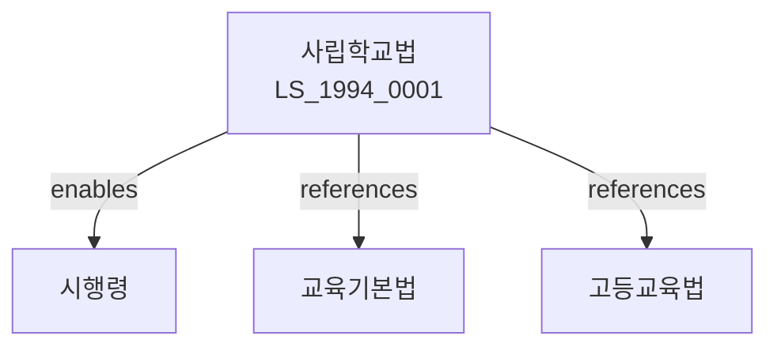

# 사립학교법

> [법률 제20102호, 2024. 1. 9., 일부개정]

---

---

## 제1장 총칙

### 제1조 (목적)

이 법은 사립학교의 특수성에 비추어 그 자주성과 공공성을 높이고 건전한 발전을 도모함을 목적으로 한다。

### 제2조 (정의)

이 법에서 사용하는 용어의 뜻은 다음과 같다。

1. "사립학교"이란 학교법인이 설치ㆍ경영하는 학교를 말한다。
2. "학교법인"이란 사립학교를 설치ㆍ경영하기 위하여 설립된 법인을 말한다。
3. "이사장"이란 학교법인의 대표자를 말한다。
4. "학교의 장"이란 당해 학교의 장을 말한다。

---

## 제2장 학교법인

### 第5条 (학교법인의 설립)

학교법인은 교육부장관의 인가를 받아 설립한다。

### 第6条 (설립요건)

설립요건은 다음 각 호와 같다。

1. 정관
2. 재산
3. 발기인

### 第7条 (정관)

정관에는 다음 각 호의 사항을 기재하여야 한다。

1. 목적
2. 명칭
3. 사무소의 소재지
4. 자산 및 회계

### 第8条 (등기)

학교법인은 설립등기를 하여야 한다。

---

## 제3장 기관

### 第15条 (이사회)

학교법인은 이사회를 둔다。

### 第16条 (이사회의 권한)

이사회는 다음 각 호의 사항을 의결한다。

1. 예산 및 결산
2. 기본재산의 관리
3. 정관변경

### 第17条 (이사)

이사는 정관으로 정한 수로 한다。

### 第18条 (감사)

학교법인은 감사를 둔다。

---

## 제4장 재산 및 회계

### 第25条 (기본재산)

학교법인은 기본재산을 관리한다。

### 第26条 (기본재산의 처분)

기본재산의 처분은 관할청의 인가를 받아야 한다。

### 第27条 (회계)

학교법인은 회계를 작성한다。

### 第28条 (예산 및 결산)

예산 및 결산은 이사회의 의결을 거쳐야 한다。

---

## 제5장 사립학교의 교원

### 第35条 (교원의 임면)

교원은 이사회의 의결을 거쳐 학교의 장이 임면한다。

### 第36条 (교원의 자격)

교원은 자격을 갖추어야 한다。

### 第37条 (교원의 신분보장)

교원은 신분이 보장된다。

### 第38条 (징계)

교원을 징계할 수 있다。

---

## 제6장 수익사업

### 第45条 (수익사업)

학교법인은 수익사업을 할 수 있다。

### 第46条 (수익사업의 종류)

수익사업의 종류는 대통령령으로 정한다。

### 第47条 (수익금의 사용)

수익금은 학교경영에 사용하여야 한다。

### 第48条 (수익사업의 보고)

수익사업에 대하여 보고하여야 한다。

---

## 제7장 감독

### 第55条 (감독)

교육부장관은 사립학교를 감독한다。

### 第56条 (보고 및 검사)

교육부장관은 필요한 경우 보고를 명하거나 검사할 수 있다。

### 第57条 (시정명령)

교육부장관은 이 법을 위반한 자에 대하여 시정명령을 할 수 있다。

### 第58条 (인가취소)

교육부장관은 중대한 위반사유가 있는 경우 인가를 취소할 수 있다。

---

## 제8장 벌칙

### 第65条 (벌칙)

다음 각 호의 어느 하나에 해당하는 자는 3년 이하의 징역 또는 3천만원 이하의 벌금에 처한다。

1. 허위로 인가를 받은 자
2. 재산을 유용한 자

### 第66条 (과태료)

다음 각 호의 어느 하나에 해당하는 자에게는 1천만원 이하의 과태료를 부과한다。

1. 정당한 사유 없이 보고를 하지 아니한 자
2. 이사회를 소집하지 아니한 자

---

## 관계 그래프

**상위 법령**
- [[헌법]] 제31조 (교육권)
- [[교육기본법]]

**관련 법령**
- [[초중등교육법]]
- [[고등교육법]]
- [[사회복지사업법]]
- [[세법]]

**하위 법령**
- [[사립학교법 시행령]]
