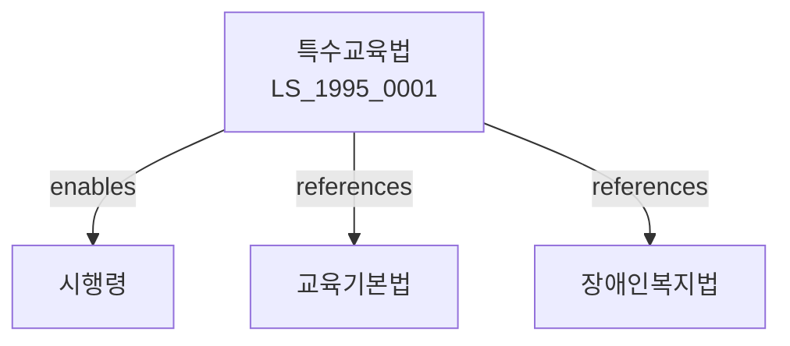

# 특수교육법

> [법률 제20103호, 2024. 1. 9., 일부개정]

---

---

## 제1장 총칙

### 제1조 (목적)

이 법은 특수교육대상자의 교육에 관한 사항을 정함으로써 그들의 잠재능력을 계발하고 사회참여에 이바지함을 목적으로 한다。

### 제2조 (정의)

이 법에서 사용하는 용어의 뜻은 다음과 같다。

1. "특수교육"이란 특수교육대상자에게 실시하는 교육을 말한다。
2. "특수교육대상자"란 장애인 등 특별한 교육적 필요가 있는 자를 말한다。
3. "특수학교"란 특수교육을 실시하는 학교를 말한다。
4. "특수학급"이란 일반학교에 설치된 특수교육을 위한 학급을 말한다。

---

## 제2장 특수교육대상자

### 第5条 (특수교육대상자의 선정)

특수교육대상자는 선정위원회의 심의를 거쳐 선정한다。

### 第6条 (선정기준)

선정기준은 다음 각 호와 같다。

1. 시각장애
2. 청각장애
3. 지적장애
4. 지체장애
5. 정서ㆍ행동장애
6. 자폐성장애
7. 의사소통장애
8. 학습장애

### 第7条 (선정절차)

선정절차는 대통령령으로 정한다。

### 第8条 (재선정)

특수교육대상자를 재선정할 수 있다。

---

## 제3장 특수교육의 실시

### 第15条 (유치원교육)

특수교육은 유치원교육부터 실시한다。

### 第16条 (초등교육)

특수교육은 초등교육을 실시한다。

### 第17条 (중등교육)

특수교육은 중등교육을 실시한다。

### 第18条 (고등교육)

특수교육은 고등교육을 실시할 수 있다。

---

## 제4章 특수교육기관

### 第25条 (특수학교)

특수학교를 설립한다。

### 第26条 (특수학급)

일반학교에 특수학급을 설치할 수 있다。

### 第27条 (순회교육)

순회교육을 실시할 수 있다。

### 第28条 (통합교육)

통합교육을 지원한다。

---

## 제5장 교원

### 第35条 (특수교육교원)

특수교육교원은 자격을 갖추어야 한다。

### 第36条 (자격인정)

특수교육교원 자격은 교육부장관이 인정한다。

### 第37条 (연수)

특수교육교원은 연수를 받아야 한다。

### 第38条 (정원)

특수교육교원의 정원은 따로 정한다。

---

## 제6장 지원

### 第45条 (교육비)

특수교육대상자의 교육비를 지원한다。

### 第46条 (교재ㆍ교구)

교재와 교구를 지원한다。

### 第47条 (치료교육)

치료교육을 지원한다。

### 第48条 (진로지도)

진로지도를 실시한다。

---

## 제7장 감독

### 第55条 (감독)

교육부장관은 특수교육을 감독한다。

### 第56条 (보고 및 검사)

교육부장관은 필요한 경우 보고를 명하거나 검사할 수 있다。

### 第57条 (시정명령)

교육부장관은 이 법을 위반한 자에 대하여 시정명령을 할 수 있다。

### 第58条 (과태료)

다음 각 호의 어느 하나에 해당하는 자에게는 과태료를 부과한다。

1. 정당한 사유 없이 보고를 하지 아니한 자
2. 특수교육대상자를 차별한 자

---

## 제8장 벌칙

### 第65条 (과태료)

다음 각 호의 어느 하나에 해당하는 자에게는 1천만원 이하의 과태료를 부과한다。

1. 정당한 사유 없이 보고를 하지 아니한 자
2. 특수교육대상자의 권리를 침해한 자

---

## 관계 그래프

**상위 법령**
- [[헌법]] 제31조 (교육권), 제34조 (장애인보호)
- [[교육기본법]]

**관련 법령**
- [[장애인복지법]]
- [[장애인차별금지법]]
- [[초중등교육법]]
- [[고등교육법]]

**하위 법령**
- [[특수교육법 시행령]]
