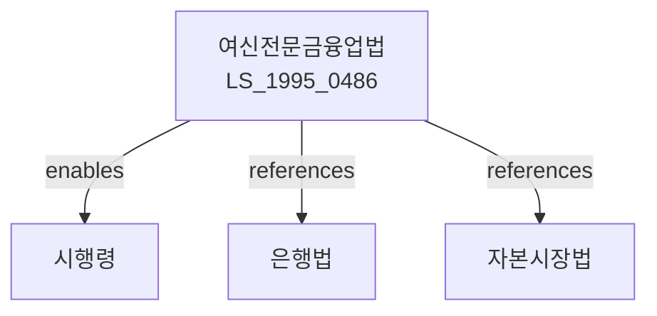

# 여신전문금융업법

> [법률 제20084호, 2024. 1. 9., 일부개정]

---

---

## 제1장 총칙

### 제1조 (목적)

이 법은 여신전문금융업을 영위하는 자에 대한 등록ㆍ감독 등에 관한 사항을 정하여 건전한 신용질서를 확립하고 금융산업의 발전과 국민경제의 성장에 이바지함을 목적으로 한다。

### 제2조 (정의)

이 법에서 사용하는 용어의 뜻은 다음과 같다。

1. "여신전문금융업"이란 신용카드업, 시설대여업, 할부금융업 및 신용대출업을 말한다。
2. "신용카드업"이란 신용카드를 발행하여 가맹점으로부터 수수료를 받고 회원에게 자금을 대부하는 업무를 말한다.
3. "시설대여업"이란 기계ㆍ설비 등을 임대하는 업무를 말한다.
4. "할부금융업"이란 물품 또는 용역의 구입자금을 융통하는 업무를 말한다.
5. "신용대출업"이란 담보 없이 신용에 의거하여 자금을 대부하는 업무를 말한다。

---

## 제2장 여신전문금융업의 등록

### 第3条 (등록)

① 여신전문금융업을 영위하려는 자는 금융위원회에 등록하여야 한다.

② 제1항에 따른 등록의 요건은 다음 각 호와 같다.

1. 자본금이 200억원 이상일 것(신용카드업의 경우 500억원 이상)
2. 건전한 경영기반을 갖출 것
3. 그 밖에 대통령령으로 정하는 요건

### 第4条 (결격사유)

다음 각 호의 어느 하나에 해당하는 자는 여신전문금융업의 등록을 할 수 없다。

1. 금치산자 또는 한정치산자
2. 파산자로서 복권되지 아니한 자
3. 이 법 또는 다른 금융관계법률을 위반하여 징역형을 선고받은 후 3년이 지나지 아니한 자

---

## 제3장 영업

### 第10条 (영업범위)

① 신용카드업자는 다음 각 호의 업무를 영위할 수 있다。

1. 신용카드의 발행 및 관리
2. 가맹점의 모집 및 관리
3. 자금대부 및 결제대금 지급
4. 그 밖에 금융위원회가 정하는 업무

② 시설대여업자는 다음 각 호의 업무를 영위할 수 있다.

1. 기계ㆍ설비의 임대
2. 할부판매
3. 그 밖에 금융위원회가 정하는 업무

### 第11条 (신용카드 발행)

① 신용카드업자는 회원의 신용도를 심사하여 신용카드를 발행하여야 한다.

② 신용카드의 발행기준 등에 관하여 필요한 사항은 금융위원회가 정한다。

### 第12条 (가맹점 모집)

① 신용카드업자는 물품 또는 용역을 판매하는 자를 가맹점으로 모집할 수 있다.

② 가맹점 모집의 기준 및 수수료 등에 관한 사항은 금융위원회가 정한다。

---

## 제4장 건전성 규제

### 第20条 (자기자본비율)

여신전문금융업자는 자기자본비율을 100분의 8 이상으로 유지하여야 한다.

### 第21条 (여신한도)

여신전문금융업자는 동일인에 대하여 자기자본의 100분의 20을 초과하여 여신을 제공할 수 없다.

### 第22条 (유동성 비율)

여신전문금융업자는 유동성 비율을 100분의 30 이상으로 유지하여야 한다.

### 第23条 (대손충당금)

여신전문금융업자는 대출채권의 회수불능에 대비하여 대손충당금을 적립하여야 한다.

---

## 제5장 감독

### 第30条 (보고 및 검사)

① 금융위원회는 필요한 경우 여신전문금융업자에 대하여 보고를 하게 하거나 검사를 할 수 있다.

② 여신전문금융업자는 제1항에 따른 보고 또는 검사에 협조하여야 한다.

### 第31条 (시정명령)

금융위원회는 여신전문금융업자가 이 법 또는 다른 법령을 위반한 경우 시정명령을 할 수 있다.

### 第32条 (영업정지)

금융위원회는 여신전문금융업자가 다음 각 호의 어느 하나에 해당하는 경우 6개월 이내의 영업정지를 할 수 있다.

1. 허위 기타 부정한 방법으로 등록을 한 경우
2. 건전성 규제를 위반한 경우
3. 그 밖에 영업정지가 필요한 경우

---

## 제6장 벌칙

### 第60条 (벌칙)

다음 각 호의 어느 하나에 해당하는 자는 3년 이하의 징역 또는 3천만원 이하의 벌금에 처한다.

1. 제3조에 따른 등록 없이 여신전문금융업을 영위한 자
2. 허위 기타 부정한 방법으로 등록을 한 자

### 第61条 (과태료)

다음 각 호의 어느 하나에 해당하는 자에게는 2천만원 이하의 과태료를 부과한다.

1. 제30조에 따른 보고를 하지 아니하거나 허위로 보고한 자
2. 제30조에 따른 검사를 거부 또는 방해한 자

---

## 관계 그래프

**상위 법령**
- [[은행법]]
- [[자본시장법]]

**관련 법령**
- [[여신전문금융업 감독규정]]
- [[할부거래법]]
- [[신용정보법]]
- [[대부업법]]

**하위 법령**
- [[여신전문금융업법 시행령]]
