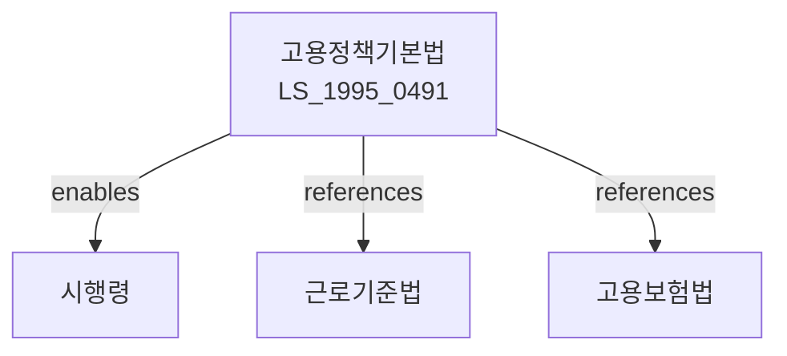

# 고용정책 기본법

> [법률 제20088호, 2024. 1. 9., 일부개정]

---

---

## 제1장 총칙

### 제1조 (목적)

이 법은 고용정책에 관한 국가 등의 책무와 노사의 역할을 명確히 하고, 고용안정과 직업능력개발 등에 관한 기본적인 사항을 정함으로써 근로자의 고용을 촉진하고 국민경제의 균형있는 발전에 이바지함을 목적으로 한다.

### 제2조 (정의)

이 법에서 사용하는 용어의 뜻은 다음과 같다.

1. "고용정책"이란 근로자의 고용안정과 직업능력개발ㆍ직업소개ㆍ직업지도 등에 관한 국가의 정책을 말한다.
2. "고용안정"이란 근로자의 실업예방과 재취업촉진을 말한다.
3. "직업능력개발"이란 근로자가 직업에 필요한 지식ㆍ기술ㆍ기능을 습득하고 향상시키는 것을 말한다.
4. "직업소개"란 구인자와 구직자를 연결하는 것을 말한다.

---

## 제2장 국가 등의 책무

### 第5条 (국가의 책무)

국가는 근로자의 고용을 안정시키고 직업능력을 개발하기 위하여 다음 각 호의 책무를 다한다.

1. 고용정책 기본계획의 수립 및 시행
2. 고용안정사업의 추진
3. 직업능력개발사업의 추진
4. 고용서비스의 제공
5. 고용보험제도의 운영

### 第6条 (지방자치단체의 책무)

지방자치단체는 국가의 고용정책에 따라 당해 지역의 특성에 맞는 고용대책을 수립ㆍ시행하여야 한다。

### 第7条 (사업주의 책무)

사업주는 근로자의 고용안정을 위하여 노력하여야 하며, 근로자의 직업능력개발을 위하여 교육훈련의 기회를 제공하도록 노력하여야 한다。

---

## 제3장 고용정책 기본계획

### 第10条 (기본계획의 수립)

① 고용노동부장관은 5년마다 고용정책 기본계획을 수립하여야 한다.

② 기본계획에는 다음 각 호의 사항이 포함되어야 한다.

1. 고용동향 및 전망
2. 고용안정에 관한 사항
3. 직업능력개발에 관한 사항
4. 고용서비스에 관한 사항
5. 그 밖에 고용정책에 필요한 사항

### 第11条 (고용동향조사)

① 고용노동부장관은 고용동향을 파악하기 위하여 조사를 실시할 수 있다.

② 조사의 방법 및 절차 등에 관하여 필요한 사항은 대통령령으로 정한다。

---

## 제4장 고용안정

### 第20条 (고용안정사업)

① 국가는 근로자의 고용안정을 위하여 다음 각 호의 사업을 실시한다.

1. 고용유지지원사업
2. 취직촉진사업
3. 직업전환지원사업
4. 지역고용촉진사업

② 사업의 내용 및 방법 등에 관하여 필요한 사항은 대통령령으로 정한다。

### 第21条 (고용유지지원)

국가는 경제상황의 변화 등으로 인하여 고용조정이 불가피한 사업주에 대하여 고용유지를 위한 지원을 할 수 있다。

---

## 제5장 직업능력개발

### 第30条 (직업능력개발사업)

① 국가는 근로자의 직업능력개발을 위하여 다음 각 호의 사업을 실시한다.

1. 직업훈련사업
2. 기능장려사업
3. 자격제도운영사업

② 사업의 내용 및 방법 등에 관하여 필요한 사항은 대통령령으로 정한다。

### 第31条 (직업훈련)

① 사업주는 근로자에 대하여 직업훈련을 실시할 수 있다.

② 국가는 직업훈련을 실시하는 사업주에 대하여 소요경비의 일부를 지원할 수 있다。

---

## 제6장 벌칙

### 第40条 (과태료)

다음 각 호의 어느 하나에 해당하는 자에게는 500만원 이하의 과태료를 부과한다。

1. 정당한 사유 없이 조사를 거부ㆍ기피한 자
2. 허위로 보고한 자

---

## 관계 그래프

**상위 법령**
- [[헌법]] 제32조 (근로의 권리)
- [[근로기준법]]

**관련 법령**
- [[고용보험법]]
- [[직업안정법]]
- [[직업능력개발법]]
- [[최저임금법]]
- [[남녀고용평등법]]

**하위 법령**
- [[고용정책기본법 시행령]]
