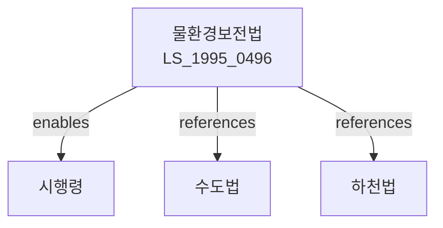

# 물환경보전법

> [법률 제20101호, 2024. 1. 9., 일부개정]

---

---

## 제1장 총칙

### 제1조 (목적)

이 법은 공공수역의 수질오염을 방지하고 물환경을 적정하게 관리하여 국민의 건강을 보호하고 생활환경을 보전함을 목적으로 한다。

### 제2조 (정의)

이 법에서 사용하는 용어의 뜻은 다음과 같다。

1. "공공수역"이란 하천, 호소, 항만, 연안해역 등 공중이 이용하는 물을 말한다.
2. "수질오염물질"이란 공공수역의 수질오염을 유발하는 물질로서 환경부령으로 정하는 것을 말한다.
3. "특정수질유해물질"이란 사람의 건강이나 생활환경에 위해를 끼칠 우려가 있는 수질오염물질로서 대통령령으로 정하는 것을 말한다。
4. "오염원"이란 수질오염물질을 배출하는 시설 또는 활동을 말한다.
5. "배출허용기준"이란 공공수역으로 배출할 수 있는 수질오염물질의 최대 농도 또는 양을 말한다.
6. "수계"란 하천의 본류와 그 지류 및 이에 유입되는 호소ㆍ저수지 등을 포함하는 물의 순환체계를 말한다.
7. "총량관리"란 수질환경기준을 달성하기 위하여 수계별로 수질오염물질의 배출량을 관리하는 것을 말한다。

---

## 제2장 수질환경기준 및 측정

### 제3조 (수질환경기준)

① 환경부장관은 공공수역의 수질을 보전하기 위하여 수질환경기준을 설정하여야 한다.

② 수질환경기준에는 다음 각 호의 사항이 포함되어야 한다.

1. 수소이온농도
2. 생물화학적산소요구량
3. 부유물질
4. 용존산소량
5. 대장균군수
6. 그 밖에 환경부령으로 정하는 사항

### 제4조 (수질측정)

① 환경부장관은 공공수역의 수질오염도를 파악하기 위하여 수질을 측정하여야 한다.

② 수질측정의 방법 및 횟수 등에 관하여 필요한 사항은 환경부령으로 정한다.

---

## 제3장 배출시설 및 방지시설

### 제10조 (배출시설의 설치신고)

① 배출시설을 설치하려는 자는 환경부령으로 정하는 바에 따라 시장ㆍ군수 또는 구청장에게 신고하여야 한다.

② 제1항에 따른 신고를 한 자가 배출시설을 변경하려는 경우에도 또한 같다。

### 제11조 (방지시설의 설치)

① 배출시설을 설치하려는 자는 배출시설에서 배출되는 수질오염물질을 처리하기 위하여 방지시설을 설치하여야 한다.

② 제1항에도 불구하고 다음 각 호의 어느 하나에 해당하는 경우에는 방지시설을 설치하지 아니할 수 있다.

1. 환경부령으로 정하는 바에 따라 폐수종말처리시설에 유입시키는 경우
2. 환경부령으로 정하는 바에 따라 수질오염물질을 배출하지 아니하는 경우

### 제12조 (배출허용기준)

① 누구든지 공공수역으로 배출하는 수질오염물질은 배출허용기준에 적합하여야 한다.

② 배출허용기준은 대통령령으로 정한다。

---

## 제4장 폐수종말처리시설

### 제25조 (폐수종말처리시설의 설치)

① 국가, 지방자치단체 또는 환경부장관이 지정하는 자는 폐수를 종말처리하기 위한 시설(이하 "폐수종말처리시설"이라 한다)을 설치ㆍ운영할 수 있다.

② 폐수종말처리시설의 설치기준 및 운영 등에 관하여 필요한 사항은 환경부령으로 정한다。

### 제26조 (폐수종말처리시설의 유료사용)

폐수종말처리시설을 사용하는 자는 대통령령으로 정하는 바에 따라 그 사용료를 납부하여야 한다。

---

## 제5장 총량관리

### 제30조 (총량관리의 실시)

① 환경부장관은 수질환경기준을 달성하기 위하여 필요한 수계에 대하여 총량관리를 실시할 수 있다.

② 총량관리의 대상 수계, 대상 오염물질 및 관리방법 등에 관하여 필요한 사항은 대통령령으로 정한다。

### 제31조 (총량관리기본계획)

① 환경부장관은 총량관리를 실시하는 수계에 대하여 총량관리기본계획을 수립하여야 한다.

② 총량관리기본계획에는 다음 각 호의 사항이 포함되어야 한다.

1. 대상 수계의 수질현황 및 오염원 조사
2. 목표수질 및 달성기간
3. 오염물질 삭감량 및 배출허용총량
4. 지역별 배출허용총량의 할당

---

## 제6장 비상조치

### 제40조 (비상조치)

① 공공수역의 수질오염으로 인하여 사람의 건강이나 생활환경에 중대한 위해를 끼칠 우려가 있는 때에는 환경부장관은 관계 행정기관의 장 또는 지방자치단체의 장에게 비상조치를 요청할 수 있다.

② 제1항에 따른 비상조치의 내용 및 절차 등에 관하여 필요한 사항은 대통령령으로 정한다。

---

## 제7장 벌칙

### 제70조 (벌칙)

다음 각 호의 어느 하나에 해당하는 자는 5년 이하의 징역 또는 5천만원 이하의 벌금에 처한다。

1. 제12조 제1항에 위반하여 배출허용기준을 초과하여 수질오염물질을 배출한 자
2. 제11조 제1항에 위반하여 방지시설을 설치하지 아니한 자

### 제71조 (과태료)

다음 각 호의 어느 하나에 해당하는 자에게는 500만원 이하의 과태료를 부과한다。

1. 제10조에 따른 배출시설 설치신고를 하지 아니한 자
2. 제4조에 따른 수질측정을 거부 또는 방해한 자

---

## 관계 그래프

**상위 법령**
- [[헌법]] 제35조 (환경권)
- [[환경정책기본법]]

**관련 법령**
- [[수도법]]
- [[하천법]]
- [[지하수법]]
- [[해양환경관리법]]

**하위 법령**
- [[물환경보전법 시행령]]
- [[물환경보전법 시행규칙]]
