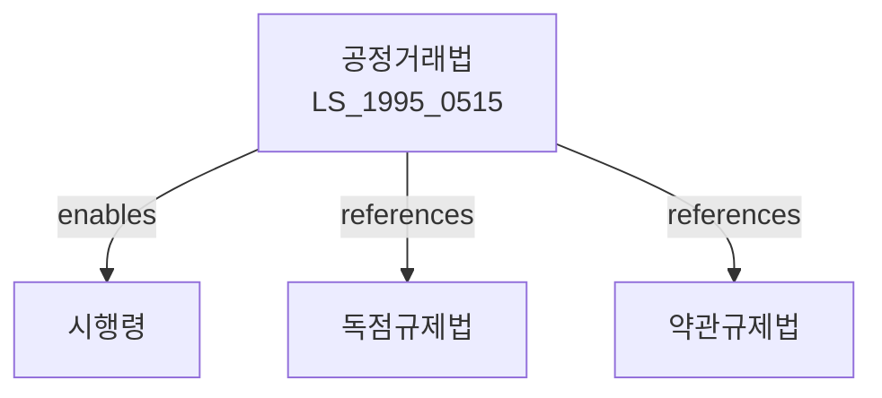

# 공정거래법

> [법률 제20091호, 2024. 1. 9., 일부개정]

---

---

## 제1장 총칙

### 제1조 (목적)

이 법은 공정하고 자유로운 경쟁을 촉진하기 위하여 부당한 공동행위, 기업결합의 제한, 불공정거래행위 등을 규제하고 사업자단체의 경쟁제한행위를 금지하며 재판매가격 유지행위와 경쟁사업자의 임원 겸임 등을 제한함으로써 국민경제의 균형있는 발전에 이바지함을 목적으로 한다。

### 제2조 (정의)

이 법에서 사용하는 용어의 뜻은 다음과 같다。

1. "사업자"란 제조업, 판매업, 서비스업 등의 사업을 영위하는 자를 말한다。
2. "사업자단체"란 사업자가 주체가 되어 조직된 단체를 말한다。
3. "경쟁제한행위"란 경쟁을 실질적으로 제한하거나 제한할 우려가 있는 행위를 말한다。
4. "부당한 공동행위"란 사업자가 공동으로 가격을 결정하거나 거래조건을 정하는 등 경쟁을 제한하는 행위를 말한다。
5. "불공정거래행위"란 경쟁사업자를 배제하거나 소비자를 속이는 등 공정한 거래질서를 해치는 행위를 말한다。

---

## 제2장 독점금지

### 제3조 (시장지배적 지위의 남용금지)

① 시장지배적 사업자는 다음 각 호의 행위를 하여서는 아니 된다。

1. 부당하게 가격을 결정ㆍ유지 또는 인상하는 행위
2. 부당하게 상품의 공급을 조절하거나 거래 상대방의 선택을 제한하는 행위
3. 부당하게 경쟁사업자의 사업활동을 방해하는 행위

② 시장지배적 사업자의 범위 및 시장지배적 지위의 남용행위에 관하여 필요한 사항은 대통령령으로 정한다。

### 제4조 (기업결합의 제한)

① 사업자는 경쟁을 실질적으로 제한하는 기업결합을 하여서는 아니 된다。

② 기업결합이란 다음 각 호의 어느 하나에 해당하는 것을 말한다。

1. 다른 사업자의 주식을 취득하는 것
2. 다른 사업자의 임원을 겸임하는 것
3. 다른 사업자와 합병하는 것
4. 다른 사업자의 영업을 양수하는 것

---

## 제3장 카르텔 금지

### 第10条 (부당한 공동행위의 금지)

사업자는 계약, 협정 그 밖의 방법으로 다른 사업자와 공동으로 다음 각 호의 행위를 하여서는 아니 된다。

1. 가격을 결정ㆍ유지 또는 인상하는 행위
2. 상품의 생산ㆍ출고량을 조절하는 행위
3. 거래지역 또는 거래상대방을 제한하는 행위
4. 경쟁을 방해하는 행위

### 第11条 (사업자단체의 금지행위)

사업자단체는 다음 각 호의 행위를 하여서는 아니 된다。

1. 구성원의 사업내용에 관하여 부당하게 제한하는 행위
2. 구성원의 공동행위를 유인 또는 강요하는 행위
3. 경쟁을 제한하는 행위

---

## 제4장 불공정거래행위

### 第20条 (불공정거래행위의 금지)

사업자는 다음 각 호의 불공정거래행위를 하여서는 아니 된다。

1. 거래상대방을 부당하게 차별하는 행위
2. 거래상대방에게 부당하게 경쟁사업자와의 거래를 금지하는 행위
3. 거래상대방에게 부당하게 이익을 제공하게 하는 행위
4. 거래상대방을 기망하여 거래하는 행위
5. 거래상대방의 의사에 반하여 거래를 강요하는 행위

---

## 제5장 재판매가격 유지

### 第25条 (재판매가격 유지행위의 금지)

사업자는 재판매업자에게 상품의 판매가격을 유지하도록 강요하여서는 아니 된다。다만, 저작권법에 따른 저작물 및 다음 각 호의 요건을 갖춘 상품은 그러하지 아니하다。

1. 해당 상품의 제조업자가 최초로 판매하는 것
2. 소비자에게 널리 알려진 것
3. 품질이 균일한 것

---

## 제6장 공정거래위원회

### 第30条 (설치)

① 공정거래에 관한 중요 사항을 심의ㆍ의결하기 위하여 공정거래위원회를 둔다。

② 공정거래위원회는 위원장 1명을 포함한 9명의 위원으로 구성한다。

### 第31条 (직권)

공정거래위원회는 다음 각 호의 직권을 가진다。

1. 위법행위의 조사 및 시정조치
2. 과징금의 부과
3. 공정거래에 관한 제도 개선

---

## 제7장 벌칙

### 第60条 (벌칙)

다음 각 호의 어느 하나에 해당하는 자는 3년 이하의 징역 또는 2억원 이하의 벌금에 처한다。

1. 제3조에 따른 시장지배적 지위의 남용행위를 한 자
2. 제4조에 따른 기업결합의 제한을 위반한 자
3. 제10조에 따른 부당한 공동행위를 한 자

### 第61条 (과징금)

공정거래위원회는 이 법을 위반한 자에게 관련 매출액의 100분의 10 이하에 해당하는 과징금을 부과할 수 있다。

---

## 관계 그래프

**상위 법령**
- [[헌법]] 제119조 (경제질서)
- [[민법]] 제3조 (사적자치)

**관련 법령**
- [[독점규제 및 공정거래에 관한 법률]]
- [[약관의 규제에 관한 법률]]
- [[소비자기본법]]
- [[하도급거래 공정화에 관한 법률]]
- [[유통산업발전법]]

**하위 법령**
- [[공정거래법 시행령]]
