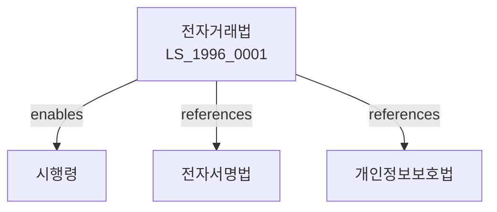

# 전자거래법

> [법률 제20104호, 2024. 1. 9., 일부개정]

---

---

## 제1장 총칙

### 제1조 (목적)

이 법은 전자거래의 안전성과 신뢰성을 확보하고 전자거래의 건전한 발전을 도모함으로써 국민경제의 발전에 이바지함을 목적으로 한다。

### 제2조 (정의)
이 법에서 사용하는 용어의 뜻은 다음과 같다。
1. "전자거래"란 전자적 방법에 의하여 재화 또는 용역을 거래하는 것을 말한다。
2. "전자문서"란 전자적 방법에 의하여 작성된 문서를 말한다.
3. "전자서명"이란 전자적 방법에 의하여 서명하는 것을 말한다。
4. "전자거래당사자"란 전자거래를 업으로 하는 자를 말한다。
---
## 제2장 전자거래의 안전성
### 第5条 (전자거래의 안전성)
전자거래는 안전하게 이루어져야 한다。
### 第6条 (전자서명의 효력)
전자서명은 서명 또는 날인의 효력을 가진다。
### 第7条 (전자문서의 효력)
전자문서는 서면문서와 동일한 효력을 가진다。
### 第8条 (전자거래의 증거)
전자거래의 증거는 전자적 형태로 보존할 수 있다。
---
## 제3장 전자거래당사자
### 第15条 (전자거래당사자의 의무)
전자거래당사자는 다음 각 호의 의무를 진다。
1. 전자거래의 안전성 확보
2. 정보의 보호
3. 기밀의 유지
4. 이용자의 권익보호
### 第16条 (전자거래의 안전성 확보)
전자거래당사자는 보안대책을 수립ㆍ시행하여야 한다。
### 第17条 (정보의 보호)
전자거래당사자는 정보를 보호하여야 한다.
### 第18条 (이용자의 보호)
전자거래당사자는 이용자를 보호하여야 한다.
---
## 제4장 전자거래의 촉진
### 第25条 (전자거래촉진)
국가는 전자거래를 촉진한다.
### 第26条 (인증제도)
전자서명의 신뢰성을 확보하기 위하여 인증제도를 운영한다.
### 第27条 (암호화)
전자거래의 안전성을 위하여 암호화 기술을 활용한다.
### 第28条 (표준화)
전자거래의 표준화를 추진한다.
---
## 제5장 소비자보호
### 第35条 (소비자보호)
전자거래에서 소비자를 보호한다.
### 第36条 (청약철회권)
전자거래에서도 청약철회권이 적용된다.
### 第37条 (피해보상)
전자거래로 인한 피해를 보상한다.
### 第38条 (분쟁조정)
전자거래 분쟁을 조정한다.
---
## 제6장 전자결제
### 第45条 (전자결제)
전자적 방법에 의한 결제를 인정한다.
### 第46条 (전자화폐)
전자화폐의 발행과 유통을 규제한다.
### 第47条 (전자자금이체)
전자자금이체를 관리한다.
### 第48条 (결제안전)
결제의 안전을 확보한다.
---
## 제7장 감독
### 第55条 (감독)
산업통상자원부장관은 전자거래를 감독한다.
### 第56条 (보고 및 검사)
산업통상자원부장관은 필요한 경우 보고를 명하거나 검사할 수 있다.
### 第57条 (시정명령)
산업통상자원부장관은 이 법을 위반한 자에 대하여 시정명령을 할 수 있다.
### 第58条 (영업정지)
산업통상자원부장관은 이 법을 위반한 자에 대하여 영업정지를 명할 수 있다.
---
## 제8장 벌칙
### 第65条 (벌칙)
다음 각 호의 어느 하나에 해당하는 자는 3년 이하의 징역 또는 3천만원 이하의 벌금에 처한다.
1. 허위로 전자거래를 한 자
2. 전자서명을 위조한 자
3. 기밀을 누설한 자
### 第66条 (과태료)
다음 각 호의 어느 하나에 해당하는 자에게는 1천만원 이하의 과태료를 부과한다.
1. 정당한 사유 없이 보고를 하지 아니한 자
2. 정보를 보호하지 아니한 자
---
## 관계 그래프
**상위 법령**
- [[헌법]] 제23조 (재산권)
- [[전자서명법]]
**관련 법령**
- [[개인정보보호법]]
- [[정보통신망법]]
- [[전자금융거래법]]
- [[소비자기본법]]
**하위 법령**
- [[전자거래법 시행령]]
