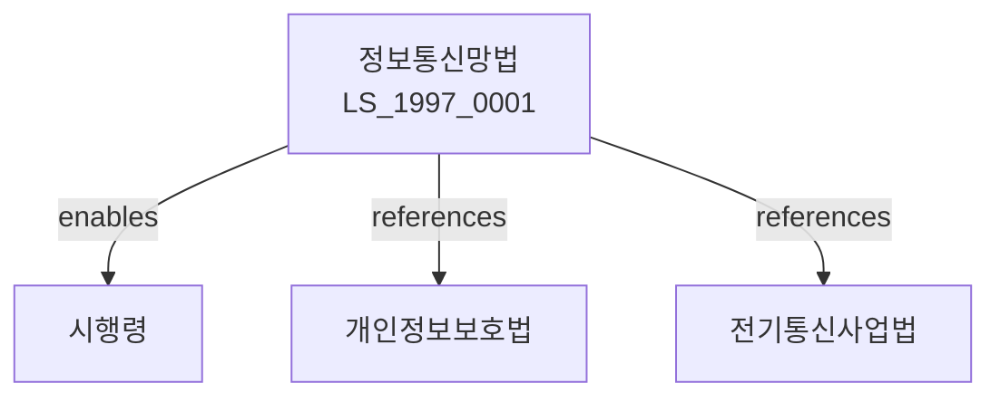

# 정보통신망법
> [법률 제20105호, 2024. 1. 9., 일부개정]

---

---

## 제1장 총칙
### 제1조 (목적)
이 법은 정보통신망의 안정적 관리와 이용의 효율화를 도모함으로써 국민경제의 발전에 이바지함을 목적으로 한다。
### 제2조 (정의)
이 법에서 사용하는 용어의 뜻은 다음과 같다。
1. "정보통신망"이란 정보통신설비를 이용하여 정보를 수집ㆍ처리하는 체계를 말한다.
2. "정보통신서비스"란 정보통신망을 이용하여 제공되는 서비스를 말한다.
3. "정보통신사업자"란 정보통신서비스를 제공하는 사업자를 말한다.
4. "이용자"란 정보통신서비스를 이용하는 자를 말한다。
---
## 제2장 정보통신망의 안정성
### 第5条 (정보통신망의 안정성)
정보통신망은 안정적으로 관리되어야 한다。
### 第6条 (정보의 보호)
정보통신망을 통해 유통되는 정보는 보호되어야 한다.
### 第7条 (비밀의 보호)
통신비밀은 침해해서는 아니 된다.
### 第8条 (안전성 확보)
정보통신사업자는 보안대책을 수립하여야 한다.
---
## 제3장 정보통신사업
### 第15条 (정보통신사업의 등록)
정보통신사업을 하려는 자는 과학기술정보통신부장관에게 등록하여야 한다.
### 第16条 (등록요건)
등록요건은 다음 각 호와 같다.
1. 시설의 확보
2. 기술능력의 보유
3. 재무능력의 확보
### 第17条 (등록결격사유)
다음 각 호의 어느 하나에 해당하는 자는 등록할 수 없다.
1. 금치산자 또는 한정치산자
2. 파산자로서 복권되지 아니한 자
3. 이 법을 위반하여 등록취소 후 2년이 지나지 아니한 자
### 第18条 (등록의 유효기간)
등록의 유효기간은 대통령령으로 정한다。
---
## 제4장 이용자 보호
### 第25条 (이용자 보호)
정보통신사업자는 이용자를 보호하여야 한다.
### 第26条 (개인정보 보호)
이용자의 개인정보를 보호하여야 한다.
### 第27条 (청약철회)
이용자는 청약을 철회할 수 있다.
### 第28条 (피해보상)
정보통신망 이용으로 인한 피해를 보상한다.
---
## 제5장 정보의 유통
### 第35条 (정보의 유통)
정보는 자유롭게 유통되어야 한다.
### 第36条 (불건전정보의 유통제한)
불건전한 정보의 유통을 제한한다.
### 第37条 (스팸메일의 금지)
스팸메일의 전송을 금지한다.
### 第38条 (개인정보의 유통)
개인정보의 유통은 본인의 동의를 받아야 한다.
---
## 제6장 감독
### 第45条 (감독)
과학기술정보통신부장관은 정보통신사업을 감독한다.
### 第46条 (보고 및 검사)
과학기술정보통신부장관은 필요한 경우 보고를 명하거나 검사할 수 있다.
### 第47条 (영업정지)
과학기술정보통신부장관은 이 법을 위반한 자에 대하여 영업정지를 명할 수 있다.
### 第48条 (등록취소)
과학기술정보통신부장관은 중대한 위반사유가 있는 경우 등록을 취소할 수 있다.
---
## 제7장 벌칙
### 第55条 (벌칙)
다음 각 호의 어느 하나에 해당하는 자는 3년 이하의 징역 또는 3천만원 이하의 벌금에 처한다。
1. 등록 없이 정보통신사업을 한 자
2. 통신비밀을 침해한 자
3. 개인정보를 유출한 자
### 第56条 (과태료)
다음 각 호의 어느 하나에 해당하는 자에게는 1천만원 이하의 과태료를 부과한다.
1. 정당한 사유 없이 보고를 하지 아니한 자
2. 개인정보를 보호하지 아니한 자
---
## 관계 그래프
**상위 법령**
- [[헌법]] 제18조 (통신의 자유)
- [[전기통신사업법]]
**관련 법령**
- [[개인정보보호법]]
- [[전자거래법]]
- [[방송법]]
- [[인터넷주소법]]
**하위 법령**
- [[정보통신망법 시행령]]
