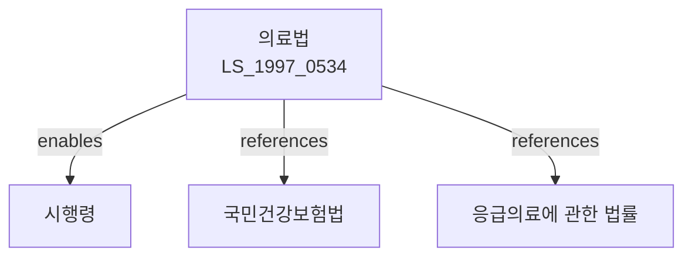

# 의료법

> [법률 제20089호, 2024. 1. 9., 일부개정]

---

---

## 제1장 총칙

### 제1조 (목적)

이 법은 의료를 제공하는 시설 및 인력에 관한 사항을 정하고 의료의 질을 향상시킴으로써 국민의 건강을 보호하고 증진함을 목적으로 한다.

### 제2조 (정의)

이 법에서 사용하는 용어의 뜻은 다음과 같다.

1. "의료"란 의사ㆍ치과의사ㆍ한의사ㆍ조산사 또는 간호사가 의학적 지식과 기술에 따라 행하는 질병의 예방ㆍ진단ㆍ치료 및 조산 등을 말한다.
2. "의료인"이란 의사ㆍ치과의사ㆍ한의사ㆍ조산사 및 간호사를 말한다.
3. "의료기관"이란 의료를 목적으로 하는 시설로서 보건복지부장관의 허가를 받은 것을 말한다.
4. "환자"란 의료를 필요로 하는 자를 말한다.

---

## 제2장 의료기관

### 第3条 (의료기관의 종류)

의료기관은 다음 각 호와 같이 구분한다.

1. 종합병원: 입원환자 100인 이상을 수용할 수 있는 시설을 갖춘 의료기관
2. 병원: 입원환자 30인 이상을 수용할 수 있는 시설을 갖춘 의료기관
3. 의원: 입원환자 30인 미만을 수용할 수 있는 시설을 갖춘 의료기관
4. 조산원: 조산사가 조산업무를 수행하는 시설
5. 보건소: 지방자치단체가 설치하는 보건의료기관

### 第4条 (의료기관의 개설)

① 의료기관을 개설하려는 자는 보건복지부장관의 허가를 받아야 한다.

② 허가의 기준 및 절차 등에 관하여 필요한 사항은 대통령령으로 정한다。

### 第5条 (의료기관의 명칭)

의료기관의 명칭은 대통령령으로 정하는 바에 따라 표시하여야 한다。

---

## 제3장 의료인

### 第10条 (의사)

① 의사가 되려는 자는 의사국가시험에 합격하고 보건복지부장관의 면허를 받아야 한다.

② 의사국가시험의 응시자격 및 방법 등에 관하여 필요한 사항은 대통령령으로 정한다。

### 第11条 (치과의사)

① 치과의사가 되려는 자는 치과의사국가시험에 합격하고 보건복지부장관의 면허를 받아야 한다。

### 第12条 (한의사)

① 한의사가 되려는 자는 한의사국가시험에 합격하고 보건복지부장관의 면허를 받아야 한다。

### 第13条 (간호사)

① 간호사가 되려는 자는 간호사국가시험에 합격하고 보건복지부장관의 면허를 받아야 한다。

---

## 제4장 의료인의 의무

### 第20条 (진료의무)

① 의료인은 진료를 요구하는 환자에 대하여 정당한 사유 없이 진료를 거부하지 못한다.

② 다만, 의료인의 전문분야가 아닌 경우에는 다른 의료기관으로의 이송을 권고할 수 있다。

### 第21条 (진료기록)

의료인은 환자에 대하여 진료기록부를 작성하고 이를 보존하여야 한다。

### 第22条 (비밀준수의무)

의료인은 직무상 알게 된 환자의 비밀을 누설하지 못한다.

### 第23条 (설명 및 동의)

의료인은 환자에게 진료의 내용 및 방법 등에 관하여 충분히 설명하고 동의를 받아야 한다.

---

## 제5장 의료광고

### 第30条 (의료광고의 제한)

① 의료기관의 개설자는 의료광고를 할 수 있다.

② 의료광고의 내용 및 방법 등에 관하여 필요한 사항은 보건복지부령으로 정한다.

### 第31条 (허위광고의 금지)

의료기관의 개설자는 허위 또는 과장된 광고를 하여서는 아니 된다.

---

## 제6장 감독

### 第40条 (감독)

① 보건복지부장관은 의료기관 및 의료인을 감독한다.

② 감독의 범위 및 방법 등에 관하여 필요한 사항은 대통령령으로 정한다。

### 第41条 (보고 및 검사)

보건복지부장관은 필요한 경우 의료기관의 개설자에게 보고를 명하거나 검사할 수 있다.

---

## 제7장 벌칙

### 第60条 (벌칙)

다음 각 호의 어느 하나에 해당하는 자는 5년 이하의 징역 또는 5천만원 이하의 벌금에 처한다.

1. 면허 없이 의료업을 영위한 자
2. 제22조에 따른 비밀준수의무를 위반한 자

### 第61条 (과태료)

다음 각 호의 어느 하나에 해당하는 자에게는 3천만원 이하의 과태료를 부과한다.

1. 제30조에 따른 광고규정을 위반한 자
2. 정당한 사유 없이 보고를 하지 아니한 자

---

## 관계 그래프

**상위 법령**
- [[헌법]] 제36조 (국민의 건강)
- [[국민건강보험법]]

**관련 법령**
- [[응급의료에 관한 법률]]
- [[약사법]]
- [[감염병 예방 및 관리에 관한 법률]]
- [[장애인복지법]]

**하위 법령**
- [[의료법 시행령]]
