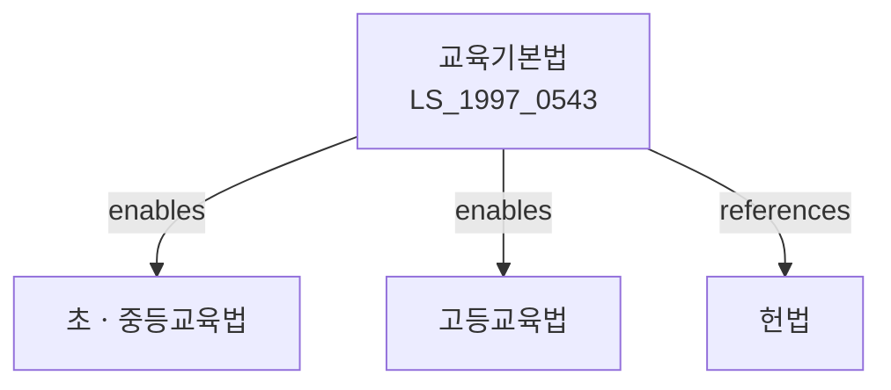

# 교육기본법

> [법률 제20206호, 2024. 2. 13., 일부개정]

---

---

## 제1장 총칙

### 제1조 (목적)

이 법은 교육에 관한 국민의 권리와 의무 및 국가와 지방자치단체의 책임을 정하고 교육제도의 기본 사항을 규정함으로써 교육의 본질을 실현하고 교육의 자주성ㆍ전문성ㆍ정치적 중립성 및 교육기회의 균등을 보장하여 민주시민을 양성하고 국가와 인류공동체의 발전에 이바지함을 목적으로 한다.

### 제2조 (교육의 이념)

교육은 홍익인간의 이념 아래 모든 국민으로 하여금 인격을 도야하고 자질을 계발하며, 국가와 국민을 사랑하는 민주시민으로서 국가발전과 인류공동체 번영에 이바지하게 함을 목적으로 한다.

### 제3조 (교육의 목표)

① 교육은 국민의 생활에 필요한 지식과 기능을 익히고 국어를 올바르게 사용하며, 국가와 민족의 문화를 계승ㆍ발전시키고 세계 문화에 공헌하게 함을 목표로 한다.

② 교육은 개인의 소질과 능력을 계발하고 인격을 도야하며, 자유ㆍ평등ㆍ박애의 정신을 함양하게 함을 목표로 한다.

③ 교육은 과학적 사고력과 창의력을 기르고 직업에 관한 지식과 기능을 익히게 함을 목표로 한다.

---

## 제2장 국민의 권리와 의무

### 제5조 (학습권)

① 모든 국민은 평생에 걸쳐 학습하고 그 능력과 적성에 따라 교육받을 권리를 가진다.

② 국가와 지방자치단체는 모든 국민이 교육받을 권리를 실현할 수 있도록 교육여건을 조성하여야 한다.

### 제6조 (의무교육)

① 국민은 초등교육 및 중등교육을 받을 의무를 진다.

② 의무교육은 무상으로 실시한다.

③ 의무교육의 연한 및 실시에 관한 사항은 따로 법률로 정한다.

### 제7조 (교육을 받을 기회)

① 모든 국민은 경제적 사회적 지위나 신분에 관계없이 그 능력에 따라 균등하게 교육받을 기회를 가진다.

② 국가와 지방자치단체는 모든 국민이 경제적 사회적 이유로 교육받을 기회를 박탈당하지 아니하도록 필요한 시책을 수립하여야 한다.

---

## 제3장 교육제도

### 제10조 (학제)

① 학교는 초등학교ㆍ중학교ㆍ고등학교ㆍ대학 등으로 구분한다.

② 제1항의 학교의 종류와 설치ㆍ운영 및 학교의 구조ㆍ편제 등에 관한 사항은 따로 법률로 정한다.

### 제11조 (학령기)

① 학령기는 6세부터 15세까지로 한다.

② 초등학교는 만 6세가 된 날이 속하는 해의 다음 해 3월 1일에 입학한다.

### 제12조 (평생교육)

① 국가와 지방자치단체는 모든 국민이 평생에 걸쳐 학습할 수 있도록 평생교육을 진흥하여야 한다.

② 평생교육에 관한 사항은 따로 법률로 정한다.

### 제13조 (특수교육)

① 국가와 지방자치단체는 특수교육대상자에게 유치원ㆍ초등학교ㆍ중학교 및 고등학교 과정의 교육을 실시하여야 한다.

② 특수교육에 관한 사항은 따로 법률로 정한다.

---

## 제4장 교육재정

### 제20조 (교육재정의 확보)

국가와 지방자치단체는 교육을 위한 시설ㆍ설비를 확충하고 교육환경을 개선하며 교원의 처우를 향상하기 위하여 교육재정을 확보하여야 한다.

### 제21조 (의무교육비)

의무교육에 필요한 교육비는 국가와 지방자치단체가 부담한다.

### 제22조 (교육재정 교부금)

① 국가는 지방자치단체의 교육행정에 소요되는 경비를 교부하기 위하여 교육재정교부금을 교부한다.

② 교육재정교부금의 교부기준 및 방법 등에 관한 사항은 따로 법률로 정한다.

---

## 제5장 보칙

### 제30조 (교육의 자주성ㆍ전문성ㆍ정치적 중립성)

교육은 그 본질에 따라 자주적으로 전문성과 정치적 중립성을 갖추어 실시되어야 한다.

### 제31조 (다른 법률과의 관계)

이 법에 규정된 사항에 관하여는 다른 법률의 규정에 불구하고 이 법이 정하는 바에 따른다.

---

## 관계 그래프

**상위 법령**
- [[헌법]] 제29조 (교육받을 권리) 및 제31조 (의무교육)

**관련 법령**
- [[초ㆍ중등교육법]]
- [[고등교육법]]
- [[평생교육법]]
- [[특수교육법]]
- [[유아교육법]]

**하위 법령**
- [[교육기본법 시행령]]
