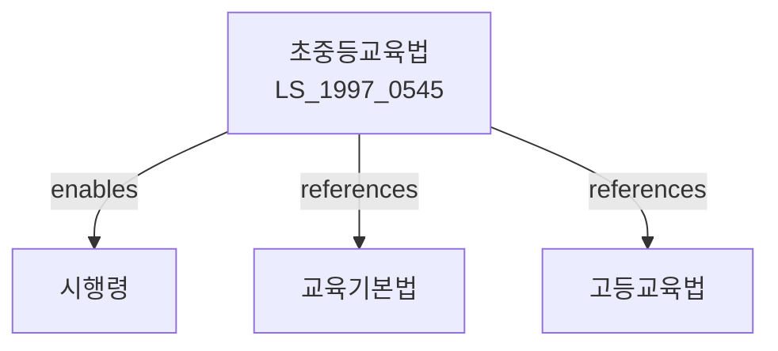

# 초ㆍ중등교육법

> [법률 제20103호, 2024. 1. 9., 일부개정]

---

---

## 제1장 총칙

### 제1조 (목적)

이 법은 초등학교ㆍ중학교 및 고등학교의 교육제도와 그 운영에 관한 기본적인 사항을 정함으로써 국민의 기본적 교육권을 보장하고 민주시민으로서의 자질을 함양함을 목적으로 한다。

### 제2조 (정의)

이 법에서 사용하는 용어의 뜻은 다음과 같다。

1. "초등학교"란 국민생활에 필요한 기초적인 초등보통교육을 하는 학교를 말한다。
2. "중학교"란 국민생활에 필요한 중등보통교육을 하는 학교를 말한다。
3. "고등학교"란 국민생활에 필요한 중등교육 및 기초적인 전문교육을 하는 학교를 말한다。
4. "특수학교"란 장애인 등에게 유치원ㆍ초등학교ㆍ중학교 또는 고등학교 과정의 교육을 하는 학교를 말한다。

---

## 제2장 학교의 설립ㆍ경영

### 第6条 (학교의 설립)

학교는 국가 또는 지방자치단체가 설립하는 공립과 법인 또는 사인이 설립하는 사립으로 구분한다。

### 第7条 (학교의 설치)

① 학교를 설치하려는 자는 교육부장관의 인가를 받아야 한다。

② 인가의 기준 및 절차 등에 관하여 필요한 사항은 대통령령으로 정한다。

### 第8条 (학교의 폐지)

학교를 폐지하려는 자는 교육부장관에게 신고하여야 한다。

---

## 제3장 교육과정

### 第15条 (교육과정)

① 학교의 교육과정은 교육부장관이 정한다。

② 교육과정에는 다음 각 호의 사항이 포함되어야 한다。

1. 교육목표
2. 교과 및 교육활동
3. 평가방법
4. 그 밖에 교육과정 운영에 필요한 사항

### 第16条 (교과용도서)

① 교과용도서는 교육붕관이 저작권을 가지거나 검정 또는 인정하는 것을 사용한다。

② 교과용도서의 검정 및 인정 등에 관하여 필요한 사항은 대통령령으로 정한다。

---

## 제4장 학교운영

### 第20条 (학기)

학교의 학기는 다음 각 호와 같다。

1. 제1학기: 3월 1일부터 8월 31일까지
2. 제2학기: 9월 1일부터 다음 해 2월말일까지

### 第21条 (수업일수)

학교의 수업일수는 매 학년 180일 이상으로 한다。

### 第22条 (학급편성)

학급의 인원은 교육부장관이 정하는 기준에 따라 편성한다。

### 第23条 (교원)

학교에는 교장, 교감 및 교사를 둔다。

---

## 제5장 학생

### 第30条 (학생의 의무)

학생은 학교규칙을 준수하고 학업에 정진하여야 한다。

### 第31条 (징계)

학생이 학교규칙을 위반한 경우 학교의 장은 징계할 수 있다。

### 第32条 (학생의 권리)

학생은 학교생활에 관하여 의견을 제시할 수 있다。

---

## 제6장 학교평가

### 第40条 (학교평가)

교육부장관 또는 교육감은 학교의 교육활동에 대한 평가를 실시할 수 있다。

### 第41条 (평가의 공개)

평가 결과는 학부모 및 지역주민에게 공개하여야 한다。

---

## 제7장 벌칙

### 第60条 (벌칙)

다음 각 호의 어느 하나에 해당하는 자는 2년 이하의 징역 또는 2천만원 이하의 벌금에 처한다。

1. 제7조에 따른 인가 없이 학교를 설치한 자
2. 허위로 인가를 받은 자

### 第61条 (과태료)

다음 각 호의 어느 하나에 해당하는 자에게는 1천만원 이하의 과태료를 부과한다。

1. 정당한 사유 없이 보고를 하지 아니한 자
2. 교육과정을 위반한 자

---

## 관계 그래프

**상위 법령**
- [[헌법]] 제31조 (교육권)
- [[교육기본법]]

**관련 법령**
- [[고등교육법]]
- [[유아교육법]]
- [[특수교육법]]
- [[사립학교법]]

**하위 법령**
- [[초중등교육법 시행령]]
