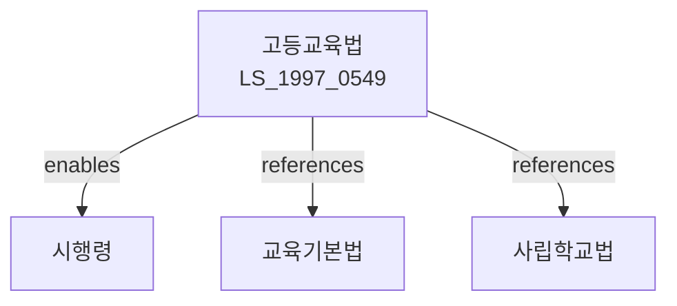

# 고등교육법

> [법률 제20128호, 2024. 1. 9., 일부개정]

---

---

## 제1장 총칙

### 제1조 (목적)

이 법은 고등교육에 관한 제도와 그 운영에 관한 기본적인 사항을 정함으로써 국가와 인류사회의 발전에 이바지할 수 있는 지도적 인격을 갖춘 인재 양성함을 목적으로 한다。

### 제2조 (정의)

이 법에서 사용하는 용어의 뜻은 다음과 같다。

1. "고등교육"이란 대학, 산업대학, 교육대학, 전문대학 등에서 실시하는 교육을 말한다。
2. "대학"이란 학술 또는 전문직업교육을 하는 고등교육기관을 말한다.
3. "산업대학"이란 산업체와 연계하여 실무교육을 하는 고등교육기관을 말한다。
4. "전문대학"이란 직업교육을 하는 고등교육기관을 말한다。

---

## 제2장 대학

### 第4条 (대학의 설치)

대학은 국가 또는 지방자치단체가 설치하는 국ㆍ공립과 법인이 설치하는 사립으로 구분한다。

### 第5条 (대학의 설치인가)

대학을 설치하려는 자는 교육부장관의 인가를 받아야 한다.

### 第6条 (설치기준)

대학의 설치기준은 대통령령으로 정한다。

### 第7条 (학생정원)

대학의 학생정원은 교육부장관의 승인을 받아야 한다.

---

## 제3장 학위

### 第10条 (학사학위)

대학을 졸업한 자에게는 학사학위를 수여한다.

### 第11条 (석사학위)

대학원 과정을 이수한 자에게는 석사학위를 수여한다.

### 第12条 (박사학위)

박사과정을 이수한 자에게는 박사학위를 수여한다.

### 第13条 (전문학사학위)

전문대학을 졸업한 자에게는 전문학사학위를 수여한다.

---

## 제4장 교원

### 第15条 (교원의 종류)

대학의 교원은 다음 각 호와 같다.

1. 총장
2. 학장
3. 교수
4. 부교수
5. 조교수
6. 전임강사

### 第16条 (교원의 자격)

교원의 자격은 학력, 경력 등을 고려하여 대통령령으로 정한다.

### 第17条 (교원의 임면)

교원은 학교법인 이사회 또는 대학의 장이 임면한다.

### 第18条 (교원의 신분보장)

교원은 이 법에 정하는 사유에 의하지 아니하고는 그 의사에 반하여 면직되지 아니한다.

---

## 제5장 학사행정

### 第20条 (입학)

입학자격은 고등학교 졸업자 또는 이와 동등 이상의 학력이 있는 자로 한다.

### 第21条 (입학전형)

입학전형은 학교생활기록부, 대학수학능력시험, 면접 등을 고려하여 실시한다.

### 第22条 (등록금)

등록금은 대학이 자율적으로 결정한다。 다만, 등록금의 인상률은 교육부장관의 승인을 받아야 한다.

### 第23条 (학기)

학기는 다음 각 호와 같다.

1. 제1학기: 3월 1일부터 8월 31일까지
2. 제2학기: 9월 1일부터 다음 해 2월말일까지

### 第24条 (수업)

수업은 강의, 실험, 실습 등으로 한다.

---

## 제6장 대학원

### 第30条 (대학원의 설치)

대학에는 대학원을 설치할 수 있다.

### 第31条 (대학원의 과정)

대학원은 석사과정, 박사과정 및 석ㆍ박사통합과정을 둘 수 있다.

### 第32条 (입학자격)

대학원 입학자격은 학사학위 취득자 또는 이와 동등 이상의 학력이 있는 자로 한다.

### 第33条 (교육과정)

대학원의 교육과정은 학술연구와 그 방법론을 교육한다.

---

## 제7장 산업대학

### 第40条 (산업대학의 설치)

직업교육을 위하여 산업대학을 설치한다.

### 第41条 (입학자격)

산업대학의 입학자격은 실무경험이 있는 자 등 대통령령으로 정하는 자로 한다.

### 第42条 (학위)

산업대학을 졸업한 자에게는 학사학위를 수여한다.

---

## 제8장 전문대학

### 第45条 (전문대학의 설치)

직업교육을 위하여 전문대학을 설치한다.

### 第46条 (교육과정)

전문대학의 교육과정은 직업교육을 중심으로 한다.

### 第47条 (학위)

전문대학을 졸업한 자에게는 전문학사학위를 수여한다.

---

## 第9章 벌칙

### 第90条 (벌칙)

다음 각 호의 어느 하나에 해당하는 자는 3년 이하의 징역 또는 3천만원 이하의 벌금에 처한다。

1. 허위로 설치인가를 받은 자
2. 입학전형에서 부정행위를 한 자

### 第91条 (과태료)

다음 각 호의 어느 하나에 해당하는 자에게는 1천만원 이하의 과태료를 부과한다。

1. 정당한 사유 없이 보고를 하지 아니한 자
2. 학생정원을 위반한 자

---

## 관계 그래프

**상위 법령**
- [[헌법]] 제31조 (교육권)
- [[교육기본법]]

**관련 법령**
- [[사립학교법]]
- [[초중등교육법]]
- [[한국교육과정평가원법]]
- [[국가평생교육진흥원법]]

**하위 법령**
- [[고등교육법 시행령]]
