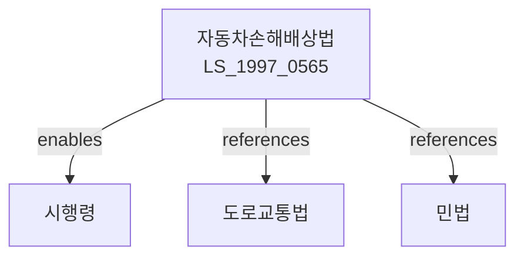

# 자동차손해배상 보장법

> [법률 제20086호, 2024. 1. 9., 일부개정]

---

---

## 제1장 총칙

### 제1조 (목적)

이 법은 자동차의 운행으로 인하여 생명이나 신체에 피해를 입은 자가 보상을 받을 수 있도록 하기 위하여 자동차의 운행자의 손해배상 책임을 확정하고, 자동차손해배상 보장사업에 관한 사항을 정함으로써 국민생활의 안정과 복리증진에 이바지함을 목적으로 한다。

### 제2조 (정의)

이 법에서 사용하는 용어의 뜻은 다음과 같다。

1. "자동차"란 자동차관리법에 따른 자동차 및 건설기계관리법에 따른 건설기계 중 대통령령으로 정하는 것을 말한다。
2. "운행자"란 자동차의 운행에 관한 지배와 운행이익을 가지는 자를 말한다。
3. "자동차손해배상책임보험"이란 자동차의 운행으로 인하여 타인의 생명ㆍ신체에 손해를 입은 경우 운행자의 배상책임을 담보하는 보험을 말한다。
4. "자동차손해배상책任공제"이란 보험사업자가 아닌 자가 운영하는 자동차손해배상책임보험과 유사한 제도를 말한다。

---

## 제2장 자동차손해배상 책임

### 제3조 (무과실책임)

① 자동차의 운행으로 인하여 타인의 생명ㆍ신체에 손해를 입은 때에는 운행자는 그 손해를 배상하여야 한다。다만, 운행자가 다음 각 호의 사실을 증명한 경우에는 그러하지 아니하다。

1. 운행자가 운행에 관하여 주의를 게을리하지 아니하였다는 사실
2. 피해자에게 고의나 과실이 있다는 사실
3. 자동차에 구조적 결함이나 기능적 장애가 없었다는 사실

② 제1항에도 불구하고 운행자가 고의 또는 중대한 과실로 인하여 손해를 입은 경우 배상책임을 면할 수 없다。

### 제4조 (피해자의 과실)

피해자에게 고의 또는 과실이 있는 경우에는 법원이 이를 참작하여 배상액을 정할 수 있다。

### 제5조 (양도인의 책임)

자동차를 양도한 자는 운행에 관한 지배와 운행이익을 상실한 날부터 15일 이내에 양도사실을 관할 시장ㆍ군수 또는 구청장에게 신고하여야 한다。이를 위반한 경우 양도인은 배상책임을 면할 수 없다。

---

## 제3장 책임보험

### 第6条 (책임보험 가입의무)

① 자동차를 운행하려는 자는 자동차손해배상책임보험(이하 "책임보험"이라 한다)에 가입하여야 한다。

② 책임보험의 가입절차 및 방법 등에 관하여 필요한 사항은 대통령령으로 정한다。

### 第7条 (책임보험의 종류)

책임보험은 다음 각 호와 같이 구분한다。

1. 종합보험: 사망 및 부상 모두를 담보하는 보험
2. 사망보험: 사망만을 담보하는 보험
3. 부상보험: 부상만을 담보하는 보험

### 第8条 (책임보험의 보장한도)

책임보험의 보장한도는 다음 각 호와 같다。

1. 사망의 경우: 1억 5천만원
2. 부상의 경우: 3천만원
3. 부상의 경우(후유장해): 1억 5천만원

### 第9条 (직접청구권)

피해자는 보험사업자에 대하여 직접 보험금을 청구할 수 있다。

---

## 제4장 자동차손해배상 보장사업

### 第20条 (보장사업의 실시)

① 정부는 자동차의 운행으로 인하여 생명ㆍ신체에 피해를 입은 자가 보상을 받을 수 있도록 자동차손해배상 보장사업(이하 "보장사업"이라 한다)을 실시한다。

② 보장사업은 다음 각 호의 사유로 피해보상을 받을 수 없는 자에게 지급한다。

1. 자동차의 운행자를 알 수 없는 경우(뺑소니)
2. 책임보험 미가입 차량에 의한 사고
3. 그 밖에 대통령령으로 정하는 사유

### 第21条 (보장한도)

보장사업에 의한 지급한도는 다음 각 호와 같다。

1. 사망의 경우: 1억 5천만원
2. 부상의 경우: 3천만원
3. 부상의 경우(후유장해): 1억 5천만원

---

## 제5장 벌칙

### 第30条 (벌칙)

다음 각 호의 어느 하나에 해당하는 자는 1년 이하의 징역 또는 1천만원 이하의 벌금에 처한다.

1. 제6조에 따른 책임보험에 가입하지 아니하고 자동차를 운행한 자
2. 제5조에 따른 양도신고를 하지 아니한 자

### 第31条 (과태료)

다음 각 호의 어느 하나에 해당하는 자에게는 300만원 이하의 과태료를 부과한다.

1. 정당한 사유 없이 책임보험 가입증명서를 휴대하지 아니한 자
2. 책임보험 가입증명서의 제시 요구를 거부한 자

---

## 관계 그래프

**상위 법령**
- [[헌법]] 제10조 (행복추구권)
- [[민법]] 제750조 (불법행위)
- [[도로교통법]]

**관련 법령**
- [[자동차관리법]]
- [[자동차보험법]]
- [[교통사고처리특례법]]
- [[상해보험법]]

**하위 법령**
- [[자동차손해배상 보장법 시행령]]
