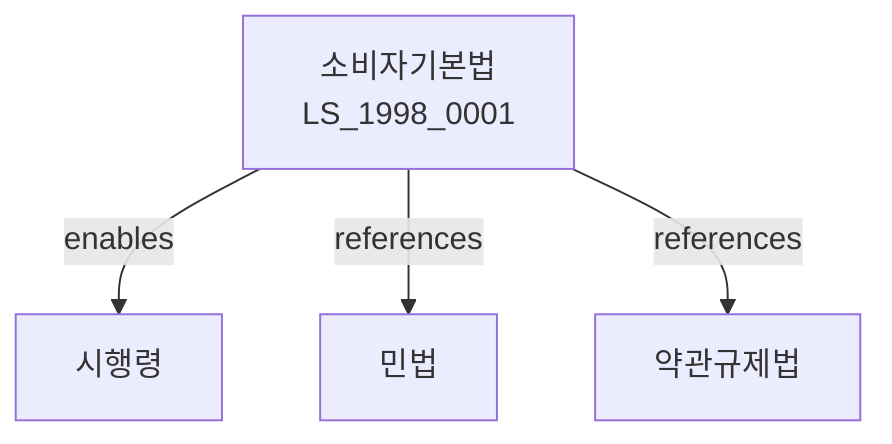

# 소비자기본법

> [법률 제20106호, 2024. 1. 9., 일부개정]

---

---

## 제1장 총칙
### 제1조 (목적)
이 법은 소비자의 권익을 증진하고 소비자생활의 향상을 도모함으로써 국민경제의 건전한 발전에 이바지함을 목적으로 한다。
### 제2조 (정의)
이 법에서 사용하는 용어의 뜻은 다음과 같다。
1. "소비자"란 물품 또는 용역을 이용하는 자를 말한다.
2. "사업자"란 물품 또는 용역을 공급하는 자를 말한다.
3. "소비자단체"란 소비자의 권익을 대변하여 활동하는 단체를 말한다.
4. "표시"이란 물품의 내용을 표시하는 것을 말한다。
---
## 제2장 소비자의 권리
### 第5条 (소비자의 권리)
소비자는 다음 각 호의 권리를 가진다。
1. 안전할 ꭄ재품을 선택할 권리
2. 올바른 정보를 제공받을 권리
3. 선택할 권리
4. 의견을 반영할 권리
5. 피해를 보상받을 권리
### 第6条 (안전할 ꭄ재품 선택권)
소비자는 안전하고 품질이 우수한 재화 또는 용역을 선택할 권리를 가진다。
### 第7条 (정보를 제공받을 권리)
사업자는 재화 또는 용역에 관한 올바른 정보를 제공하여야 한다.
### 第8条 (계량 등의 적정)
계량은 정확하여야 한다。
---
## 제3장 사업자의 의무
### 第15条 (사업자의 의무)
사업자는 다음 각 호의 의무를 진다.
1. 품질관리
2. 정보제공
3. 안전확보
4. 불만처리
### 第16条 (품질관리)
사업자는 재화 또는 용역의 품질을 관리하여야 한다.
### 第17条 (정보제공)
사업자는 재화 또는 용역에 관한 정보를 제공하여야 한다.
### 第18条(안전확보)
사업자는 재화 또는 용역의 안전을 확보하여야 한다。
---
## 제4장 표시 및는 광고
### 第25条 (표시)
재화의 표시는 정확하여야 한다.
### 第26条 (광고의 진실성)
광고는 진실하여야 한다.
### 第27条 (허위광고의 금지)
허위광고를 금지한다.
### 第28条(과대광고의 금지)
과대광고를 금지한다。
---
## 제5장 소비자단체
### 第35条 (소비자단체)
소비자단체를 설립할 수 있다。
### 第36条 (소비자단체의 업무)
소비자단체는 다음 각 호의 업무를 수행한다。
1. 소비자상담
2. 소비자교육
3. 분쟁조정
4. 정책제안
### 第37条 (소비자단체의 지원)
국가는 소비자단체를 지원한다.
### 第38条 (소비자단체의 운영)
소비자단체는 투명하게 운영하여야 한다.
---
## 제6장 소비자보호시책
### 第45条 (소비자보호시책)
정부는 소비자보호시책을 수립한다.
### 第46条 (소비자안전)
재화 및는 용역의 안전을 확보한다.
### 第47条 (소비자교육)
소비자교육을 실시한다.
### 第48条 (소비자정보)
소비자정보를 제공한다.
---
## 제7장 감독
### 第55条 (감독)
소비자보호원장은 소비자보호 업무를 감독한다.
### 第56条 (보고 및 검사)
소비자보호원장은 필요한 경우 보고를 명하거나 검사할 수 있다.
### 第57条 (시정명령)
소비자보호원장은 이 법을 위반한 자에 대하여 시정명령을 할 수 있다。
### 第58条 (과태료)
다음 각 호의 어느 하나에 해당하는 자에게는 과태료를 부과한다.
1. 정당한 사유 없이 보고를 하지 아니한 자
2. 허위광고를 한 자
---
## 제8장 벌칙
### 第65条 (과태료)
다음 각 호의 어느 하나에 해당하는 자에게는 1천만원 이하의 과태료를 부과한다。
1. 정당한 사유 없이 보고를 하지 아니한 자
2. 표시를 위반한 자
---
## 관계 그래프
**상위 법령**
- [[헌법]] 제23조 (재산권)
- [[민법]]
**관련 법령**
- [[약관규제법]]
- [[전자거래법]]
- [[제조물책임법]]
- [[할부거래법]]
**하위 법령**
- [[소비자기본법 시행령]]
