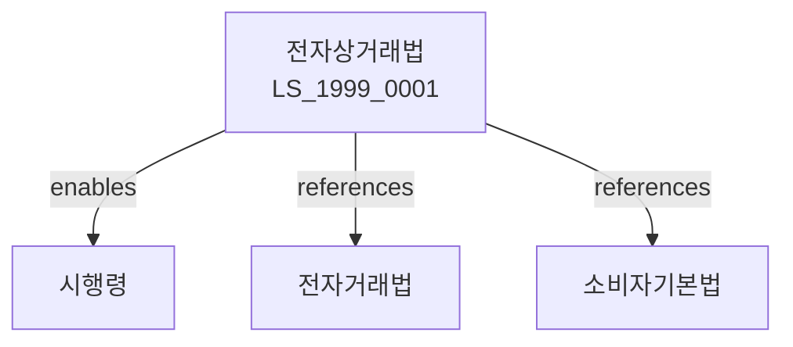

# 전자상거래법

> [법률 제20107호, 2024. 1. 9., 일부개정]

---

---

## 제1장 총칙
### 제1조 (목적)
이 법은 전자상거래의 건전한 발전과 이용자의 보호를 도모함으로써 국민경제의 발전과 공공복리의 증진에 이바지함을 목적으로 한다。
### 제2조 (정의)
이 법에서 사용하는 용어의 뜻은 다음과 같다。
1. "전자상거래"란 전자적 방법에 의하여 재화 또는 용역을 거래하는 것을 말한다。
2. "전자상거래당사자"란 전자상거래를 업으로 하는 자를 말한다.
3. "전자결제"란 전자적 방법에 의하여 결제하는 것을 말한다.
4. "사이버몰"이란 온라인상점을 말한다.
---
## 제2장 전자상거래의 기본원칙
### 第5条 (전자상거래의 기본원칙)
전자상거래는 다음 각 호의 원칙에 따라야 한다。
1. 자유로운 거래
2. 공정한 경쟁
3. 이용자 보호
4. 정보의 보호
### 第6条 (자유로운 거래)
전자상거래는 자유롭게 이루어져야 한다.
### 第7条 (공정한 경쟁)
전자상거래에서 공정한 경쟁을 보장한다.
### 第8条 (이용자 보호)
전자상거래 이용자를 보호한다.
---
## 제3장 전자상거래당사자
### 第15条 (전자상거래당사자의 신고)
전자상거래당사자는 공정거래위원회에 신고하여야 한다.
### 第16条 (신고요건)
신고요건은 다음 각 호와 같다。
1. 상호ㆍ주소
2. 업무의 내용
3. 책임자의 성명
### 第17条 (신고의 변경)
신고사항을 변경한 때는 변경신고를 하여야 한다.
### 第18条 (영업의 양도)
영업을 양도한 때는 승계신고를 하여야 한다.
---
## 제4장 계약
### 第25条 (전자계약)
전자계약은 서면계약과 동일한 효력을 가진다.
### 第26条 (계약의 성립)
전자계약은 승낙의 의사표시로 성립한다.
### 第27条 (청약의 철회)
청약은 철회할 수 있다.
### 第28条 (계약의 해지)
계약은 해지할 수 있다.
---
## 제5장 이용자 보호
### 第35条 (이용자 보호)
전자상거래당사자는 이용자를 보호하여야 한다.
### 第36条 (정보의 제공)
이용자에게 필요한 정보를 제공하여야 한다.
### 第37条 (개인정보의 보호)
이용자의 개인정보를 보호하여야 한다.
### 第38条 (피해보상)
전자상거래로 인한 피해를 보상하여야 한다.
---
## 제6장 사이버몰
### 第45条 (사이버몰의 운영)
사이버몰을 운영하는 자는 신고하여야 한다.
### 第46条 (사이버몰의 의무)
사이버몰 운영자는 다음 각 호의 의무를 진다.
1. 정보제공
2. 이용자보호
3. 분쟁해결
### 第47条 (반품보증보험)
사이버몰 운영자는 반품보증보험에 가입할 수 있다.
### 第48条 (사이버몰의 휴업)
사이버몰 운영자는 휴업 시 신고하여야 한다.
---
## 제7장 감독
### 第55条 (감독)
공정거래위원회는 전자상거래를 감독한다.
### 第56条 (보고 및 검사)
공정거래위원회는 필요한 경우 보고를 명하거나 검사할 수 있다.
### 第57条 (시정명령)
공정거래위원회는 이 법을 위반한 자에 대하여 시정명령을 할 수 있다。
### 第58条 (과태료)
다음 각 호의 어느 하나에 해당하는 자에게는 과태료를 부과한다.
1. 정당한 사유 없이 보고를 하지 아니한 자
2. 이용자를 보호하지 아니한 자
---
## 제8장 벌칙
### 第65条 (과태료)
다음 각 호의 어느 하나에 해당하는 자에게는 1천만원 이하의 과태료를 부과한다。
1. 정당한 사유 없이 보고를 하지 아니한 자
2. 허위정보를 제공한 자
---
## 관계 그래프
**상위 법령**
- [[헌법]] 제119조 (경제질서)
- [[전자거래법]]
**관련 법령**
- [[소비자기본법]]
- [[전자거래법]]
- [[전자서명법]]
- [[방문판매법]]
**하위 법령**
- [[전자상거래법 시행령]]
