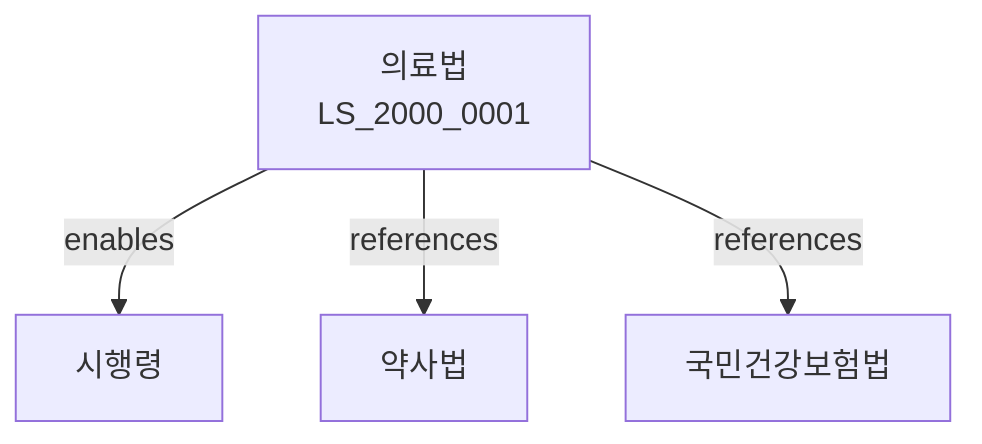

# 의료법

> [법률 제20108호, 2024. 1. 9., 일부개정]

---

---

## 제1장 총칙

### 제1조 (목적)

이 법은 국민의 건강을 보호하고 의료체계의 발전을 도모함으로써 국민의 보건 향상에 이바지함을 목적으로 한다。

### 제2조 (정의)

이 법에서 사용하는 용어의 뜻은 다음과 같다。

1. "의료인"이란 의사ㆍ치과의사ㆍ간호사 등을 말한다.
2. "의료기관"이란 의료를 목적으로 하는 시설을 말한다.
3. "의료행위"이란 의료를 목적으로 하는 행위를 말한다.
4. "환자"란 의료행위를 받는 자를 말한다.

---

## 제2장 의료인
### 第5条 (의사)
의사는 보건복지부장관의 면허를 받아야 한다.
### 第6条 (면허요건)
면허요건은 다음 각 호와 같다.

1. 의학교육과정 이수
2. 국가고시합격
3. 인성 및 직업윤리

### 第7条 (면허결격사유)
다음 각 호의 어느 하나에 해당하는 자는 면허를 받을 수 없다.

1. 금치산자 또는 한정치산자
2. 의료법을 위반하여 면허취소 후 3년이 지나지 아니한 자
3. 마약 등 약물남용범죄로 처벌받은 자

### 第8条 (면허의 효력)
의사면허는 계속하여 효력을 가진다.

---

## 제3장 의료기관
### 第15条 (의료기관의 개설허가)
의료기관을 개설하려는 자는 시도지사의 허가를 받아야 한다.
### 第16条 (허가요건)
허가요건은 다음 각 호와 같다.

1. 시설의 확보
2. 의료인의 확보
3. 장비의 확보
4. 운영자금의 확보

### 第17条 (허가결격사유)
다음 각 호의 어느 하나에 해당하는 자는 허가를 받을 수 없다.

1. 금치산자 또는 한정치산자
2. 의료법을 위반하여 허가취소 후 3년이 지나지 아니한 자

3. 공공질서를 문란하게 한 자
### 第18条 (허가의 유효기간)
허가의 유효기간은 대통령령으로 정한다.

---

## 제4장 의료의 질
### 第25条 (의료의 질 관리)
의료기관은 의료의 질을 관리하여야 한다.
### 第26条 (환자안전)
의료기관은 환자의 안전을 확보하여야 한다.
### 第27条(감염관리)
의료기관은 감염을 예방하고 관리하여야 한다.
### 第28条 (의료기록)
의료기관은 의료기록을 작성ㆍ보관하여야 한다.

---

## 제5장 의료분쟁
### 第35条 (의료분쟁조정)
의료분쟁을 조정한다.
### 第36条 (조정위원회)
의료분쟁조정위원회를 둔다.
### 第37条 (조정절차)
조정절차는 대통령령으로 정한다.
### 第38条 (조정의 효력)
조정은 재판상 화해와 동일한 효력을 가진다.

---

## 제6장 응급의료
### 第45条 (응급의료)
응급의료를 체계적으로 제공한다.
### 第46条 (응급의료기관)
응급의료기관을 지정한다.
### 第47条 (응급환자)
응급환자에게 우선적으로 의료를 제공한다.
### 第48条 (응급의료비용)
응급의료비용을 지원한다.

---

## 제7장 감독
### 第55条 (감독)
보건복지부장관은 의료를 감독한다.
### 第56条 (보고 및 검사)
보건복지부장관은 필요한 경우 보고를 명하거나 검사할 수 있다.
### 第57条 (시정명령)
보건복지부장관은 이 법을 위반한 자에 대하여 시정명령을 할 수 있다.
### 第58条 (허가취소)
보건복지부장관은 중대한 위반사유가 있는 경우 허가를 취소할 수 있다.

---

## 제8장 벌칙
### 第65条 (벌칙)
다음 각 호의 어느 하나에 해당하는 자는 3년 이하의 징역 또는 3천만원 이하의 벌금에 처한다.

1. 면허 없이 의료행위를 한 자
2. 허위로 면허를 받은 자
3. 의료기록을 위조한 자

### 第66条 (과태료)
다음 각 호의 어느 하나에 해당하는 자에게는 1천만원 이하의 과태료를 부과한다.

1. 정당한 사유 없이 보고를 하지 아니한 자
2. 의료기록을 보관하지 아니한 자

---

## 관계 그래프

**상위 법령**
- [[헌법]] 제36조 (국민의 건강)
- [[국민건강증진법]]

**관련 법령**
- [[약사법]]
- [[국민건강보험법]]
- [[응급의료법]]
- [[장기요양보험법]]

**하위 법령**
- [[의료법 시행령]]
