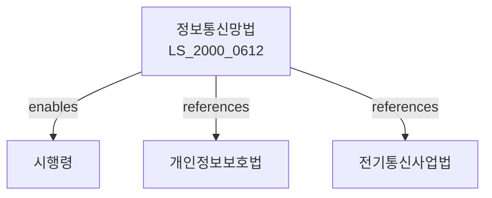

# 정보통신망 이용촉진 및 정보보호 등에 관한 법률

> [법률 제20090호, 2024. 1. 9., 일부개정]

---

---

## 제1장 총칙

### 제1조 (목적)

이 법은 정보통신망의 이용을 촉진하고 정보통신서비스의 이용자를 보호하며, 정보통신망을 통한 정보의 흐름을 원활하게 함으로써 국민의 삶의 질 향상과 국가경쟁력 강화에 이바지함을 목적으로 한다.

### 제2조 (정의)

이 법에서 사용하는 용어의 뜻은 다음과 같다.

1. "정보통신망"이란 정보통신설비를 이용하여 정보를 수집ㆍ처리ㆍ보관ㆍ검색ㆍ송신 또는 수신하기 위한 통신망을 말한다.
2. "정보통신서비스제공자"란 정보통신망을 이용하여 정보를 제공하거나 매개하는 자를 말한다.
3. "이용자"란 정보통신서비스를 이용하는 자를 말한다.
4. "개인정보"란 살아 있는 개인에 관한 정보로서 성명, 주민등록번호 등을 통하여 당해 개인을 식별할 수 있는 정보를 말한다.

---

## 제2장 정보통신망의 이용촉진

### 第5条 (정보통신망의 구축)

① 국가 및 지방자치단체는 정보통신망의 구축을 촉진하기 위하여 필요한 지원을 할 수 있다.

② 정보통신망 구축의 기준 및 지원방법 등에 관하여 필요한 사항은 대통령령으로 정한다。

### 第6条 (정보화촉진 시범사업)

과학기술정보통신부장관은 정보화촉진을 위하여 시범사업을 실시할 수 있다。

---

## 제3장 정보통신서비스 이용자의 보호

### 第20条 (이용자의 권리)

이용자는 정보통신서비스를 이용함에 있어 다음 각 호의 권리를 가진다.

1. 개인정보의 열람 및 정정 요구
2. 개인정보의 처리정지 요구
3. 동의 철회 요구
4. 정보통신서비스의 선택 및 해지

### 第21条 (이용자의 동의)

① 정보통신서비스제공자는 이용자의 개인정보를 수집ㆍ이용하려면 미리 이용자의 동의를 받아야 한다.

② 동의의 방법 및 절차 등에 관하여 필요한 사항은 대통령령으로 정한다。

### 第22条 (개인정보의 보호)

정보통신서비스제공자는 개인정보가 분실ㆍ도난ㆍ유출ㆍ변조 또는 훼손되지 아니하도록 필요한 보안조치를 하여야 한다。

---

## 제4장 청소년 보호

### 第30条 (유해정보의 식별)

정보통신서비스제공자는 청소년에게 유해한 정보를 식별하기 위한 조치를 하여야 한다。

### 第31条 (유해정보의 차단)

정보통신서비스제공자는 청소년에게 유해한 정보가 유통되지 아니하도록 차단장치 등을 설치ㆍ운영할 수 있다。

### 第32条 (청소년의 보호)

정보통신서비스제공자는 청소년이 유해정보에 접근하지 아니하도록 보호조치를 하여야 한다。

---

## 제5장 스팸정보의 전송 제한

### 第40条 (광고성 정보의 전송 제한)

① 누구든지 정보통신망을 통하여 광고성 정보를 전송하려면 수신자의 명확한 사전 동의를 받아야 한다。

② 광고성 정보의 전송방법 및 절차 등에 관하여 필요한 사항은 대통령령으로 정한다。

### 第41条 (수신거부 조치)

① 광고성 정보의 수신자는 수신을 거부할 수 있다。

② 정보통신서비스제공자는 수신거부 조치를 한 자에게 광고성 정보를 전송하여서는 아니 된다。

---

## 제6장 벌칙

### 第60条 (벌칙)

다음 각 호의 어느 하나에 해당하는 자는 5년 이하의 징역 또는 5천만원 이하의 벌금에 처한다.

1. 이 법에 따른 동의 없이 개인정보를 수집ㆍ이용한 자
2. 개인정보를 목적 외 용도로 이용하거나 제3자에게 제공한 자

### 第61条 (과태료)

다음 각 호의 어느 하나에 해당하는 자에게는 3천만원 이하의 과태료를 부과한다。

1. 제40조에 따른 광고성 정보 전송 제한을 위반한 자
2. 제22조에 따른 보안조치를 하지 아니한 자

---

## 관계 그래프

**상위 법령**
- [[헌법]] 제18조 (통신의 자유)
- [[개인정보보호법]]

**관련 법령**
- [[전기통신사업법]]
- [[정보통신기반 보호법]]
- [[청소년보호법]]
- [[전자상거래등에서의소비자보호에관한법률]]

**하위 법령**
- [[정보통신망법 시행령]]
