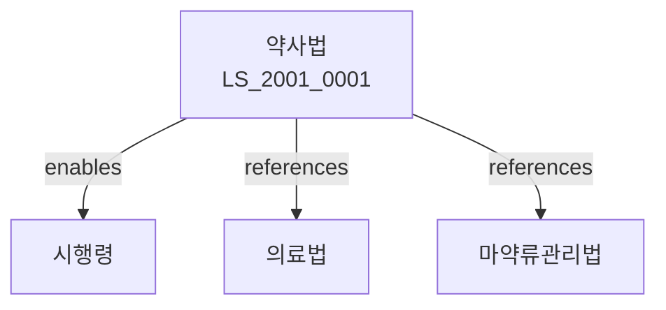

# 약사법

> [법률 제20109호, 2024. 1. 9., 일부개정]

---

---

## 제1장 총칙
### 제1조 (목적)
이 법은 약품의 품질을 확보하고 약사에 관한 사항을 정함으로써 국민의 보건 향상에 이바지함을 목적으로 한다.

### 제2조 (정의)
이 법에서 사용하는 용어의 뜻은 다음과 같다.

1. "약품"이란 의약품, 의약외품, 화장품 등을 말한다.
2. "의약품"이란 질병의 진단ㆍ치료ㆍ예방에 사용하는 물품을 말한다.
3. "의약외품"이란 의약품 외의 약품을 말한다.
4. "약국"이란 약사에 관한 업무를 관장하는 기관을 말한다。

---

## 제2장 약국
### 第5条 (약국의 개설)
약국을 개설하려는 자는 식품의약품안전처장의 허가를 받아야 한다.
### 第6条 (허가요건)
허가요건은 다음 각 호와 같다.

1. 시설의 확보
2. 약사사의 면허를 받은 자의 확보
3. 약사감정사의 면허를 받은 자의 확보

### 第7条 (허가결격사유)
다음 각 호의 어느 하나에 해당하는 자는 허가를 받을 수 없다.

1. 금치산자 또는 한정치산자
2. 약사법을 위반하여 허가취소 후 2년이 지나지 아니한 자
3. 마약 등 약물남용범죄로 처벌받은 자
### 第8条 (허가의 유효기간)
허가의 유효기간은 대통령령으로 정한다.

---

## 제3장 약사사
### 第15条 (약사사)
약사사는 식품의약품안전처장의 면허를 받아야 한다.
### 第16条 (면허요건)
면허요건은 다음 각 호와 같다.

1. 약학계 대학 졸업
2. 국가고시합격
3. 실무경력

### 第17条(면허결격사유)
다음 각 호의 어느 하나에 해당하는 자는 면허를 받을 수 없다.

1. 금치산자 또는 한정치산자
2. 약사법을 위반하여 면허취소 후 2년이 지나지 아니한 자
3. 마약 등 약물남용범죄로 처벌받은 자
### 第18条(면허의 갱신)
약사사 면허는 정기적으로 갱신하여야 한다.

---

## 제4장 약품의 관리
### 第25条(제조 및 수입)
약품을 제조 또는 수입하려는 자는 품목허가를 받아야 한다.
### 第26条(품목허가요건)
품목허가요건은 대통령령으로 정한다.
### 第27条(임상시험)
약품의 제조 및 수입 시 임상시험을 하여야 한다.
### 第28条(허가취소)
약품이 기준에 부적합한 경우 허가를 취소할 수 있다.

---

## 제5장 약품의 유통
### 第35条(도매업)
약품 도매업을 하려는 자는 허가를 받아야 한다.
### 第36条(소매업)
약품 소매업을 하려는 자는 신고하여야 한다.
### 第37条(유통관리)
약품은 적절하게 유통 관리하여야 한다.
### 第38条(보관기준)
약품은 보관기준에 따라 보관하여야 한다.

---

## 제6장 안전성 관리
### 第45条(약물이상반응)
약물이상반응을 신고하여야 한다.
### 第46条(회수)
유해약품을 회수하여야 한다.
### 第47条(폐기)
유효기간이 만료된 약품을 폐기하여야 한다.
### 第48条(안전성 정보)
약품의 안전성 정보를 관리하여야 한다.

---

## 제7장 감독
### 第55条(감독)
식품의약품안전처장은 약사를 감독한다.
### 第56条(보고 및 검사)
식품의약품안전처장은 필요한 경우 보고를 명하거나 검사할 수 있다.
### 第57条(시정명령)
식품의약품안전처장은 이 법을 위반한 자에 대하여 시정명령을 할 수 있다.
### 第58条(허가취소)
식품의약품안전처장은 중대한 위반사유가 있는 경우 허가를 취소할 수 있다.

---

## 제8장 벌칙
### 第65条(벌칙)
다음 각 호의 어느 하나에 해당하는 자는 5년 이하의 징역 또는 5천만원 이하의 벌금에 처한다.

1. 허가 없이 약국을 개설한 자
2. 면허 없이 약사행위를 한 자
3. 유해약품을 제조한 자

### 第66条(과태료)
다음 각 호의 어느 하나에 해당하는 자에게는 2천만원 이하의 과태료를 부과한다.

1. 정당한 사유 없이 보고를 하지 아니한 자
2. 약품을 부적합하게 유통한 자

---

## 관계 그래프

**상위 법령**
- [[헌법]] 제36조 (국민의 건강)
- [[식품위생법]]

**관련 법령**
- [[의료법]]
- [[마약류관리법]]
- [[건강기능식품법]]
- [[화장품법]]

**하위 법령**
- [[약사법 시행령]]
