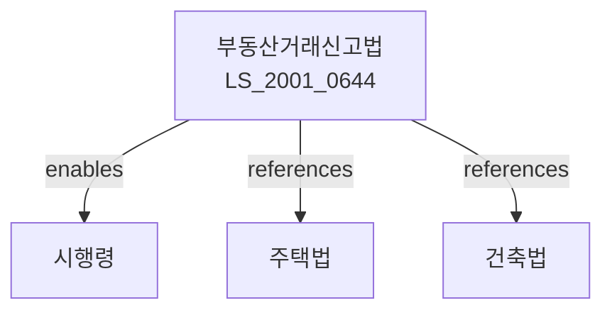

# 부동산 거래신고 등에 관한 법률

> [법률 제20080호, 2024. 1. 9., 일부개정]

---

---

## 제1장 총칙

### 제1조 (목적)

이 법은 부동산거래의 적정한 질서를 확립하고 부동산가격을 안정시키기 위하여 부동산거래의 신고 및 실거래가격의 공개 등에 관한 사항을 정함으로써 국민주거생활의 안정과 국민경제의 건전한 발전에 이바지함을 목적으로 한다。

### 제2조 (정의)

이 법에서 사용하는 용어의 뜻은 다음과 같다。

1. "부동산"이란 토지 및 건축물을 말한다。
2. "부동산거래"란 부동산의 매매, 교환, 증여 등에 의한 소유권 이전을 말한다。
3. "실거래가격"이란 부동산거래 당사자 사이에 실제로 거래된 가격을 말한다。
4. "거래신고관청"이란 부동산거래의 신고를 관할하는 시장ㆍ군수 또는 구청장을 말한다。

---

## 제2장 부동산거래의 신고

### 제3조 (거래신고)

① 부동산거래 당사자는 거래계약일부터 30일 이내에 실거래가격을 거래신고관청에 신고하여야 한다.

② 거래신고는 부동산의 소재지, 면적, 용도, 거래가격 등을 기재한 신고서에 의한다。

### 제4조 (신고내용의 검증)

① 거래신고관청은 신고된 내용이 허위인지 여부를 확인하기 위하여 필요한 조사를 할 수 있다.

② 제1항에 따른 조사 결과 허위신고로 확인된 경우 거래신고관청은 관련 사실을 통지하고 시정을 명할 수 있다。

### 제5조 (신고증명서 발급)

거래신고관청은 거래신고를 받은 경우 신고증명서를 발급할 수 있다。

---

## 제3장 실거래가격의 공개

### 제10조 (실거래가격의 공개)

① 국토교통부장관은 신고된 실거래가격을 수집ㆍ분석하여 공개할 수 있다。

② 실거래가격 공개의 범위 및 방법 등에 관하여 필요한 사항은 대통령령으로 정한다。

### 제11조 (가격정보의 활용)

① 실거래가격 정보는 부동산시장의 안정 및 부동산정책 수립 등을 위하여 활용할 수 있다。

② 실거래가격 정보는 정보통신망을 통하여 제공할 수 있다。

---

## 제4장 부동산 중개

### 第20条 (중개업자의 의무)

① 부동산중개업자는 정직하고 성실하게 업무를 수행하여야 한다。

② 부동산중개업자는 거래 당사자에게 다음 각 호의 정보를 제공하여야 한다。

1. 거래 대상 부동산의 현황
2. 실거래가격 정보
3. 그 밖에 거래에 필요한 정보

### 第21条 (거래정보 제공)

부동산중개업자는 거래가 성사된 경우 거래정보를 거래신고관청에 제공할 수 있다。

---

## 제5장 벌칙

### 第30条 (벌칙)

다음 각 호의 어느 하나에 해당하는 자는 2년 이하의 징역 또는 2천만원 이하의 벌금에 처한다。

1. 제3조에 따른 거래신고를 하지 아니한 자
2. 제4조에 따른 시정명령을 이행하지 아니한 자

### 第31条 (과태료)

다음 각 호의 어느 하나에 해당하는 자에게는 1천만원 이하의 과태료를 부과한다。

1. 제3조에 따른 기한 내에 거래신고를 하지 아니한 자
2. 허위로 거래신고를 한 자

---

## 관계 그래프

**상위 법령**
- [[헌법]] 제23조 (재산권)
- [[주택법]]
- [[건축법]]

**관련 법령**
- [[공인중개사법]]
- [[부동산가격공시및감정평가에관한법률]]
- [[국토계획및이용에관한법률]]
- [[주택법]]

**하위 법령**
- [[부동산거래신고법 시행령]]
