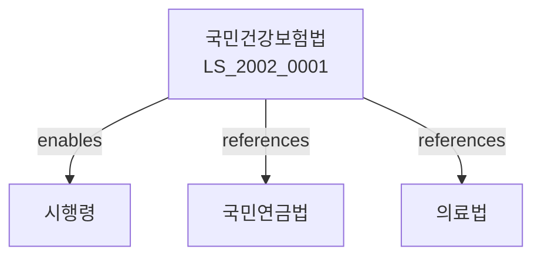

# 국민건강보험법

> [법률 제20110호, 2024. 1. 9., 일부개정]

---

---

## 제1장 총칙
### 제1조 (목적)
이 법은 국민의 질병ㆍ부상 등에 대하여 보험급여을 실시함으로써 국민의 건강을 증진하고 사회보장을 도모함을 목적으로 한다.

### 제2조 (정의)
이 법에서 사용하는 용어의 뜻은 다음과 같다.

1. "건강보험"이란 질병ㆍ부상 등에 대하여 보험급여을 제공하는 제도를 말한다.
2. "가입자"란 건강보험에 가입된 자를 말한다.
3. "피부양자"란 가입자의 피부양자를 말한다.
4. "보험료"란 건강보험의 운영에 필요한 비용을 말한다.

5. "보험급여"이란 건강보험에 의하여 제공하는 급여를 말한다.

---

## 제2장 가입자 및 피부양자
### 第5条(가입자)
건강보험의 가입자는 다음 각 호와 같다.

1. 직장가입자
2. 지역가입자
### 第6条(직장가입자)
직장가입자는 직장에 고용된 자로 한다.
### 第7条(지역가입자)
지역가입자는 직장가입자 외의 자로 한다.
### 第8条(피부양자)
가입자의 피부양자는 배우자와 직계존속으로 한다.

---

## 제3장 보험급여
### 第15条(보험급여의 종류)
보험급여는 다음 각 호와 같다.

1. 요양급여
2. 건강검진급여
3. 분만급여
4. 요양비급여
### 第16条(요양급여)
요양급여는 요양을 제공하는 급여이다.
### 第17条(건강검진급여)
건강검진급여는 건강검진을 제공하는 급여이다.
### 第18条(분만급여)
분만급여는 분만에 관한 급여이다.
### 第19条(요양비급여)
요양비급여는 요양비용을 지급하는 급여이다.

---

## 제4장 보험급여의 실시
### 第25条(요양기관)
요양기관은 요양급여를 제공한다.
### 第26条(요양의 방법)
요양은 요양기관에서 요양비급여일에 의하여 실시한다.
### 第27条(본인부담금)
요양에 소요되는 비용의 일부를 본인이 부담한다.
### 第28条(비급여 대상)
다음 각 호의 비용은 급여하지 아니한다.

1. 예방접종 비용
2. 건강보조식품 비용
3. 미용 목적의 비용

---

## 제5장 보험료
### 第35条(보험료의 납부)
가입자는 보험료를 납부하여야 한다.
### 第36条(보험료율)
보험료율은 대통령령으로 정한다.
### 第37条(보험료의 징수)
보험료는 국민건강보험공단이 징수한다.
### 第38条(체납)
보험료를 체납한 경우 가산금을 부과한다.

---

## 제6장 재정
### 第45条(국고보조)
국가는 건강보험 운영에 필요한 비용을 보조한다.
### 第46条(부담금)
국가는 보험료의 일부를 부담한다.
### 第47条(기금)
국민건강보험기금을 설치한다.
### 第48条(회계)
건강보험 운영에 관한 회계를 따로 정한다.

---

## 제7장 감독
### 第55条(감독)
보건복지부장관은 건강보험을 감독한다.
### 第56条(보고 및 검사)
보건복지부장관은 필요한 경우 보고를 명하거나 검사할 수 있다.
### 第57条(시정명령)
보건복지부장관은 이 법을 위반한 자에 대하여 시정명령을 할 수 있다.
### 第58条(과태료)
다음 각 호의 어느 하나에 해당하는 자에게는 과태료를 부과한다.

1. 정당한 사유 없이 보고를 하지 아니한 자
2. 보험료를 체납한 자

---

## 제8장 벌칙
### 第65条(벌칙)
다음 각 호의 어느 하나에 해당하는 자는 3년 이하의 징역 또는 3천만원 이하의 벌금에 처한다.
1. 허위로 보험급여를 받은 자
2. 요양기관으로 사칭한 자

3. 보험료를 착취한 자
### 第66条(과태료)
다음 각 호의 어느 하나에 해당하는 자에게는 1천만원 이하의 과태료를 부과한다。
1. 정당한 사유 없이 보고를 하지 아니한 자
2. 요양에 관한 기록을 위조한 자
---

## 관계 그래프
**상위 법령**
- [[헌법]] 제34조 (사회보장)
- [[사회보장기본법]]

**관련 법령**
- [[국민연금법]]
- [[의료법]]
- [[장기요양보험법]]
- [[노인장기요양보험법]]

**하위 법령**
- [[국민건강보험법 시행령]]
