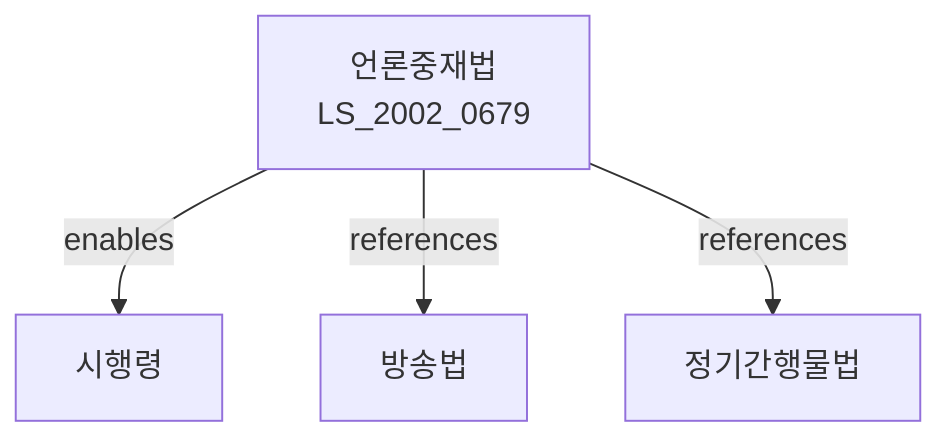

# 언론중재 및 피해구제 등에 관한 법률

> [법률 제20091호, 2024. 1. 9., 일부개정]

---

---

## 제1장 총칙

### 제1조 (목적)

이 법은 언론으로 인한 피해의 신속하고 공정한 구제와 언론의 자유 및 책임에 관한 사항을 정함으로써 언론의 건전한 발전과 국민의 기본권 보호에 이바지함을 목적으로 한다.

### 제2조 (정의)

이 법에서 사용하는 용어의 뜻은 다음과 같다.

1. "언론"이란 신문ㆍ통신ㆍ방송ㆍ인터넷신문 등을 통하여 보도하는 것을 말한다.
2. "언론사"란 언론을 행하는 자를 말한다.
3. "언론중재"란 언론으로 인한 분쟁을 중재하는 것을 말한다.
4. "피해자"란 언론보도로 인하여 명예나 권익을 침해받은 자를 말한다.

---

## 제2장 언론의 자유와 책임

### 第4条 (언론의 자유)

언론은 그 자유와 독립을 존중받는다.

### 第5条 (언론의 책임)

언론사는 진실을 보도하고 공익에 이바지하여야 한다.

### 第6条 (사실의 확인)

언론사는 보도하기 전에 사실을 확인하여야 한다。

### 第7条 (공정성)

언론사는 보도에 있어 공정성을 기하여야 한다。

---

## 제3장 언론중재위원회

### 第10条 (설치)

언론중재 및 피해구제를 위하여 언론중재위원회를 둔다。

### 第11条 (기능)

언론중재위원회는 다음 각 호의 사항을 처리한다。

1. 언론으로 인한 분쟁의 중재
2. 정정보도 및 반론보도의 권고
3. 피해구제에 관한 사항
4. 그 밖에 언론중재에 필요한 사항

### 第12条 (조직)

① 언론중재위원회는 위원장을 포함한 9인 이내의 위원으로 구성한다。

② 위원의 자격ㆍ임명 등에 관하여 필요한 사항은 대통령령으로 정한다。

---

## 제4장 피해구제

### 第20条 (이의신청)

피해자는 언론보도에 대하여 이의를 신청할 수 있다。

### 第21条 (정정보도)

① 피해자는 언론사에 대하여 정정보도를 요청할 수 있다。

② 언론사는 정정보도 요청을 받은 경우 지체 없이 이를 처리하여야 한다。

### 第22条 (반론보도)

① 피해자는 언론사에 대하여 반론보도를 요청할 수 있다。

② 언론사는 반론보도 요청을 받은 경우 그 내용을 보도하여야 한다。

### 第23条 (손해배상)

언론보도로 인하여 피해를 입은 자는 언론사에 대하여 손해배상을 청구할 수 있다。

---

## 제5장 중재절차

### 第30条 (중재신청)

피해자는 언론중재위원회에 중재를 신청할 수 있다。

### 第31条 (중재의 절차)

① 언론중재위원회는 중재신청을 받은 경우 지체 없이 중재절차를 개시한다。

② 중재절차는 공정하고 신속하게 진행하여야 한다。

### 第32条 (중재결정)

언론중재위원회는 중재절차를 거쳐 중재결정을 한다。

---

## 제6장 벌칙

### 第50条 (과태료)

다음 각 호의 어느 하나에 해당하는 자에게는 1천만원 이하의 과태료를 부과한다。

1. 중재결정을 이행하지 아니한 자
2. 정당한 사유 없이 중재절차에 출석하지 아니한 자

---

## 관계 그래프

**상위 법령**
- [[헌법]] 제21조 (언론ㆍ출판의 자유)
- [[방송법]]

**관련 법령**
- [[정기간행물 등록 등에 관한 법률]]
- [[인터넷신문 등록 및 육성 등에 관한 법률]]
- [[정보통신망 이용촉진 및 정보보호 등에 관한 법률]]

**하위 법령**
- [[언론중재법 시행령]]
