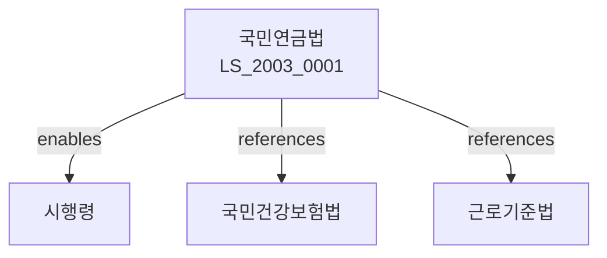

# 국민연금법

> [법률 제20111호, 2024. 1. 9., 일부개정]

---

---

## 제1장 총칙
### 제1조 (목적)
이 법은 노령ㆍ장애 또는 사망 등의 경우에 연금을 지급함으로써 국민의 생활안정과 복지증진에 이바지함을 목적으로 한다.

### 제2조 (정의)
이 법에서 사용하는 용어의 뜻은 다음과 같다。

1. "국민연금"이란 노령연금ㆍ장애연금ㆍ유족연금 등을 말한다.
2. "가입자"란 국민연금에 가입된 자를 말한다.
3. "수급권자"란 국민연금을 받을 권리가 있는 자를 말한다.
4. "연금보험료"란 국민연금의 운영에 필요한 비용을 말한다.
5. "연금급여"이란 국민연금에 의하여 제공하는 급여를 말한다。
---

## 제2장 가입자
### 第5条(가입자)
국민연금의 가입자는 다음 각 호와 같다.

1. 당연가입자
2. 임의가입자
### 第6条(당연가입자)
당연가입자는 18세 이상 60세 미만의 국민으로 한다.
### 第7条(임의가입자)
임의가입자는 당연가입자 외의 자로 한다.
### 第8条(가입자의 자격)
가입자의 자격에 관한 사항은 대통령령으로 정한다.

---

## 제3장 연금급여
### 第15条(연금급여의 종류)
연금급여는 다음 각 호와 같다。

1. 노령연금
2. 장애연금
3. 유족연금
4. 반환일시금
### 第16条(노령연금)
노령연금은 노령에 도달한 때 지급한다.
### 第17条(장애연금)
장애연금은 장애가 발생한 때 지급한다。
### 第18条(유족연금)
유족연금은 가입자가 사망한 때 그 유족에게 지급한다。
### 第19条(반환일시금)
반환일시금은 가입자격을 상실한 때 지급한다.

---

## 제4장 연금급여의 산정
### 第25条(노령연금의 수급요건)
노령연금은 가입기간이 10년 이상인 자에게 지급한다.
### 第26条(장애연금의 수급요건)
장애연금은 가입 중 장애가 발생한 자에게 지급한다。
### 第27条(유족연금의 수급요건)
유족연금은 가입자가 사망한 때 그 유족에게 지급한다。
### 第28条(급여액)
연금급여의 급여액은 보험료 납부기간 등을 고려하여 산정한다.

---

## 제5장 연금보험료
### 第35条(연금보험료의 납부)
가입자는 연금보험료를 납부하여야 한다.
### 第36条(연금보험료율)
연금보험료율은 대통령령으로 정한다.
### 第37条(연금보험료의 징수)
연금보험료는 국민연금공단이 징수한다.
### 第38条(체납)
연금보험료를 체납한 경우 가산금을 부과한다.

---

## 제6장 재정
### 第45条(국고보조)
국가는 국민연금 운영에 필요한 비용을 보조한다.
### 第46条(기금)
국민연금기금을 설치한다.
### 第47条(적립금)
국민연금기금은 장기적으로 적립하여야 한다.
### 第48条(회계)
국민연금 운영에 관한 회계를 따로 정한다.

---

## 제7장 감독
### 第55条(감독)
보건복지부장관은 국민연금을 감독한다。
### 第56条(보고 및 검사)
보건복지부장관은 필요한 경우 보고를 명하거나 검사할 수 있다。
### 第57条(시정명령)
보건복지부장관은 이 법을 위반한 자에 대하여 시정명령을 할 수 있다。
### 第58条(과태료)
다음 각 호의 어느 하나에 해당하는 자에게는 과태료를 부과한다。
1. 정당한 사유 없이 보고를 하지 아니한 자
2. 연금보험료를 체납한 자
---

## 제8장 벌칙
### 第65条(벌칙)
다음 각 호의 어느 하나에 해당하는 자는 3년 이하의 징역 또는 3천만원 이하의 벌금에 처한다。
1. 허위로 연금급여를 받은 자
2. 연금기금을 횡령한 자
3. 연금보험료를 착취한 자
### 第66条(과태료)
다음 각 호의 어느 하나에 해당하는 자에게는 1천만원 이하의 과태료를 부과한다。
1. 정당한 사유 없이 보고를 하지 아니한 자
2. 연금급여에 관한 기록을 위조한 자
---

## 관계 그래프
**상위 법령**
- [[헌법]] 제34조 (사회보장)
- [[사회보장기본법]]

**관련 법령**
- [[국민건강보험법]]
- [[근로기준법]]
- [[장애인복지법]]
- [[고용보험법]]

**하위 법령**
- [[국민연금법 시행령]]
