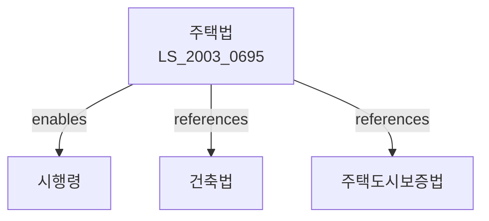

# 주택법

> [법률 제20100호, 2024. 1. 9., 일부개정]

---

---

## 제1장 총칙

### 제1조 (목적)

이 법은 주택의 건설ㆍ공급 및 관리에 관한 사항을 정함으로써 국민 주거생활의 안정과 주거수준의 향상에 이바지함을 목적으로 한다.

### 제2조 (정의)

이 법에서 사용하는 용어의 뜻은 다음과 같다.

1. "주택"이란 주거용으로 사용하는 건축물 및 시설을 말한다.
2. "공동주택"이란 주택으로 쓰는 층수가 2개 층 이상인 주택으로서 다음 각 목의 어느 하나에 해당하는 것을 말한다.
   가. 다세대주택: 주택으로 쓰는 바닥면적의 합계가 660제곱미터 이하이고 층수가 4개 층 이하인 주택
   나. 연립주택: 주택으로 쓰는 바닥면적의 합계가 660제곱미터를 초과하고 층수가 4개 층 이하인 주택
   다. 아파트: 층수가 5개 층 이상인 주택
3. "다가구주택"이란 주택으로 쓰는 바닥면적의 합계가 660제곱미터 이하이고 층수가 3개 층 이하인 주택으로서 19세대 이하가 거주할 수 있는 주택을 말한다.
4. "단독주택"이란 공동주택 및 다가구주택 외의 주택을 말한다.
5. "주택건설사업"이란 주택과 그 부대시설 및 복리시설을 건설하는 사업을 말한다.
6. "대지조성사업"이란 주택건설사업을 목적으로 하는 토지를 조성하는 사업을 말한다.

---

## 제2장 주택건설

### 제10조 (주택건설사업의 등록)

① 주택건설사업을 하려는 자는 국토교통부장관에게 등록하여야 한다.

② 제1항에 따른 등록의 기준ㆍ절차 등에 필요한 사항은 대통령령으로 정한다.

### 제11조 (등록의 결격사유)

다음 각 호의 어느 하나에 해당하는 자는 제10조에 따른 등록을 할 수 없다.

1. 금치산자 또는 한정치산자
2. 파산자로서 복권되지 아니한 자
3. 이 법 또는 「주택도시보증법」을 위반하여 징역형을 선고받고 그 집행이 종료되거나 집행을 받지 아니하기로 확정된 후 2년이 지나지 아니한 자
4. 제16조에 따라 등록이 취소된 후 2년이 지나지 아니한 자

### 제12조 (주택건설사업의 시공)

① 제10조에 따라 등록한 자(이하 "주택건설사업자"라 한다)는 주택건설사업을 시공할 수 있다.

② 주택건설사업자는 건설기술의 향상과 주거환경의 개선을 위하여 노력하여야 한다.

---

## 제3장 주택공급

### 제25조 (주택의 공급)

① 주택건설사업자는 건설한 주택을 공급한다.

② 국가 또는 지방자치단체는 저소득층 및 취약계층에게 주택을 공급하기 위하여 공공주택을 건설ㆍ공급할 수 있다.

### 제26조 (주택공급의 기준)

주택건설사업자는 대통령령으로 정하는 바에 따라 공급대상자의 선정기준, 공급방법, 공급가격 등을 정하여 주택을 공급하여야 한다.

### 제27조 (청약저축)

① 주택을 공급받으려는 자는 주택청약종합저축 등 대통령령으로 정하는 저축에 가입하여야 한다.

② 제1항에 따른 저축의 종류, 가입요건, 납입금액 등에 관하여 필요한 사항은 대통령령으로 정한다.

---

## 제4장 주택관리

### 제35조 (공동주택의 관리)

① 공동주택의 관리주체는 입주자 등의 공동생활의 편익을 도모하고 주택의 가치를 유지ㆍ관리하기 위하여 노력하여야 한다.

② 공동주택의 관리방법 및 관리주체의 의무 등에 관하여 필요한 사항은 대통령령으로 정한다.

### 제36조 (관리단)

① 공동주택을 관리하기 위하여 입주자 등으로 구성된 관리단을 설립한다.

② 관리단은 법인으로 한다.

③ 관리단의 설립ㆍ운영 등에 관하여 필요한 사항은 대통령령으로 정한다.

### 제37조 (장기수선충당금)

① 관리주체는 공동주택의 주요 시설의 교체 및 보수에 소요되는 비용에 충당하기 위하여 장기수선충당금을 적립하여야 한다.

② 장기수선충당금의 적립기준 및 사용 등에 관하여 필요한 사항은 대통령령으로 정한다.

---

## 제5장 주거복지

### 제50조 (주거급여)

국가 및 지방자치단체는 생활이 어려운 사람에게 주거급여를 실시하여야 한다.

### 제51조 (공공임대주택)

① 국가 및 지방자치단체는 저소득층을 위한 공공임대주택을 공급하여야 한다.

② 공공임대주택의 공급대상, 공급기준, 임대기간 등에 관하여 필요한 사항은 대통령령으로 정한다.

### 제52조 (주거취약계층 지원)

국가 및 지방자치단체는 장애인, 고령자, 한부모가족 등 주거취약계층에게 주거안정을 위한 지원을 하여야 한다.

---

## 제6장 벌칙

### 제70조 (벌칙)

다음 각 호의 어느 하나에 해당하는 자는 5년 이하의 징역 또는 5천만원 이하의 벌금에 처한다.

1. 제10조 제1항에 따른 등록을 하지 아니하고 주택건설사업을 한 자
2. 허위 기타 부정한 방법으로 제10조 제1항에 따른 등록을 한 자

### 제71조 (벌칙)

다음 각 호의 어느 하나에 해당하는 자는 3년 이하의 징역 또는 3천만원 이하의 벌금에 처한다.

1. 제26조에 따른 주택공급기준을 위반하여 주택을 공급한 자
2. 제37조에 따른 장기수선충당금을 적립하지 아니한 자

---

## 관계 그래프

**상위 법령**
- [[헌법]] 제35조 (거주의 자유)

**관련 법령**
- [[건축법]]
- [[주택도시보증법]]
- [[도시 및 주거환경정비법]]
- [[주택임대차보호법]]

**하위 법령**
- [[주택법 시행령]]
- [[주택법 시행규칙]]
