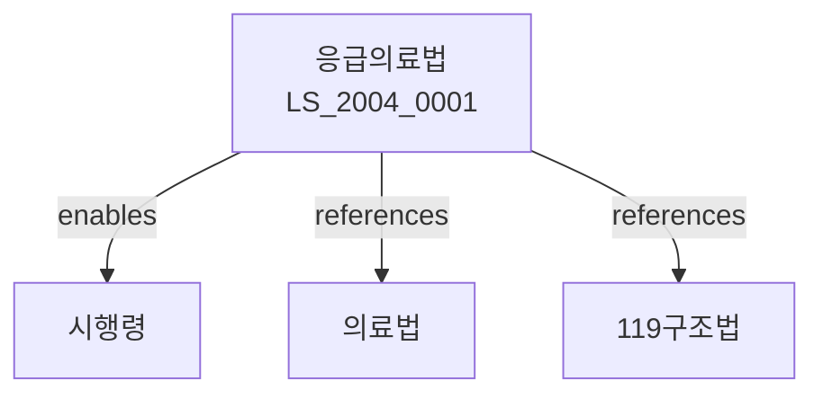

# 응급의료법

> [법률 제20112호, 2024. 1. 9., 일부개정]

---

---

## 제1장 총칙
### 제1조 (목적)
이 법은 응급의료에 관한 사항을 정함으로써 응급환자의 신속한 구조와 치료를 도모하고 국민의 생명을 보호함을 목적으로 한다。

### 제2조 (정의)
이 법에서 사용하는 용어의 뜻은 다음과 같다。

1. "응급환자"란 질병ㆍ부상 등으로 인하여 응급조치가 필요한 환자를 말한다.
2. "응급의료"란 응급환자에게 응급조치를 제공하는 것을 말한다.
3. "응급의료기관"이란 응급의료를 제공하는 의료기관을 말한다.
4. "응급구조"란 응급환자를 응급의료기관으로 이송하는 것을 말한다。

---

## 제2장 응급의료체계
### 第5条(응급의료체계)
국가는 응급의료체계를 구축한다。
### 第6条(응급의료기관)
응급의료기관은 다음 각 호와 같다。

1. 지역응급의료센터
2. 전문응급의료기관
3. 응급진료센터
### 第7条(지역응급의료센터)
지역응급의료센터는 관할 구역의 응급의료를 담당한다.
### 第8条(전문응급의료기관)
전문응급의료기관은 중증응급환자의 치료를 담당한다.

---

## 제3장 응급의료인력
### 第15条(응급의료전문인력)
응급의료전문인력을 양성한다.
### 第16条(응급구조사)
응급구조사는 응급구조를 담당한다.
### 第17条(자격)
응급의료전문인력의 자격은 정한다.
### 第18条(교육훈련)
응급의료전문인력에 대한 교육훈련을 실시한다.

---

## 제4장 응급구조
### 第25条(응급구조)
응급구조는 119구조 등을 통해 이루어진다.
### 第26条(119구조)
119구조는 응급환자에 대한 신속한 구조를 담당한다.
### 第27条(응급환자의 이송)
응급환자는 응급의료기관으로 이송한다.
### 第28条(이송의 우선순위)
응급환자는 중증도에 따라 우선순위를 정하여 이송한다.

---

## 제5장 응급의료정보
### 第35条(응급의료정보체계)
응급의료정보체계를 구축한다。
### 第36条(정보의 수집)
응급의료에 필요한 정보를 수집한다。
### 第37条(정보의 관리)
응급의료정보를 체계적으로 관리한다.
### 第38条(정보의 활용)
응급의료정보를 응급의료에 활용한다.

---

## 제6장 비용
### 第45条(응급의료비용)
응급의료비용은 건강보험에 의하여 지급한다.
### 第46条(구조비용)
구조비용은 건강보험에 의하여 지급한다.
### 第47条(국고보조)
국가는 응급의료 운영에 필요한 비용을 보조한다.
### 第48条(지방비 부담)
지방자치단체는 응급의료 운영에 필요한 비용을 부담할 수 있다.

---

## 제7장 감독
### 第55条(감독)
보건복지부장관은 응급의료를 감독한다。
### 第56条(보고 및 검사)
보건복지부장관은 필요한 경우 보고를 명하거나 검사할 수 있다.
### 第57条(시정명령)
보건복지부장관은 이 법을 위반한 자에 대하여 시정명령을 할 수 있다.
### 第58条(과태료)
다음 각 호의 어느 하나에 해당하는 자에게는 과태료를 부과한다。
1. 정당한 사유 없이 보고를 하지 아니한 자
2. 응급의료기관을 거짓으로 신고한 자
---

## 제8장 벌칙
### 第65条(과태료)
다음 각 호의 어느 하나에 해당하는 자에게는 1천만원 이하의 과태료를 부과한다。
1. 정당한 사유 없이 보고를 하지 아니한 자
2. 응급환자를 차별한 자
---

## 관계 그래프

**상위 법령**
- [[헌법]] 제34조 (사회보장), 제36조 (국민의 건강)
- [[의료법]]

**관련 법령**
- [[의료법]]
- [[119구조법]]
- [[국민건강보험법]]
- [[재난안전법]]

**하위 법령**
- [[응급의료법 시행령]]
