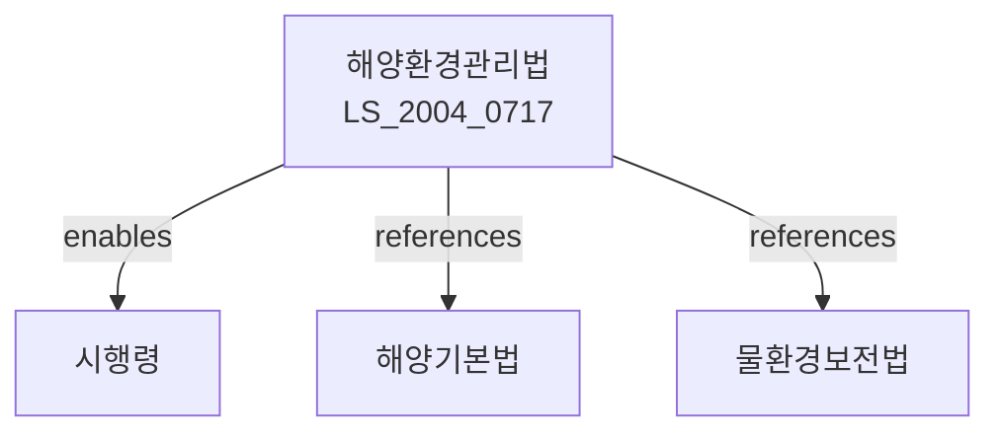

# 해양환경 관리법

> [법률 제20106호, 2024. 1. 9., 일부개정]

---

---

## 제1장 총칙

### 제1조 (목적)

이 법은 해양오염의 방지와 해양생태계의 보전ㆍ관리에 관한 사항을 정함으로써 해양환경을 적정하게 관리하고 해양의 지속가능한 이용을 도모함을 목적으로 한다。

### 제2조 (정의)

이 법에서 사용하는 용어의 뜻은 다음과 같다。

1. "해양오염"이란 해양에 유해물질을 유출ㆍ방류하거나 투기하여 해양환경을 나쁘게 하는 것을 말한다。
2. "해양생태계"란 해양의 생물과 그 생물이 살아가는 환경이 상호 작용하는 계를 말한다。
3. "해양보호구역"이란 해양환경을 보전하기 위하여 지정하는 구역을 말한다。
4. "해양환경영향평가"란 해양에 미치는 영향을 미리 조사ㆍ분석ㆍ평가하는 것을 말한다。

---

## 제2장 해양환경 관리기본계획

### 第5条 (기본계획의 수립)

① 해양수산부장관은 관계 중앙행정기관의 장과 협의하여 10년마다 해양환경 관리기본계획을 수립하여야 한다。

② 기본계획에는 다음 각 호의 사항이 포함되어야 한다。

1. 해양환경 현황 및 전망
2. 해양오염 방지에 관한 사항
3. 해양생태계 보전에 관한 사항
4. 해양보호구역의 지정 및 관리에 관한 사항
5. 그 밖에 해양환경 관리에 필요한 사항

### 第6条 (시행계획의 수립)

관계 중앙행정기관의 장은 기본계획에 따라 소관 분야의 시행계획을 수립하여야 한다。

---

## 제3장 해양오염의 방지

### 第10条 (해양오염의 방지)

누구든지 해양에 유해물질을 유출ㆍ방류하거나 투기하여 해양환경을 오염시켜서는 아니 된다。

### 第11条 (배출허용기준)

해양으로 배출하는 폐수 등은 대통령령으로 정하는 배출허용기준에 적합하여야 한다。

### 第12条 (해양투기의 제한)

해양에 폐기물을 투기하려는 자는 해양수산부장관의 허가를 받아야 한다。

### 第13条 (해양사고에 대한 대책)

해양오염사고가 발생한 경우 사업자는 지체 없이 오염방제조치를 하여야 한다。

---

## 제4장 해양생태계의 보전

### 第20条 (해양보호구역의 지정)

해양수산부장관은 해양생태계를 보전하기 위하여 필요한 해역을 해양보호구역으로 지정할 수 있다。

### 第21条 (해양보호구역의 관리)

해양보호구역에서는 다음 각 호의 행위를 제한할 수 있다。

1. 해양생물의 포획ㆍ채취
2. 해저광물의 채광
3. 매립 또는 준설
4. 그 밖에 해양생태계에 영향을 미치는 행위

### 第22条 (해양생물다양성의 보전)

국가는 해양생물다양성을 보전하기 위하여 필요한 조치를 하여야 한다。

---

## 제5장 해양환경영향평가

### 第30条 (해양환경영향평가)

① 대통령령으로 정하는 규모 이상의 사업을 해양에서 하려는 자는 해양환경영향평가서를 작성하여 해양수산부장관에게 제출하여야 한다。

② 해양환경영향평가의 항목 및 방법 등에 관하여 필요한 사항은 대통령령으로 정한다。

### 第31条 (평가서의 검토)

해양수산부장관은 평가서를 검토한 후 해양환경영향을 최소화하는 대책을 수립하여야 한다。

---

## 제6장 벌칙

### 第50条 (벌칙)

다음 각 호의 어느 하나에 해당하는 자는 5년 이하의 징역 또는 5천만원 이하의 벌금에 처한다。

1. 제10조에 따른 해양오염 방지의무를 위반한 자
2. 제12조에 따른 허가 없이 해양투기를 한 자

### 第51条 (과태료)

다음 각 호의 어느 하나에 해당하는 자에게는 3천만원 이하의 과태료를 부과한다。

1. 배출허용기준을 위반한 자
2. 정당한 사유 없이 보고를 하지 아니한 자

---

## 관계 그래프

**상위 법령**
- [[헌법]] 제35조 (환경권)
- [[해양기본법]]

**관련 법령**
- [[물환경보전법]]
- [[해양오염방지법]]
- [[해양안전관리법]]
- [[해양수산자원관리법]]

**하위 법령**
- [[해양환경관리법 시행령]]
