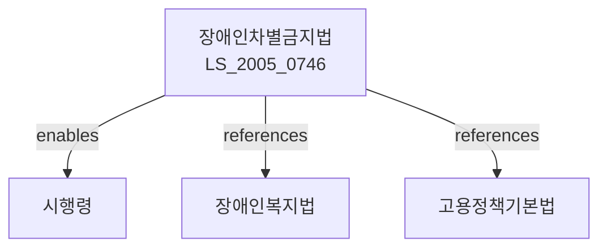

# 장애인차별금지 및 권리구제 등에 관한 법률

> [법률 제20094호, 2024. 1. 9., 일부개정]

---

---

## 제1장 총칙

### 제1조 (목적)

이 법은 장애인의 완전한 사회참여와 평등을 실현하기 위하여 장애에 대한 차별을 금지하고 장애인의 권익을 효과적으로 보장ㆍ구제함으로써 장애인의 인권을 보호하고 사회통합에 이바지함을 목적으로 한다.

### 제2조 (정의)

이 법에서 사용하는 용어의 뜻은 다음과 같다.

1. "장애인"이란 신체적ㆍ정신적 장애로 인하여 장기간에 걸쳐 일상생활이나 사회생활을 하는 데 상당한 제약을 받는 자로서 대통령령으로 정하는 자를 말한다.
2. "차별"이란 장애를 이유로 하는 통상적인 대우와 구별되는 혜택이나 불이익을 주는 것을 말한다.
3. "합리적 편의제공"이란 장애인이 비장애인과 동등하게 활동할 수 있도록 장애인의 특성에 맞게 편의를 제공하는 것을 말한다.
4. "공공기관"이란 국가기관, 지방자치단체, 공공단체 및 그 밖에 대통령령으로 정하는 기관을 말한다。

---

## 제2장 차별의 금지

### 제4조 (차별의 금지)

누구든지 장애를 이유로 다음 각 호의 어느 하나에 해당하는 차별을 하여서는 아니 된다.

1. 고용, 임금, 승진, 교육 등 근로와 관련된 차별
2. 재화, 용역 및 시설의 공급과 이용에 관한 차별
3. 교육 및 직업훈련과 관련된 차별
4. 그 밖에 사회생활과 관련된 차별

### 제5조 (정당한 사유)

제4조에도 불구하고 다음 각 호의 어느 하나에 해당하는 경우에는 차별로 보지 아니한다.

1. 장애의 성격상 특정 활동을 수행할 수 없는 경우
2. 특정 직무의 성격상 장애으로 인하여 수행할 수 없는 경우
3. 그 밖에 정당한 사유가 있는 경우

### 제6조 (합리적 편의제공)

① 공공기관 및 사업자는 장애인에게 합리적 편의를 제공하여야 한다。

② 제1항에 따른 합리적 편의제공에 관한 기준 및 방법 등에 관하여 필요한 사항은 대통령령으로 정한다。

---

## 제3장 장애인에 대한 고용

### 제10조 (고용차별 금지)

사업주는 근로자의 채용, 임금, 승진, 교육, 정년, 퇴직 및 해고 등에 있어서 장애를 이유로 차별하여서는 아니 된다。

### 제11조 (장애인 고용의무)

① 국가 및 지방자치단체, 공공기관 및 상시 근로자 50명 이상을 고용하는 사업주는 근로자 수의 100분의 3 이상에 해당하는 장애인을 고용하여야 한다.

② 장애인 고용의무의 이행기준 및 고용장려금 등에 관하여 필요한 사항은 따로 법률로 정한다。

### 제12조 (장애인 고용촉진)

국가와 지방자치단체는 장애인의 고용을 촉진하기 위하여 다음 각 호의 시책을 추진하여야 한다。

1. 장애인 직업재활시설의 설치ㆍ운영 지원
2. 장애인 적합 직종 개발 및 보급
3. 장애인 고용장려금 지급
4. 그 밖에 장애인 고용촉진에 필요한 시책

---

## 제4장 편의시설 및 정보접근

### 第20条 (편의시설의 설치)

① 공공시설, 대중교통수단 및 공중이용시설의 설치자는 장애인의 이용에 편리하도록 편의시설을 설치하여야 한다.

② 편의시설의 종류 및 설치기준 등에 관하여 필요한 사항은 대통령령으로 정한다。

### 第21条 (정보접근 보장)

① 국가 및 지방자치단체, 공공기관은 장애인의 정보접근을 보장하기 위하여 다음 각 호의 조치를 하여야 한다.

1. 점자, 수화, 자막 등 의사소통 수단 제공
2. 장애인 전용 정보단말기 보급
3. 웹사이트의 웹접근성 준수
4. 그 밖에 장애인의 정보접근에 필요한 조치

---

## 제5장 권리구제

### 第30条 (장애인차별금지위원회)

① 장애인차별사항을 심의하고 장애인의 권리구제를 위하여 국가인권위원회에 장애인차별금지위원회를 둔다.

② 장애인차별금지위원회의 조직 및 운영 등에 관하여 필요한 사항은 대통령령으로 정한다。

### 第31条 (차별시정 신청)

장애인차별금지법에 따른 차별을 받은 자는 장애인차별금지위원회에 차별시정을 신청할 수 있다。

### 第32条 (조정)

장애인차별금지위원회는 차별시정 신청을 받은 경우 당사자 사이의 조정을 시도할 수 있다。

---

## 제6장 벌칙

### 第50条 (벌칙)

다음 각 호의 어느 하나에 해당하는 자는 3년 이하의 징역 또는 2천만원 이하의 벌금에 처한다。

1. 제4조에 따른 차별금지 규정을 위반한 자
2. 제6조에 따른 합리적 편의제공 의무를 위반한 자

### 第51条 (과태료)

다음 각 호의 어느 하나에 해당하는 자에게는 1천만원 이하의 과태료를 부과한다。

1. 제20조에 따른 편의시설을 설치하지 아니한 자
2. 제21조에 따른 정보접근 보장 의무를 위반한 자

---

## 관계 그래프

**상위 법령**
- [[헌법]] 제11조 (평등권), 제34조 (인간다운 생활권)
- [[장애인복지법]]

**관련 법령**
- [[고용정책기본법]]
- [[장애인고용촉진 및 직업재활법]]
- [[편의증진에관한법률]]
- [[국가인권위원회법]]

**하위 법령**
- [[장애인차별금지법 시행령]]
