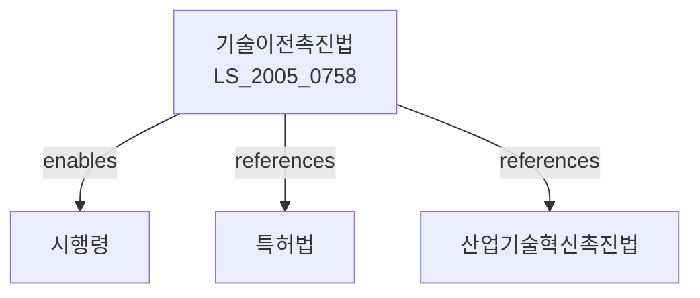

# 기술의 이전 및 사업화 촉진에 관한 법률

> [법률 제20082호, 2024. 1. 9., 일부개정]

---

---

## 제1장 총칙

### 제1조 (목적)

이 법은 기술의 이전 및 사업화에 관한 사항을 정함으로써 기술혁신을 촉진하고 국가경쟁력을 강화하여 국민경제의 발전에 이바지함을 목적으로 한다。

### 제2조 (정의)

이 법에서 사용하는 용어의 뜻은 다음과 같다。

1. "기술"이란 제품의 제조, 서비스의 제공 등에 이용되는 지식, 기법 및 그 응용방법을 말한다。
2. "기술이전"이란 기술을 타인에게 유상 또는 무상으로 제공하는 것을 말한다。
3. "사업화"란 기술을 이용하여 제품을 제조하거나 서비스를 제공하는 등 영리를 목적으로 하는 사업을 영위하는 것을 말한다。
4. "연구개발특구"란 연구개발 활동을 촉진하기 위하여 지정된 구역을 말한다。

---

## 제2장 기술이전 촉진

### 第3条 (기술이전촉진 기본계획)

① 정부는 기술이전 및 사업화를 촉진하기 위하여 5년마다 기술이전촉진 기본계획을 수립하여야 한다.

② 기본계획에는 다음 각 호의 사항이 포함되어야 한다.

1. 기술이전 및 사업화 현황 및 전망
2. 기술이전 촉진 방안
3. 사업화 지원 방안
4. 그 밖에 기술이전 및 사업화에 필요한 사항

### 第4条 (기술이전기관)

① 기술이전 및 사업화를 촉진하기 위하여 기술이전기관을 지정할 수 있다.

② 기술이전기관의 지정기준 및 절차 등에 관하여 필요한 사항은 대통령령으로 정한다.

### 第5条 (기술이전 정보망)

① 정부는 기술이전 정보를 효율적으로 제공하기 위하여 기술이전 정보망을 구축ㆍ운영할 수 있다.

② 기술이전 정보망의 구축 및 운영에 관하여 필요한 사항은 대통령령으로 정한다.

---

## 제3장 기술사업화 촉진

### 第10条 (기술사업화 지원)

① 정부는 기술의 사업화를 촉진하기 위하여 다음 각 호의 지원을 할 수 있다.

1. 자금 지원
2. 기술 지도 및 컨설팅
3. 창업 지원
4. 그 밖에 기술사업화에 필요한 지원

② 제1항에 따른 지원의 대상, 기준 및 절차 등에 관하여 필요한 사항은 대통령령으로 정한다.

### 第11条 (기술보증)

① 정부는 기술의 사업화를 촉진하기 위하여 기술보증제도를 운영할 수 있다.

② 기술보증의 대상, 절차 및 한도 등에 관하여 필요한 사항은 대통령령으로 정한다.

### 第12条 (기술평가)

① 기술의 사업화를 촉진하기 위하여 기술평가를 실시할 수 있다.

② 기술평가의 기준 및 방법 등에 관하여 필요한 사항은 대통령령으로 정한다。

---

## 제4장 연구개발특구

### 第20条 (연구개발특구의 지정)

① 산업통상자원부장관은 연구개발 활동을 촉진하기 위하여 필요한 지역을 연구개발특구로 지정할 수 있다.

② 연구개발특구의 지정기준 및 절차 등에 관하여 필요한 사항은 대통령령으로 정한다.

### 第21条 (연구개발특구의 운영)

① 연구개발특구에는 연구개발기관, 기술기업 등이 입주할 수 있다.

② 연구개발특구의 운영에 관하여 필요한 사항은 대통령령으로 정한다。

---

## 제5장 기술금융

### 第30条 (기술금융 지원)

정부는 기술의 이전 및 사업화에 필요한 자금을 원활하게 공급하기 위하여 기술금융을 지원할 수 있다.

### 第31条 (기술금융기관)

① 기술금융을 제공하는 기관을 기술금융기관으로 지정할 수 있다.

② 기술금융기관의 지정기준 및 업무 등에 관하여 필요한 사항은 대통령령으로 정한다.

---

## 제6장 벌칙

### 第40条 (과태료)

다음 각 호의 어느 하나에 해당하는 자에게는 1천만원 이하의 과태료를 부과한다。

1. 제4조에 따른 기술이전기관의 지정기준을 위반한 자
2. 정당한 사유 없이 보고를 하지 아니한 자

---

## 관계 그래프

**상위 법령**
- [[산업기술혁신촉진법]]
- [[특허법]]

**관련 법령**
- [[중소기업창업지원법]]
- [[벤처기업육성에관한특별조치법]]
- [[기술신용보증기금법]]
- [[산업발전법]]

**하위 법령**
- [[기술이전촉진법 시행령]]
