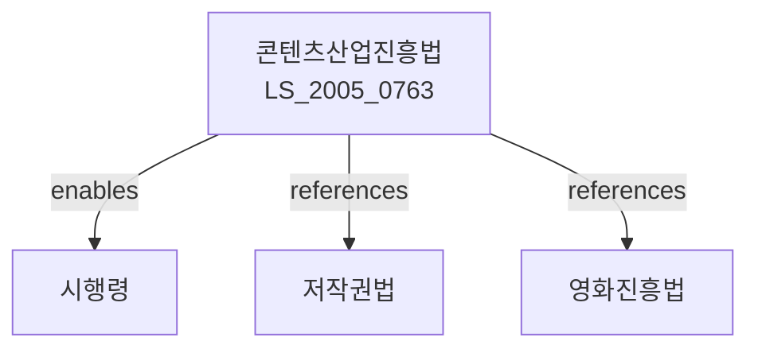

# 콘텐츠산업 진흥법

> [법률 제20107호, 2024. 1. 9., 일부개정]

---

---

## 제1장 총칙

### 제1조 (목적)

이 법은 콘텐츠산업을 진흥하기 위한 시책을 종합적으로 추진함으로써 국민의 문화향수 기회를 확대하고 국민경제의 발전에 이바지함을 목적으로 한다。

### 제2조 (정의)

이 법에서 사용하는 용어의 뜻은 다음과 같다。

1. "콘텐츠"란 문화ㆍ지식ㆍ정보 등을 소재로 하여 영상ㆍ음악ㆍ게임ㆍ출판 등의 형태로 제작된 것을 말한다。
2. "콘텐츠산업"이란 콘텐츠를 기획ㆍ제작ㆍ유통ㆍ서비스하는 산업을 말한다。
3. "콘텐츠기업"이란 콘텐츠산업을 영위하는 기업을 말한다。
4. "콘텐츠전문인력"이란 콘텐츠의 기획ㆍ제작ㆍ유통 등에 관한 전문지식을 가진 자를 말한다。

---

## 제2장 콘텐츠산업 진흥기본계획

### 第5条 (기본계획의 수립)

① 문화체육관광부장관은 5년마다 콘텐츠산업 진흥기본계획을 수립하여야 한다。

② 기본계획에는 다음 각 호의 사항이 포함되어야 한다。

1. 콘텐츠산업 현황 및 전망
2. 콘텐츠산업 진흥의 목표 및 방향
3. 콘텐츠 기술개발에 관한 사항
4. 콘텐츠 전문인력 양성에 관한 사항
5. 콘텐츠 수출진흥에 관한 사항
6. 그 밖에 콘텐츠산업 진흥에 필요한 사항

### 第6条 (콘텐츠진흥기관)

① 문화체육관광부장관은 콘텐츠산업의 진흥을 위하여 콘텐츠진흥기관을 지정할 수 있다。

② 콘텐츠진흥기관의 지정기준 및 업무 등에 관하여 필요한 사항은 대통령령으로 정한다。

---

## 제3장 콘텐츠산업의 진흥

### 第10条 (기술개발의 지원)

국가는 콘텐츠 기술개발을 위하여 다음 각 호의 지원을 할 수 있다。

1. 기술개발자금의 지원
2. 기술지도 및 컨설팅
3. 시설투자 지원
4. 그 밖에 기술개발에 필요한 지원

### 第11条 (전문인력 양성)

국가는 콘텐츠 전문인력을 양성하기 위하여 다음 각 호의 시책을 추진한다。

1. 교육프로그램의 개발 및 지원
2. 전문인력 양성기관의 지정
3. 해외연수 지원
4. 그 밖에 전문인력 양성에 필요한 시책

### 第12条 (자금지원)

국가는 콘텐츠기업에 대하여 자금을 지원할 수 있다。

### 第13条 (세제지원)

콘텐츠기업에 대하여는 조세특례제한법에 따른 세제지원을 할 수 있다。

---

## 제4장 콘텐츠의 유통 및 수출

### 第20条 (유통구조의 개선)

국가는 콘텐츠의 유통구조를 개선하기 위하여 필요한 시책을 추진한다。

### 第21条 (수출진흥)

국가는 콘텐츠의 수출을 진흥하기 위하여 다음 각 호의 지원을 할 수 있다。

1. 해외시장 조사 및 정보제공
2. 해외마케팅 지원
3. 해외진출 컨설팅
4. 그 밖에 수출진흥에 필요한 지원

### 第22条 (해외진출 지원)

국가는 콘텐츠기업의 해외진출을 위하여 필요한 지원을 할 수 있다。

---

## 제5장 벌칙

### 第40条 (과태료)

다음 각 호의 어느 하나에 해당하는 자에게는 1천만원 이하의 과태료를 부과한다。

1. 정당한 사유 없이 보고를 하지 아니한 자
2. 허위로 보고한 자

---

## 관계 그래프

**상위 법령**
- [[헌법]] 제22조 (학문과 예술의 자유)
- [[문화기본법]]

**관련 법령**
- [[저작권법]]
- [[영화진흥법]]
- [[게임산업진흥법]]
- [[출판문화산업진흥법]]
- [[방송법]]

**하위 법령**
- [[콘텐츠산업진흥법 시행령]]
