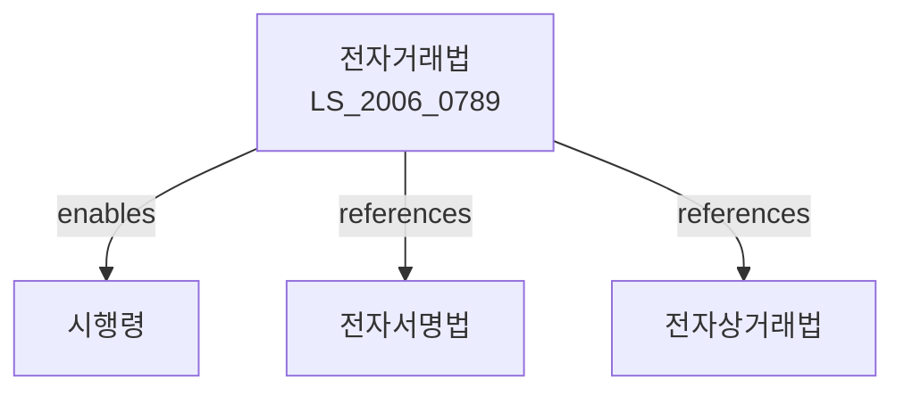

# 전자문서 및 전자거래 기본법

> [법률 제20092호, 2024. 1. 9., 일부개정]

---

---

## 제1장 총칙

### 제1조 (목적)

이 법은 전자문서 및 전자거래의 효력 등에 관한 기본적인 사항을 정함으로써 전자거래를 촉진하고 국민경제의 발전에 이바지함을 목적으로 한다.

### 제2조 (정의)

이 법에서 사용하는 용어의 뜻은 다음과 같다.

1. "전자문서"란 컴퓨터 등 정보처리능력을 가진 장치에 의하여 전자적인 형태로 작성ㆍ송신ㆍ수신 또는 저장된 정보를 말한다.
2. "전자거래"란 재화나 용역의 거래의 전부 또는 일부를 전자문서에 의하여 처리하는 것을 말한다.
3. "전자서명"란 전자문서의 작성자의 신원과 당해 전자문서의 변경 여부를 확인할 수 있도록 한 서명을 말한다.
4. "인증기관"이란 전자서명의 진위를 확인하는 기관을 말한다。

---

## 제2장 전자문서

### 第4条 (전자문서의 효력)

전자문서는 법률ㆍ행정규칙 또는 관습에 특별한 규정이 있는 경우를 제외하고는 서면문서와 동일한 효력을 가진다。

### 第5条 (전자문서의 작성)

전자문서는 그 내용을 임의로 변경할 수 없는 방식으로 작성하여야 한다。

### 第6条 (전자문서의 보존)

전자문서를 보존하는 경우에는 그 내용이 변경되지 아니하도록 하여야 한다。

---

## 제3장 전자서명

### 第10条 (전자서명의 효력)

전자서명은 서면문서의 서명 또는 기명날인과 동일한 효력을 가진다。

### 第11条 (공인전자서명)

① 인증기관으로부터 인증받은 전자서명은 공인전자서명으로 한다。

② 공인전자서명에 관하여 필요한 사항은 대통령령으로 정한다。

### 第12条 (인증기관의 지정)

① 전자서명의 인증업무를 수행하려는 자는 과학기술정보통신부장관의 지정을 받아야 한다。

② 지정의 요건 및 절차 등에 관하여 필요한 사항은 대통령령으로 정한다。

---

## 제4장 전자거래

### 第20条 (전자거래의 효력)

전자거래는 법률ㆍ행정규칙 또는 관습에 특별한 규정이 있는 경우를 제외하고는 일반거래와 동일한 효력을 가진다。

### 第21条 (전자거래의 안정성)

전자거래에 참여하는 자는 전자거래의 안정성과 신뢰성을 확보하기 위하여 노력하여야 한다。

### 第22条 (전자거래의 보호)

국가는 전자거래에 참여하는 자의 권익을 보호하기 위하여 필요한 조치를 하여야 한다。

---

## 제5장 전자거래 촉진

### 第30条 (전자거래 촉진정책)

정부는 전자거래를 촉진하기 위하여 다음 각 호의 정책을 추진한다。

1. 전자거래 기반의 구축
2. 전자거래 기술의 개발
3. 전자거래 인력의 양성
4. 국제전자거래의 촉진

### 第31条 (기술개발의 지원)

국가는 전자거래 관련 기술의 개발을 지원할 수 있다。

---

## 제6장 벌칙

### 第40条 (벌칙)

다음 각 호의 어느 하나에 해당하는 자는 3년 이하의 징역 또는 3천만원 이하의 벌금에 처한다。

1. 인증기관의 지정 없이 인증업무를 수행한 자
2. 허위로 전자서명을 한 자

### 第41条 (과태료)

다음 각 호의 어느 하나에 해당하는 자에게는 1천만원 이하의 과태료를 부과한다。

1. 정당한 사유 없이 보고를 하지 아니한 자
2. 정당한 사유 없이 검사를 거부한 자

---

## 관계 그래프

**상위 법령**
- [[헌법]] 제127조 (과학기술 진흥)
- [[전자서명법]]

**관련 법령**
- [[전자상거래등에서의소비자보호에관한법률]]
- [[정보통신망 이용촉진 및 정보보호 등에 관한 법률]]
- [[전자금융거래법]]
- [[전자정부법]]

**하위 법령**
- [[전자거래법 시행령]]
