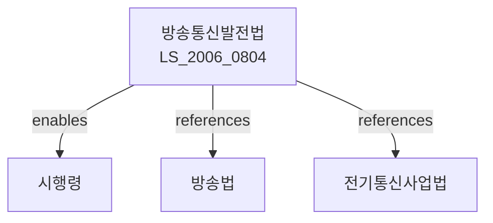

# 방송통신발전 기본법

> [법률 제20108호, 2024. 1. 9., 일부개정]

---

---

## 제1장 총칙

### 제1조 (목적)

이 법은 방송과 통신의 융합 및 발전에 관한 기본적인 사항을 정함으로써 국민의 알 권리를 보장하고 방송통신의 발전을 도모하여 국민경제의 발전에 이바지함을 목적으로 한다。

### 제2조 (정의)

이 법에서 사용하는 용어의 뜻은 다음과 같다。

1. "방송통신"이란 방송과 통신의 융합서비스 및 이와 관련된 기술ㆍ시설 등을 말한다。
2. "방송통신서비스"란 방송과 통신을 결합하여 제공하는 서비스를 말한다。
3. "방송통신망"이란 방송과 통신을 위한 네트워크를 말한다。
4. "방송통신사업"이란 방송통신서비스를 제공하는 사업을 말한다。

---

## 제2장 방송통신발전 기본계획

### 第5条 (기본계획의 수립)

① 과학기술정보통신부장관은 방송통신위원회와 협의하여 5년마다 방송통신발전 기본계획을 수립하여야 한다。

② 기본계획에는 다음 각 호의 사항이 포함되어야 한다。

1. 방송통신 현황 및 전망
2. 방송통신 기술개발에 관한 사항
3. 방송통신망 구축에 관한 사항
4. 방송통신서비스 진흥에 관한 사항
5. 이용자 보호에 관한 사항
6. 그 밖에 방송통신발전에 필요한 사항

### 第6条 (방송통신발전 심의)

방송통신위원회는 기본계획의 수립 및 시행에 관한 중요 사항을 심의한다。

---

## 제3장 방송통신망의 구축

### 第10条 (방송통신망의 구축)

국가는 방송통신망을 구축하기 위하여 필요한 지원을 할 수 있다。

### 第11条 (초고속정보통신망)

국가는 초고속정보통신망의 구축을 촉진하기 위하여 필요한 시책을 추진한다。

### 第12条 (차세대방송망)

국가는 차세대방송망의 구축을 촉진하기 위하여 필요한 시책을 추진한다。

---

## 제4장 방송통신서비스의 진흥

### 第20条 (방송통신서비스의 진흥)

국가는 방송통신서비스를 진흥하기 위하여 다음 각 호의 시책을 추진한다。

1. 신규서비스 개발 지원
2. 기술개발 지원
3. 시범사업 추진
4. 그 밖에 방송통신서비스 진흥에 필요한 시책

### 第21条 (미디어융합 서비스)

국가는 미디어융합 서비스의 발전을 촉진하기 위하여 필요한 지원을 할 수 있다。

### 第22条 (UCC 보호)

국가는 이용자창작콘텐츠(UCC)의 창작 및 유통을 촉진하기 위하여 필요한 지원을 할 수 있다。

---

## 제5장 이용자 보호

### 第30条 (이용자 보호)

국가는 방송통신서비스 이용자를 보호하기 위하여 다음 각 호의 조치를 한다。

1. 개인정보 보호
2. 청소년 보호
3. 소비자 피해구제
4. 그 밖에 이용자 보호에 필요한 조치

### 第31条 (방송통신서비스의 품질)

방송통신서비스제공자는 대통령령으로 정하는 품질기준에 적합한 서비스를 제공하여야 한다。

---

## 제6장 방송통신발전을 위한 지원

### 第40条 (자금지원)

국가는 방송통신발전을 위하여 필요한 자금을 지원할 수 있다。

### 第41条 (세제지원)

방송통신사업에 대하여는 조세특례제한법에 따른 세제지원을 할 수 있다。

### 第42条 (인력양성)

국가는 방송통신 전문인력을 양성하기 위하여 필요한 지원을 할 수 있다。

---

## 제7장 벌칙

### 第45条 (과태료)

다음 각 호의 어느 하나에 해당하는 자에게는 1천만원 이하의 과태료를 부과한다。

1. 정당한 사유 없이 보고를 하지 아니한 자
2. 허위로 보고한 자

---

## 관계 그래프

**상위 법령**
- [[헌법]] 제21조 (언론ㆍ출판의 자유)
- [[방송법]]

**관련 법령**
- [[전기통신사업법]]
- [[정보통신망법]]
- [[인터넷멀티미디어방송사업법]]
- [[지상파DMB방송법]]

**하위 법령**
- [[방송통신발전법 시행령]]
