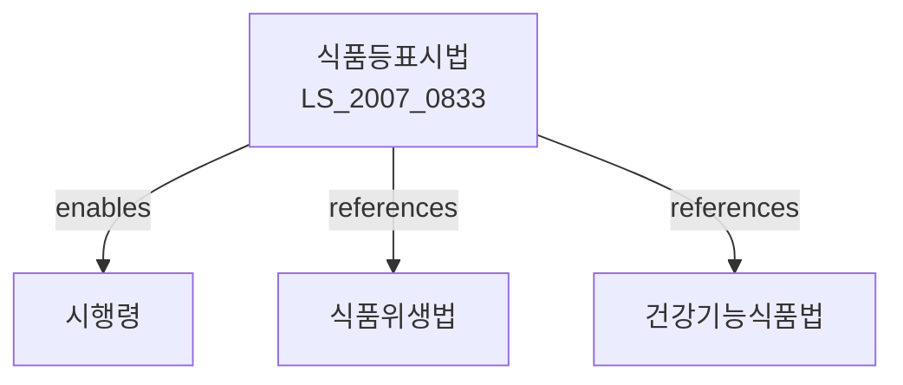

# 식품 등의 표시ㆍ광고에 관한 법률

> [법률 제20109호, 2024. 1. 9., 일부개정]

---

---

## 제1장 총칙

### 제1조 (목적)

이 법은 식품 등의 표시 및 광고에 관한 사항을 정함으로써 소비자에게 올바른 정보를 제공하고 소비자의 건강과 권익을 보호함을 목적으로 한다。

### 제2조 (정의)

이 법에서 사용하는 용어의 뜻은 다음과 같다。

1. "식품등"이란 식품, 건강기능식품, 식품첨가물 등을 말한다。
2. "표시"란 식품등의 용기 또는 포장에 적는 문구ㆍ그림 등을 말한다。
3. "광고"란 식품등의 판매를 위하여 정보를 제공하는 행위를 말한다。
4. "영양성분"란 식품등에 함유된 단백질ㆍ지방ㆍ탄수화물 등을 말한다。

---

## 제2장 표시에 관한 사항

### 第4条 (표시사항)

식품등의 용기 또는 포장에는 다음 각 호의 사항을 표시하여야 한다。

1. 제품명
2. 제조업소의 명칭 및 소재지
3. 제조연월일 또는 유통기한
4. 내용량
5. 영양성분
6. 그 밖에 식약처장이 정하는 사항

### 第5条 (영양성분의 표시)

영양성분은 대통령령으로 정하는 기준 및 방법에 따라 표시하여야 한다。

### 第6条 (표시의 방법)

표시는 소비자가 보기 쉽고 이해하기 쉽도록 하여야 한다。

### 第7条 (허위표시의 금지)

누구든지 식품등에 대하여 허위의 표시를 하여서는 아니 된다。

### 第8条 (과대포장의 제한)

식품등의 포장은 제품의 보호 및 이동에 필요한 범위를 초과하여서는 아니 된다。

---

## 제3장 광고에 관한 사항

### 第15条 (광고의 제한)

식품등의 광고는 다음 각 호의 방법에 의하여서는 아니 된다。

1. 허위 또는 과장된 내용
2. 의약품으로 오인될 우려가 있는 내용
3. 소비자를 기만할 우려가 있는 내용
4. 그 밖에 식약처장이 정하는 내용

### 第16条 (광고의 심의)

식품등의 광고는 식약처장의 심의를 받을 수 있다。

### 第17条 (광고의 자율심의)

식품등의 제조업자는 광고의 자율심의를 위한 기구를 설치할 수 있다。

---

## 제4장 감시 및 조치

### 第20条 (표시ㆍ광고의 감시)

식약처장은 식품등의 표시 및 광고를 감시할 수 있다。

### 第21条 (시정명령)

식약처장은 이 법을 위반한 자에게 시정을 명할 수 있다。

### 第22条 (공표)

식약처장은 이 법을 위반한 사실을 공표할 수 있다。

---

## 제5장 벌칙

### 第30条 (벌칙)

다음 각 호의 어느 하나에 해당하는 자는 3년 이하의 징역 또는 3천만원 이하의 벌금에 처한다。

1. 제7조에 따른 허위표시를 한 자
2. 제15조에 따른 광고제한을 위반한 자

### 第31条 (과태료)

다음 각 호의 어느 하나에 해당하는 자에게는 1천만원 이하의 과태료를 부과한다。

1. 제4조에 따른 표시사항을 표시하지 아니한 자
2. 제5조에 따른 영양성분 표시기준을 위반한 자

---

## 관계 그래프

**상위 법령**
- [[헌법]] 제36조 (국민의 건강)
- [[식품위생법]]

**관련 법령**
- [[건강기능식품법]]
- [[농수산물품질관리법]]
- [[축산물위생관리법]]
- [[소비자기본법]]

**하위 법령**
- [[식품등표시법 시행령]]
