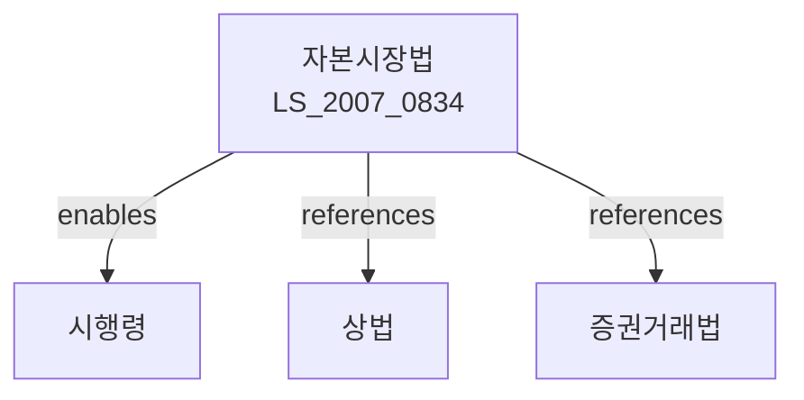

# 자본시장과 금융투자업에 관한 법률

> [법률 제20092호, 2024. 1. 9., 일부개정]

---

---

## 제1부 총칙

### 제1조 (목적)

이 법은 자본시장의 효율적인 기능을 제고하고 금융투자업의 건전한 발전을 도모하며, 투자자를 보호함으로써 국민경제의 발전에 이바지함을 목적으로 한다。

### 제2조 (정의)

이 법에서 사용하는 용어의 뜻은 다음과 같다.

1. "금융투자상품"이란 이익을 얻거나 손실을 회피할 목적으로 현재 또는 장래의 특정시점에 금전, 증권 등을 교환하기로 약속하는 것으로서 투자 위험이 있는 것을 말한다.
2. "증권"이란 다음 각 목의 어느 하나에 해당하는 것을 말한다.
   가. 주식, 신주인수권, 사채 등 출자 증권
   나. 국채, 지방채 등 채무 증권
   다. 수익증권, 투자증권 등 집합투자증권
3. "금융투자업"이란 금융투자상품을 취득ㆍ처분하거나 중개ㆍ주선하는 업무를 말한다.
4. "투자매매업"이란 금융투자상품을 자기의 계산으로 취득ㆍ처분하는 업무를 말한다。
5. "투자중개업"이란 금융투자상품의 취득ㆍ처분을 중개ㆍ주선하는 업무를 말한다。
6. "집합투자업"이란 투자자로부터 금전, 증권 등을 납입받아 이를 운용하고 그 수익을 분배하는 업무를 말한다。

---

## 제2부 금융투자업

### 제8조 (금융투자업의 등록)

① 금융투자업을 영위하려는 자는 금융위원회에 등록하여야 한다.

② 제1항에 따른 등록의 요건 및 절차 등에 관하여 필요한 사항은 대통령령으로 정한다。

### 제9조 (결격사유)

다음 각 호의 어느 하나에 해당하는 자는 제8조에 따른 등록을 할 수 없다.

1. 금치산자 또는 한정치산자
2. 파산선고를 받고 복권되지 아니한 자
3. 이 법을 위반하여 금고 이상의 실형을 선고받고 그 집행이 종료되거나 집행을 받지 아니하기로 확정된 후 3년이 지나지 아니한 자

### 제10조 (겸업금지)

금융투자업자는 다른 금융투자업을 겸업하고자 하는 경우 금융위원회의 승인을 받아야 한다.

---

## 제3부 투자자 보호

### 제20조 (적합성 원칙)

① 금융투자업자는 투자자에게 금융투자상품의 내용, 위험 등을 충분히 설명하여야 한다。

② 금융투자업자는 투자자의 투자목적, 재산상황 등을 고려하여 적합한 금융투자상품을 권유하여야 한다。

### 第21条 (불공정거래 금지)

누구든지 다음 각 호의 어느 하나에 해당하는 행위를 하여서는 아니 된다.

1. 미공개정보를 이용한 거래
2. 시세조작
3. 허위매매
4. 기만행위
5. 부당권유

### 第22条 (미공개정보이용 금지)

① 상장법인 등의 임원ㆍ직원 또는 주요주주는 직무와 관련하여 얻은 미공개 중요정보를 이용하여 해당 유가증권 등을 매매하여서는 아니 된다。

② 제1항에 따른 미공개 중요정보의 범위 등에 관하여 필요한 사항은 대통령령으로 정한다。

---

## 제4부 공시

### 第50条 (공시의무)

① 상장법인은 다음 각 호의 사항을 공시하여야 한다。

1. 영업내용 및 재무상황
2. 주요 경영사항
3. 주식 등의 대량보유 상황
4. 그 밖에 투자자 보호를 위하여 필요한 사항

② 공시의 방법 및 시기 등에 관하여 필요한 사항은 대통령령으로 정한다。

### 第51条 (분기보고서)

① 상장법인은 각 분기의 경영내용을 기재한 분기보고서를 금융위원회에 제출하여야 한다.

② 분기보고서에는 다음 각 호의 사항이 포함되어야 한다。

1. 재무제표
2. 영업실적
3. 주요 경영사항

---

## 제5부 벌칙

### 第400条 (벌칙)

다음 각 호의 어느 하나에 해당하는 자는 10년 이하의 징역 또는 10억원 이하의 벌금에 처한다。

1. 제21조에 따른 불공정거래를 한 자
2. 제22조에 따른 미공개정보를 이용한 거래를 한 자

### 第401条 (징역과 벌금의 병과)

제400조의 죄를 범한 자에게는 징역과 벌금을 병과할 수 있다。

### 第402条 (과태료)

다음 각 호의 어느 하나에 해당하는 자에게는 5억원 이하의 과태료를 부과한다。

1. 제20조에 따른 설명의무를 위반한 자
2. 제50조에 따른 공시의무를 위반한 자

---

## 관계 그래프

**상위 법령**
- [[헌법]] 제23조 (재산권)
- [[상법]]

**관련 법령**
- [[은행법]]
- [[보험업법]]
- [[여신전문금융업법]]
- [[자금세탁방지법]]

**하위 법령**
- [[자본시장법 시행령]]
- [[자본시장법 시행규칙]]
