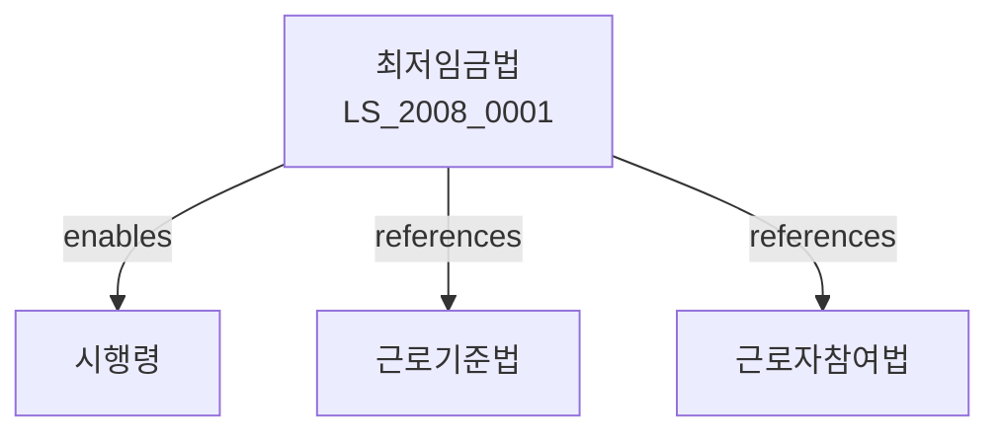

# 최저임금법

> [법률 제20113호, 2024. 1. 9., 일부개정]

---

---

## 제1장 총칙
### 제1조 (목적)
이 법은 근로자의 생계를 보장하기 위하여 최저임금제도를 실시함으로써 근로자의 생활안정과 근로조건의 개선을 도모함을 목적으로 한다。

### 제2조의2 (정의)
이 법에서 사용하는 용어의 뜻은 다음과 같다。

1. "최저임금"이란 근로자의 생계를 유지하는 데 필요한 최저한도의 임금을 말한다.
2. "임금"이란 사용자가 근로자에게 근로의 대가로 지급하는 것을 말한다。
3. "사용자"이란 사업주 또는 사업경영자를 말한다。
4. "근로자"이란 직업의 종류를 불문하고 임금을 목적으로 사용자에게 고용된 자를 말한다。

---

## 제2장 최저임금의 결정
### 第5条 (최저임금의 결정)
최저임금은 최저임금위원회의 심의를 거쳐 고용노동부장관이 결정한다.
### 第6条 (최저임금위원회)
최저임금위원회는 다음 각 호의 위원으로 구성한다.

1. 근로자를 대표하는 위원
2. 사용자를 대표하는 위원
3. 공익을 대표하는 위원
### 第7条(심의)
최저임금위원회는 재적위원 3분의 2 이상의 출석으로 심의한다.
### 第8条(의결)
최저임금위원회의 의결은 재적위원 과반수의 찬성으로 의결한다.

---

## 제3장 최저임금의 효력
### 第15条(최저임금의 효력)
최저임금의 결정은 1년마다 고용노동부장관이 고시한다.
### 第16条(최저임금의 적용범위)
최저임금은 모든 근로자에게 적용된다.
### 第17条(예외)
다음 각 호의 근로자에게는 적용하지 아니한다.

1. 친족과 함께 동거하는 사용자의 가족
2. 감독적ㆍ관리적 직무
3. 수습ㆍ훈련 또는 간호 업무
### 第18条(시간임금)
시간외 근로에 대하여 시간임금을 적용한다.

---

## 제4장 임금의 지급
### 第25条(지급의무무)
사용자는 근로자에게 최저임금 이상의 임금을 지급하여야 한다.
### 第26条(임금지급 방법)
임금은 통화로 지급한다.
### 第27条(임금명세)
임금명세에는 임금액, 임금지급일, 임금지급방법 등을 기재하여야 한다.
### 第28条(임금체불)
임금을 체불한 경우 지체지급하여야 한다.

---

## 제5장 감독
### 第35条(감독)
고용노동부장관은 최저임금의 이행을 감독한다.
### 第36条(보고 및 검사)
고용노동부장관은 필요한 경우 보고를 명하거나 검사할 수 있다.
### 第37条(시정명령)
고용노동부장관은 이 법을 위반한 자에 대하여 시정명령을 할 수 있다.
### 第38条(과태료)
다음 각 호의 어느 하나에 해당하는 자에게는 과태료를 부과한다。
1. 정당한 사유 없이 보고를 하지 아니한 자
2. 최저임금 이하의 임금을 지급한 자
---

## 제6장 벌칙
### 第45条(벌칙)
다음 각 호의 어느 하나에 해당하는 자는 3년 이하의 징역 또는 3천만원 이하의 벌금에 처한다。
1. 최저임금 이하의 임금을 지급한 자
2. 허위 보고를 한 자
3. 임금을 착취한 자
### 第46条(과태료)
다음 각 호의 어느 하나에 해당하는 자에게는 2천만원 이하의 과태료를 부과한다。
1. 정당한 사유 없이 보고를 하지 아니한 자
2. 임금명세를 교부하지 아니한 자
---

## 관계 그래프

**상위 법령**
- [[헌법]] 제32조, 제34조 (근로권, 생존권)
- [[근로기준법]]

**관련 법령**
- [[근로기준법]]
- [[근로자참여법]]
- [[남녀고용평등법]]
- [[기간제 및 단시간근로자 보호법]]

**하위 법령**
- [[최저임금법 시행령]]
