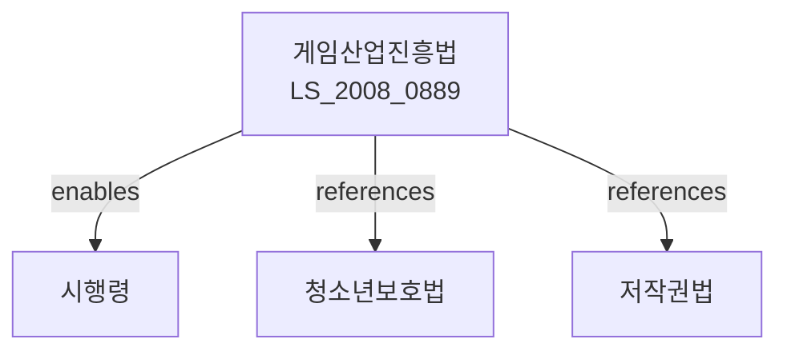

# 게임산업 진흥에 관한 법률

> [법률 제20093호, 2024. 1. 9., 일부개정]

---

---

## 제1장 총칙

### 제1조 (목적)

이 법은 게임산업을 진흥하고 게임이용자를 보호함으로써 국민의 건전한 여가생활과 국민경제의 발전에 이바지함을 목적으로 한다.

### 제2조 (정의)

이 법에서 사용하는 용어의 뜻은 다음과 같다.

1. "게임"이란 오락ㆍ유흥ㆍ학습 등을 목적으로 컴퓨터ㆍ통신망 등을 이용하여 즐기는 것을 말한다.
2. "게임산업"이란 게임의 제작ㆍ배급ㆍ제공 등을 영위하는 산업을 말한다.
3. "게임제공업"이란 게임을 제공하는 영업을 말한다.
4. "게임물"이란 게임에 이용되는 물품 또는 프로그램을 말한다.

---

## 제2장 게임산업의 진흥

### 第5条 (게임산업진흥 기본계획)

① 문화체육관광부장관은 5년마다 게임산업진흥 기본계획을 수립하여야 한다。

② 기본계획에는 다음 각 호의 사항이 포함되어야 한다。

1. 게임산업의 현황 및 전망
2. 게임산업 진흥을 위한 정책방향
3. 게임기술 개발에 관한 사항
4. 게임인력 양성에 관한 사항
5. 게임수출 진흥에 관한 사항

### 第6条 (게임진흥기관)

① 문화체육관광부장관은 게임산업의 진흥을 위하여 게임진흥기관을 지정할 수 있다。

② 게임진흥기관의 지정기준 및 절차 등에 관하여 필요한 사항은 대통령령으로 정한다。

### 第7条 (자금지원)

국가는 게임산업의 진흥을 위하여 게임기업에 대하여 자금을 지원할 수 있다。

---

## 제3장 게임물의 등급분류

### 第10条 (등급분류)

① 게임물은 청소년에게 미치는 영향 등을 고려하여 다음 각 호와 같이 등급을 분류한다。

1. 전체이용가: 모든 연령의 이용자가 이용할 수 있는 것
2. 12세이용가: 만 12세 이상의 이용자가 이용할 수 있는 것
3. 15세이용가: 만 15세 이상의 이용자가 이용할 수 있는 것
4. 청소년이용불가: 만 19세 이상의 이용자가 이용할 수 있는 것

② 등급분류의 기준 및 절차 등에 관하여 필요한 사항은 대통령령으로 정한다。

### 第11条 (등급분류 신청)

게임물을 제작하거나 배급하려는 자는 게임물등급분류위원회에 등급분류를 신청하여야 한다。

### 第12条 (등급분류의 표시)

게임물의 제작자 또는 배급자는 게임물에 등급분류를 표시하여야 한다。

---

## 제4장 게임제공업

### 第20条 (게임제공업의 등록)

① 게임제공업을 영위하려는 자는 시장ㆍ군수 또는 구청장에게 등록하여야 한다。

② 등록의 요건 및 절차 등에 관하여 필요한 사항은 대통령령으로 정한다。

### 第21条 (영업시설 기준)

게임제공업의 영업시설은 대통령령으로 정하는 기준에 적합하여야 한다。

### 第22条 (영업시간의 제한)

게임제공업자는 청소년의 보호를 위하여 대통령령으로 정하는 시간에는 영업을 하여서는 아니 된다。

---

## 제5장 청소년 보호

### 第30条 (청소년의 보호)

게임제공업자는 청소년의 건전한 성장을 저해할 우려가 있는 경우 청소년의 이용을 제한할 수 있다。

### 第31条 (과몰입 방지)

게임제공업자는 게임이용자의 과몰입을 방지하기 위한 조치를 하여야 한다。

### 第32条 (유해정보의 차단)

게임제공업자는 청소년에게 유해한 정보가 포함되지 아니하도록 하여야 한다。

---

## 제6장 벌칙

### 第50条 (벌칙)

다음 각 호의 어느 하나에 해당하는 자는 3년 이하의 징역 또는 3천만원 이하의 벌금에 처한다。

1. 제10조에 따른 등급분류를 받지 아니하고 게임물을 제공한 자
2. 제20조에 따른 등록 없이 게임제공업을 영위한 자

### 第51条 (과태료)

다음 각 호의 어느 하나에 해당하는 자에게는 2천만원 이하의 과태료를 부과한다。

1. 제12조에 따른 등급분류 표시를 하지 아니한 자
2. 제22조에 따른 영업시간 제한을 위반한 자

---

## 관계 그래프

**상위 법령**
- [[헌법]] 제22조 (학문과 예술의 자유)
- [[청소년보호법]]

**관련 법령**
- [[저작권법]]
- [[음비디오및게임물에관한법률]]
- [[정보통신망 이용촉진 및 정보보호 등에 관한 법률]]
- [[콘텐츠산업 진흥법]]

**하위 법령**
- [[게임산업진흥법 시행령]]
